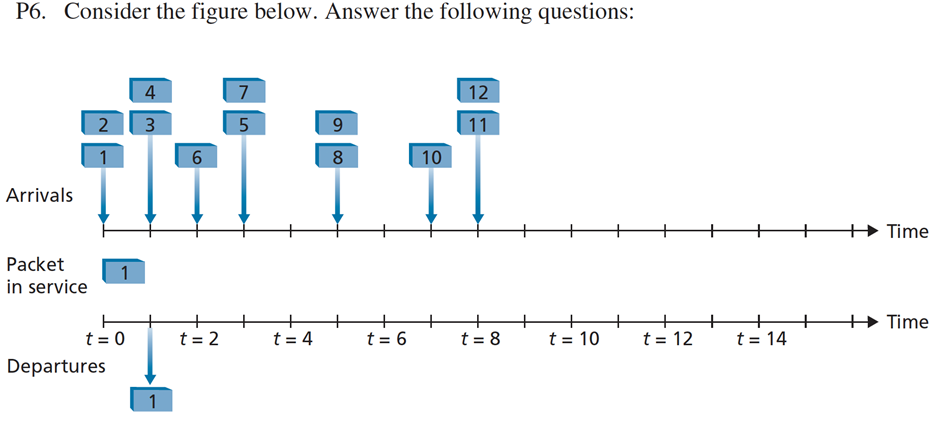
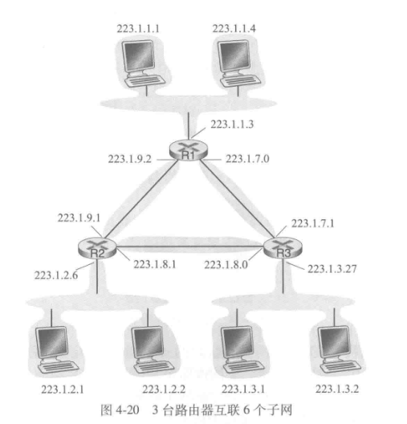
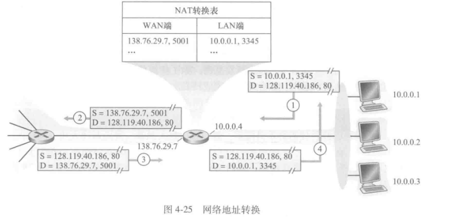
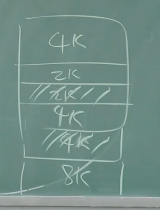
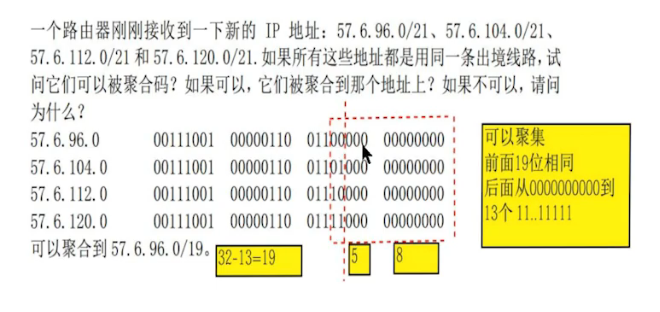
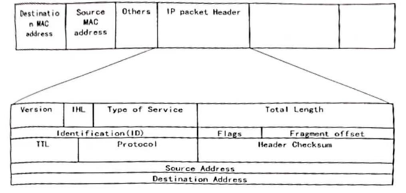
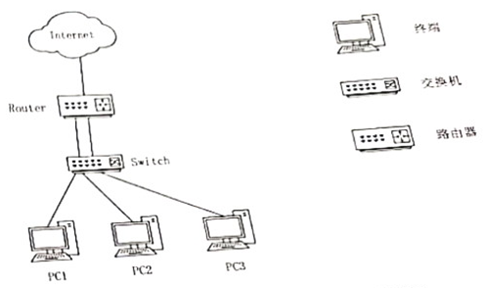

这是一份基于视频内容的详细课堂笔记总结，涵盖了计算机网络网络层（第4章）的习题讲解和核心概念回顾。

# 1	期末重点
- 知道网络层的两个平面，都干啥有啥功能
- 知道Internet的服务模型是BestEffort
- 路由器基本的构造（三种结构）和他的转发功能
- 最前缀匹配
- 排队和阻塞的相关内容要有所了解
- 常见的调度算法，基于优先级队列的怎么做
- IP协议IP Datagram format不要求记忆，但是稍微了解常见的几个TTL是啥意思
- fragment已经拿掉了，因为现在不太做分片了
- IP地址，他的ip地址的分类，私有IP，子网的概念，如何划分子网、
- DHCP怎么运行的，怎么拿到ip地址，ip的层次结构
- NAT，知道公网到私网ip的转换
- MiddleBox，知道是啥。ip的沙漏的图，加了一些东西让他更臃肿了

# 2	计算机网络课堂笔记：第四章 网络层复习与习题讲解

## 2.1	1. R2：网络层的两个平面
### 2.1.1	数据平面与控制平面
我们将网络层的功能主要划分为两个部分：**数据平面**和**控制平面**。
*   **数据平面（Data Plane）**：
    *   主要负责**本地**的、每个路由器的功能。
    *   核心功能是**转发（Forwarding）**：决定从路由器的输入端口到达的分组如何转发到输出端口。这是局部的操作。
*   **控制平面（Control Plane）**：
    *   主要负责**全局**范围内的逻辑。
    *   核心功能是**路由（Routing）**：决定数据报如何在路由器之间路由，决定数据报从源到目标主机之间的端到端路径。
    *   **关系**：在传统工作方式下，控制平面（通过路由协议）计算出转发表，然后将转发表下发给数据平面，数据平面根据IP协议和转发表来实现局部的转发功能。

## 2.2	2. R3：转发与路由的区别
再次强调数据平面和控制平面的区别：
*   **转发（Forwarding）**：是**局部**动作。是将分组从输入接口转移到合适的输出接口的过程。
*   **路由（Routing）**：是**全局**过程。是规划从源头到目的地的分组传输路径的过程。

## 2.3	3. R10：交换结构（Switching Fabric）
在路由器的内部结构中，输入端口和输出端口之间有一个核心组件叫做 **Switching Fabric**（中文翻译为交换结构或交换机构，有时也叫互联网络）。

在Fabric中主要有三种交换方式：
1.  **内存（Memory）**
2.  **总线（Bus）**
3.  **互联网络（Crossbar / Interconnection Network）**

**关于 Crossbar（纵横模式）的特点：**
Crossbar 的方式可以实现**多对多**的传输。
*   只要输入和输出端口不冲突，传输可以并行进行。
*   例如：输入端口A发给输出端口X的同时，输入端口B可以发给输出端口Y。因为线路相互不影响，互不干扰。

## 2.4	4. R11/12/13：输入输出端口的排队与丢包,HOL

描述在输入端口会出现分组丢失的原因。描述在输入端口如何消除分组丢失（不使用无限大缓存区）。

描述在输出端口会出现分组丢失的原因。通过提高交换结构速率，能够防止这种丢失吗？

什么是HOL阻塞？它出现在输人端口还是输出端口？

### 1. 输入端口的分组丢失

- 原因：
    
    如果交换结构（Switch Fabric）的处理速率慢于输入线路的汇聚到达速率，输入端口的缓存队列就会不断增长。当缓存区（Buffer）被填满时，新到达的分组就会因为没有存储空间而被丢弃。
    
    - 这种情况通常发生在多个输入端口同时向同一个输出端口发送数据，或者交换结构本身的转发速度不够快时。
        
- 如何消除分组丢失（不使用无限大缓存区）：要消除输入端口的分组丢失，必须提高交换结构的处理速率。
    - **具体方法**：将交换结构的速率提高到至少 **$n$ 倍的输入线路速率**（$n \times R_{input}$），其中 $n$ 是输入端口的数量。
    - **原理**：在最坏的情况下（即所有 $n$ 个输入端口都以全速接收数据），交换结构也能以足够快的速度将所有分组转发到输出端口，从而避免分组在输入端口排队积压。

---

### 2. 输出端口的分组丢失

- 原因：当交换结构将分组推送到输出端口的速率超过了输出链路（Output Line）的发送速率时，分组会在输出端口的缓存中排队。如果到达速率持续超过发送速率，输出缓存最终会被填满，导致后续到达的分组被丢弃。
    - 这种情况即使在交换结构非常快时也会发生，因为瓶颈在于通向外部网络的链路带宽。
        
- 提高交换结构速率能防止这种丢失吗？ 不能。
    - **解释**：提高交换结构速率只会让分组更快地到达输出端口，这反而可能加剧输出端口的拥塞压力。输出端口的丢失是由**输出链路的物理传输速率（带宽）限制**造成的。无论交换结构多快，如果输出线路发不出去，分组依然会堆积并最终丢失。

---

### 3. 什么是 HOL 阻塞？

- 定义：HOL 阻塞全称为 Head-of-Line Blocking（排头阻塞）。它指的是在队列中，排在队头（Head of the Line）的分组因为某种原因（如目的端口忙）无法转发，导致排在它后面的分组也被阻塞无法转发，即使这些后续分组的目的端口是空闲的。
    
- 出现位置： 它出现在输入端口。
    - **场景描述**：在使用**输入排队（Input Queuing）**的交换机中，如果一个输入队列队头的数据包要发往输出端口 X，但端口 X 正忙（例如正被另一个输入端口占用），那么这个队头数据包必须等待。此时，排在它后面的所有数据包（哪怕是要发往空闲端口 Y 的）都必须等待，造成了效率的损失。

## 2.5	5. R17：IP数据报的协议字段
当主机收到一个IP数据报时，网络层如何知道将其交给上层的哪个协议？
*   IP首部有一个字段叫做 **Protocol（协议）**。
*   这个字段的作用类似于TCP/UDP中的端口号，用于解复用。
*   根据Protocol字段的数值，决定是将数据交给 **ICMP**、**TCP**、**UDP** 还是其他协议。

## 2.6	6. R30：IPv6 首部字段的变化
IPv6 相比 IPv4，首部发生了很大变化：
*   **版本号**：4比特。
*   **Traffic Class**：服务类型/流量类别。
*   **Flow Label**：流标签。
*   **Payload Length**：载荷长度。
*   **Next Header（下一个首部）**：在IPv6中，这个字段相当于IPv4中的 Protocol 字段，用于指明上层协议或扩展首部。
*   **Hop Limit（跳数限制）**：在IPv6中，这个字段相当于IPv4中的 **TTL (Time To Live)**。
    *   作用完全一样：每经过一跳（路由器）减1，减为0时丢弃该包，并向源主机发送ICMP错误报告（超时）。

## 2.7	7. R33：OpenFlow 与传统路由器
OpenFlow 的流表（Flow Table）与传统路由器的转发表有何区别？
*   **传统路由器**：
    *   **匹配**：仅根据IP头部的**目标IP地址**进行匹配（使用最长前缀匹配）。
    *   **动作**：单纯的**转发**。
*   **OpenFlow**：
    *   **匹配**：匹配的字段非常多，涵盖链路层（MAC）、网络层（IP）、传输层（端口）等多个层次。
    *   **动作（Action）**：不仅是转发，还可以是**丢弃（Drop）**、**修改字段（Modify）**、**泛洪（Flood）**、或者**泛洪给控制器**。

基于目的地转发的转发表仅包含**IP**报头字段以及对应的输出链路接口；
而**OpenFlow**流表包含(1)首部字段值集合：用于匹配；(2)计数器集合：当分组与流表条目匹配时进行更新；(3)当分组匹配流表项时所采取的动作集合。

## 2.8	P6 几个轮询的查询

a. Assuming FIFO service, indicate the time at which packets 2 through 12 each leave the queue. For each packet, what is the delay between its arrival and the beginning of the slot in which it is transmitted? What is the average of this delay over all 12 packets?

b. Now assume a priority service, and assume that odd-numbered packets are high priority, and even-numbered packets are low priority. Indicate the time at which packets 2 through 12 each leave the queue. For each packet, what is the delay between its arrival and the beginning of the slot in which it is transmitted? What is the average of this delay over all 12 packets?

c. Now assume round robin service. Assume that packets 1, 2, 3, 6, 11, and 12 are from class 1, and packets 4, 5, 7, 8, 9, and 10 are from class 2. Indicate the time at which packets 2 through 12 each leave the queue. For each packet, what is the delay between its arrival and its departure? What is the average delay over all 12 packets?

d. Now assume weighted fair queueing (WFQ) service. Assume that odd-numbered packets are from class 1, and even-numbered packets are from class 2. Class 1 has a WFQ weight of 2, while class 2 has a WFQ weight of 1. Note that it may not be possible to achieve an idealized WFQ schedule as described in the text, so indicate why you have chosen the particular packet to go into service at each time slot. For each packet what is the delay between its arrival and its departure? What is the average delay over all 12 packets?

e. What do you notice about the average delay in all four cases (FIFO, RR, priority, and WFQ)?【**All average delay remains the same, no matter what algorithm is used.**】

我就不贴答案了，没意思

## 2.9	P15很奇怪的一个子网划分问题，但是好像也没毛病
考虑图4-20中显示的拓扑。（在12:00以顺时针开始）标记具有主机的3个子网为网络A、B和C，标记没有主机的子网为网络D、E和F。

a. 为这6个子网分配网络地址，要满足下列限制：所有地址必须从214.97.254/23分配；子网A应当具有足够地址以支持250个接口；子网B应当具有足够地址以支持120个接口；子网C应当具有足够地址以支持120个接口。当然，子网D、E和F应当支持两个接口。对于每个子网，分配采用的形式是`a.b.c.d/x`或`a.b.c.d/x-e.f.g.h/y`。

b. 使用你对（a）部分的答案，为这3台路由器提供转发表（使用最长前缀匹配）。

Subnet A: 214.97.255/24 (256 addresses)
Subnet B: 214.97.254.0/25 - 214.97.254.0/29 (128-8 = 120 addresses)
Subnet C: 214.97.254.128/25 (128 addresses)
Subnet D: 214.97.254.0/31 (2 addresses)
Subnet E: 214.97.254.2/31 (2 addresses)
Subnet F: 214.97.254.4/30 (4 addresses)

To simplify the solution, assume that no datagrams have router interfaces as ultimate destinations. Also, label D, E, F for the upper-right, bottom, and upper-left interior subnets, respectively.

### 2.9.1	Router 1

| Longest Prefix Match                | Outgoing Interface |
|--------------------------------------|--------------------|
| 11010110 01100001 11111111          | Subnet A           |
| 11010110 01100001 11111110 0000000  | Subnet D           |
| 11010110 01100001 11111110 0000001  | Subnet F           |

### 2.9.2	Router 2

| Longest Prefix Match                | Outgoing Interface |
|--------------------------------------|--------------------|
| 11010110 01100001 11111111 0000000  | Subnet D           |
| 11010110 01100001 11111110 0        | Subnet B           |
| 11010110 01100001 11111110 0000001  | Subnet E           |

### 2.9.3	Router 3

| Longest Prefix Match               | Outgoing Interface |
| ---------------------------------- | ------------------ |
| 11010110 01100001 11111111 0000001 | Subnet F           |
| 11010110 01100001 11111110 0000001 | Subnet E           |
| 11010110 01100001 11111110 1       | Subnet C           |

## 2.10	P18 NAT地址分配

a) Home addresses: 192.168.1.1, 192.168.1.2, 192.168.1.3 with the router interface being 192.168.1.4

b)NAT Translation Table

| WAN Side            | LAN Side          |
| ------------------- | ----------------- |
| 24.34.112.235, 4000 | 192.168.1.1, 3345 |
| 24.34.112.235, 4001 | 192.168.1.1, 3346 |
| 24.34.112.235, 4002 | 192.168.1.2, 3445 |
| 24.34.112.235, 4003 | 192.168.1.2, 3446 |
| 24.34.112.235, 4004 | 192.168.1.3, 3545 |
| 24.34.112.235, 4005 | 192.168.1.3, 3546 |

## 2.11	P19通过NAT统计后面的主机数量
假设你有兴趣检测NAT后面的主机数量。你观察到在每个IP分组上IP层顺序地标出一个标识号。由一台主机生成的第一个IP分组的标识号是一个随机数，后继IP分组的标识号是顺序分配的。假设由NAT后面主机产生的所有IP分组都发往外部。

a. 基于这个观察，假定你能够俘获由NAT向外发送的所有分组，你能概要给出一种简单的技术来检测NAT后面不同主机的数量吗？评估你的答案。

b. 如果标识号不是顺序分配而是随机分配的，这种技术还能正常工作吗？评估你的答案。

a) Since all IP packets are sent outside, so we can use a packet sniffer to record all IP packets generated by the hosts behind a NAT. As each host generates a sequence of IP
packets with sequential numbers and a distinct (very likely, as they are randomly chosen from a large space) initial identification number (ID), we can group IP packets with consecutive IDs into a cluster. The number of clusters is the number of hosts behind the NAT.

b) However, if those identification numbers are not sequentially assigned but randomly
assigned, the technique suggested in part (a) won’t work, as there won’t be clusters in
sniffed data.

## 2.12	P20 NAT对P2P应用的影响
在这个习题中，我们将探讨NAT对P2P应用程序的影响。假定用户名为Arnold的对等方通过查询发现，用户名为Bernard的对等方有一个要下载的文件。同时假定Bernard和Arnold都位于NAT后面。尝试设计一种技术，使得Arnold与Bernard创建一条TCP连接，而不对NAT做应用特定的配置。如果难以设计这样的技术，试讨论其原因。

It is not possible to devise such a technique. In order to establish a direct TCP connection between Arnold and Bernard, either Arnold or Bob must initiate a connection to the other. **But the NATs covering Arnold and Bob drop SYN packets arriving from the WAN side**. Thus neither Arnold nor Bob can initiate a TCP connection to the other if they are both behind NATs.

## 2.13	MTU 与 分片（Fragmentation）【不是第八版课本题】

### 2.13.1	MTU (Maximum Transmission Unit)
*   **定义**：最大传输单元。指的是**物理网络**（如以太网）所能承载的层上数据报的最大长度（包含IP头）。
*   IP网络是逻辑网络，承载在物理网络之上。物理网络有限制，IP层就必须遵守。
*   以太网通常 MTU = 1500 字节。

### 2.13.2	分片计算题示例
**题目条件**：
*   原始数据报总长度 $L = 2400$ 字节（含头部）。
*   路径上某段链路的 MTU = 700 字节。
*   假设 IP 头部为 20 字节。

考虑向具有700字节MTU的一条链路发送一个2400字节的数据报。假定初始数据报标有标识号422。将会生成多少个分片？在生成相关分片的数据报中各个字段的值是多少？

**计算步骤**：
1.  **计算实际载荷能力**：
    *   每个分片最大总长 700 字节。
    *   减去 IP 头部 20 字节，每个分片最多能携带的数据（Payload）= $700 - 20 = 680$ 字节。
2.  **检查8字节对齐**：
    *   IP分片的偏移量（Offset）是以8字节为单位的。
    *   检查：$680 / 8 = 85$。可以整除，说明 680 字节作为分片数据长度是合法的。
3.  **计算原始载荷**：
    *   原始数据报载荷 = $2400 - 20 = 2380$ 字节。
4.  **进行分片**：
    *   **第1片**：载荷 680B。Offset = 0，MF (More Fragments) = 1。
    *   **第2片**：载荷 680B。Offset = $680/8 = 85$，MF = 1。
    *   **第3片**：载荷 680B。Offset = $1360/8 = 170$，MF = 1。
    *   **第4片**：剩余数据 = $2380 - 680 \times 3 = 2380 - 2040 = 340$ 字节。
        *   第4片总长 = $340 + 20 = 360$ 字节（小于700，合法）。
        *   Offset = $2040/8 = 255$，MF = 0（最后一片）。
---

最大传输单元（MTU）为700字节，其中要包含20个字节的IP首部，能够存放680字节的数据。
数据报为2400字节，除去20字节的IP首部，共有2380字节的数据。
分片的个数为$2380/680≈4$。

四个分片的标识号均为422，片偏移字段分别为0、85、170、255，标志分别为1、1、1、0

## 2.14	开销（Overhead）计算
**题目场景**：
*   要在网络上传输一个 5MB 的文件。
*   使用 TCP/IP 传输。
*   MTU = 1500 字节。
*   IP头 = 20B，TCP头 = 20B。

**计算逻辑**：
1.  **单位换算**：
    *   **存储领域**：$1M = 1024K, 1K = 1024B$。
    *   **通信/网络领域**：通常 $1M = 10^6, 1k = 1000$。
    *   在本题中（以及很多网络题），除非特别说明，5MB 通常按 $5 \times 10^6$ 字节计算。
2.  **单包有效载荷（MSS）**：
    *   $MSS = MTU - IP头 - TCP头 = 1500 - 20 - 20 = 1460$ 字节。
3.  **需要多少个包**：
    *   $N = \lceil (5 \times 10^6) / 1460 \rceil$。
4.  **总传输量**：
    *   总传输字节 = 原始文件大小 + 所有包的头部开销。
    *   或者：$N \times 1500$ （最后一片可能不满1500，需精确计算）。
5.  **开销（Overhead）与效率**：
    *   头部（Header）就是开销（Cost）。【其实如果是UDP或者TCP的话还要有8或者20字节的头部】
    *   如果“头”太大（Overhead大），利用率就低。

## 2.15	附加题：地址分配与聚合（Address Aggregation）
**题目场景**：
*   ISP 拥有一个大地址块（例如 `/17` 的块）。
*   需要分配给四个机构，需求量分别为：4000、2000、4000、8000 个地址。

假定从 198.16.0.0 开始有大量连续的 IP 地址可用，现在 4 个组织 A、B、C、D 按照顺序依次申请 **4000**、**2000**、4000 和 8000 个地址。对于每一个申请，请利用w.x.y.z/s 的形式写出所分配的第一个 IP 地址、最后一个 IP 地址以及掩码。

分配 IP 地址时要以$2^n$为基准分配。对4000、2000、4000、8000分别取以2为底的对数再向上取整，分别为12、11、12、13。

| 起始地址        | 终止地址          | 掩码             |
| ----------- | ------------- | -------------- |
| 198.16.0.0  | 198.16.15.255 | 198.16.0.0/20  |
| 198.16.16.0 | 198.16.23.255 | 198.16.16.0/21 |
| 198.16.32.0 | 198.16.47.255 | 198.16.32.0/20 |
| 198.16.64.0 | 198.16.95.255 | 198.16.64.0/19 |

---

**分配原则与技巧**：
1.  **2的N次方对齐**：分配给子网的地址块大小必须是 $2^n$。
2.  **起始地址对齐**：子网的**起始地址**必须是该子网块大小的整数倍。不能随便从中间切一段。
    *   例如：你要分一个 4K（4096）的块，起始地址必须能被 4096 整除。
3.  **分配策略**：
    *   建议**从大到小**分配，或者仔细画图规划，以免产生无法利用的碎片（空隙）。比如这种情况
    *   例如：先分8K，再分4K，再分4K，最后分2K。
    *   如果你先分了2K，紧接着想分一个4K，可能因为地址对齐要求（Alignment），中间会留下一段2K的空隙无法被这4K利用。

## 2.16	附加题2：地址聚合

#### 2.16.1.1	第一步：列出二进制形式

我们将第三个字节（即变化的部分）展开为二进制：
- **57.6.96.0/21:** $96$ 的二进制是 `01100000`
- **57.6.104.0/21:** $104$ 的二进制是 `01101000`
- **57.6.112.0/21:** $112$ 的二进制是 `01110000`
- **57.6.120.0/21:** $120$ 的二进制是 `01111000`
    

#### 2.16.1.2	第二步：寻找共同前缀

观察这四个地址的前三个字节：

- 前两个字节 `57.6` 完全相同（共 $16$ 位）。
- 第三个字节的前三位均为 `011`。
- 从第四位开始出现不同（红色虚线标记处）。
#### 2.16.1.3	第三步：计算聚合结果

- **共同位数：** 前两个字节的 $16$ 位 + 第三个字节的 $3$ 位 = **19 位**。
- **网络地址：** 保持前 $19$ 位不变，后面全部置为 $0$。
    - 第三个字节变为 `01100000`，即十进制的 $96$。
- **聚合后的地址：** **57.6.96.0/19**。
    
## 2.17	附加题3 分配地址【注意0和1的问题】

一个自治系统有5个局域网，LAN1至LAN4上的主机数分别为：200，100，60和**15**。LAN5是连接LAN1-LAN4的，该自治系统分配到的IP地址块为30.138.118/23。试给出每一个局域网的分配地址，在下表中填上分配的地址块和可用于标识主机的起始地址与结尾地址，并画出拓扑结构。
- **需要注意的是，这个15的地址并不能只给他分配16个，因为全0和全1的要保留**
### 2.17.1	前两个分组
本题有多种答案，满足地址不重合，地址数符合要求，注意可用地址去除主机号为全0和全1。

将 30.138.118/23 写为 00011110 100001010 01110110 00000000

第一个 LAN 需要 200 个地址，由于$2^7 < 200 + 2 < 2^8$，所以给它分配的地址块为 30.138.118.0/24。
其首地址为 30.138.118.1，尾地址为 30.138.118.254

第二个 LAN 需要 100 个地址，由于$2^6 < 100 + 2 < 2^7$，所以给它分配的地址块为 30.138.119.0/25
其首地址为 30.138.119.1，尾地址为 30.138.119.126

### 2.17.2	设计思路【接续老师答案AI写】

1. **地址分配原则**：为了节省 IP 地址并保证地址块不重叠，我们采用 **VLSM（可变长子网掩码）**，按照主机需求量从大到小的顺序进行切分。
2. **LAN4 特别注意**：由于需要 15 个主机地址，加上 1 个网络地址和 1 个广播地址，共需 **17** 个 IP。因此必须分配 $2^5 = 32$ 个地址（$/27$），而不能使用 $2^4 = 16$ 个地址（$/28$）。
3. **LAN5 为主干网**：它负责连接 LAN1 至 LAN4 的路由器。这意味着 LAN5 至少需要 4 个 IP（每个局域网的网关接口）加上网络和广播地址。

---

### 2.17.3	地址分配详解

#### 2.17.3.1	1. LAN3 (需要 60 个地址)

- **计算**：$2^5 < 60 + 2 \le 2^6$，因此分配 $2^6 = 64$ 个地址。
- **掩码**：$/26$ ($32 - 6 = 26$)。
- **起始点**：接在 LAN2 之后，从 `30.138.119.128` 开始。
- **地址块**：**30.138.119.128/26**

#### 2.17.3.2	2. LAN4 (需要 15 个地址)

- **计算**：$2^4 < 15 + 2 \le 2^5$，因此分配 $2^5 = 32$ 个地址。
- **掩码**：$/27$ ($32 - 5 = 27$)。
- **起始点**：接在 LAN3 之后，从 `30.138.119.192` 开始。
- **地址块**：**30.138.119.192/27**

#### 2.17.3.3	3. LAN5 (主干网，连接 4 个子网)

- **需求**：至少 4 个接口地址。
- **计算**：$2^2 < 4 + 2 \le 2^3$，分配 $2^3 = 8$ 个地址即可。为方便管理，通常也可分配稍大一点。
- **掩码**：$/29$ (或 $/28$)。
- **起始点**：接在 LAN4 之后，从 `30.138.119.224` 开始。
- **地址块**：**30.138.119.224/29**

---

### 2.17.4	分配结果汇总表

|**局域网**|**主机数**|**分配地址块**|**起始主机地址**|**结尾主机地址**|
|---|---|---|---|---|
|**LAN1**|200|30.138.118.0/24|30.138.118.1|30.138.118.254|
|**LAN2**|100|30.138.119.0/25|30.138.119.1|30.138.119.126|
|**LAN3**|60|30.138.119.128/26|30.138.119.129|30.138.119.190|
|**LAN4**|15|30.138.119.192/27|30.138.119.193|30.138.119.222|
|**LAN5**|-|30.138.119.224/29|30.138.119.225|30.138.119.230|

---

### 2.17.5	拓扑结构说明

拓扑结构通常采用 **星型或总线型主干** 结构：

- **中心节点**：LAN5 作为主干局域网（通常是一个交换机）。
- **路由器**：共有 4 台路由器（R1-R4），每台路由器有两个接口。
    - 一个接口连接到各自的本地局域网（LAN1-LAN4）。
    - 另一个接口连接到主干网 LAN5。
- **外部连接**：其中一台路由器（或额外的一台）连接到外部自治系统。

# 3	往年卷

## 3.1	背书部分

### 3.1.1	1. 路由表与转发表的区别

| **特性**   | **路由表 (Routing Table)**            | **转发表 (Forwarding Table / FIB)**    |
| -------- | ---------------------------------- | ----------------------------------- |
| **层级**   | 控制层面 (Control Plane)               | 数据层面 (Data Plane)                   |
| **主要功能** | 存储并计算到达各目的网络的最佳路径。                 | 用于快速查找并将进入的分组交换到正确的输出端口。            |
| **数据内容** | 包含拓扑信息、度量值（Metric）、管理距离、路由来源等详细信息。 | 仅包含目的网络前缀及其对应的下一跳地址和输出接口（优化后的查找结果）。 |
| **复杂程度** | 结构复杂，记录多，更新频率相对较低。                 | 结构精简，专门针对快速匹配（如最长前缀匹配）进行了硬件优化。      |
| **生成方式** | 由路由协议（OSPF, BGP, RIP等）计算得出或静态配置。   | 根据路由表的信息提取并转换而成。                    |

---

### 3.1.2	2. 存储位置

- **路由表 (Routing Table)**
    - **存储位置：** 存储在路由器的 **主处理器（CPU）内存（RAM）** 中。
    - **原因：** 路由表需要处理复杂的路由计算和协议交互，属于控制层面的任务，因此由系统的通用 CPU 进行维护。
- **转发表 (Forwarding Table / FIB)**
    - **存储位置：** 通常存储在 **线路卡（Line Cards）** 的专用存储器中，或者存储在 **TCAM（三态内容寻址寄存器）** 等硬件加速芯片中。
    - **原因：** 为了实现线速转发（Wire-speed forwarding），必须避免每个分组都去询问 CPU。将转发表下发到各线路卡的专用硬件中，可以让路由器在分组到达时以极高的速度完成查表和转发。
---

## 3.2	2020国际化IP数据包分组【重点看】

现有一个包(IPv4)从结点A沿多个路由器的路径传至结点B，其所含内容如下

(1)该包在传输途中， 求上图至少哪些部分会发生改变。

(2)若该IP包表头长度=28byte编号ID=66且length=4000,现经过一段最大传输单元MTU=1500bytes的以太网，假设分段后的每个IP子包表头长28bytes，请写出每个子包的具体的Length, ID,分段标志fragment flag以及每段的偏移offset

### 3.2.1	(1) 传输途中至少会发生改变的部分

当一个 IP 数据报在互联网中经过路由器转发时，数据链路层帧和网络层头部中的某些字段**必须**或**可能**发生变化：
		  
- **源/目的 MAC 地址 (Source/Destination MAC Address)：** 这是改变最频繁的部分。每一跳（经过一个路由器）时，旧的数据链路层封装会被剥离，路由器会根据下一跳的 ARP 表项重新封装新的源 MAC（路由器的出端口地址）和目的 MAC（下一跳结点的地址）。
- **生存时间 (TTL)：** 每经过一个路由器，该值必须减 1。如果减到 0，报文将被丢弃并向源端发送 ICMP 超时报文。
- **头部校验和 (Header Checksum)：** 由于 TTL 字段发生了变化，路由器必须重新计算并填充 IP 头部的校验和。
- **总长度 (Total Length)、标志 (Flags) 及分段偏移 (Fragment Offset)：** 如果路径中某段链路的 **MTU（最大传输单元）** 小于当前数据报长度，路由器会对该包进行分片。此时，分片后的每个子包的总长度、偏移量以及 MF 标志位都会改变（具体见下一题）。
    
> **注意：** 在常规转发中，源和目的 **IP 地址**通常保持不变（除非涉及 NAT 网络地址转换）。

---

### 3.2.2	(2) IP 数据报分片计算

**原始数据分析：**

- **总长度 (Length)** = 4000 字节
- **头部长度 (Header)** = 28 字节
- **有效载荷 (Payload)** = $4000 - 28 = 3972$ 字节
- **标识 (ID)** = 66
- **以太网 MTU** = 1500 字节
    

**分片原则：**

1. 每个分片的载荷长度必须是 **8 字节的整数倍**（因为 Offset 以 8 字节为单位）。
2. 每个分片可携带的最大载荷 = $MTU - Header = 1500 - 28 = 1472$ 字节。
3. $1472 / 8 = 184$，满足 8 字节对齐要求。
    

**分片结果表：**

|**子包编号**|**Length (字节)**|**ID**|**分段标志 (MF)**|**偏移 (Offset)**|**计算说明**|
|---|---|---|---|---|---|
|**子包 1**|**1500**|66|**1**|**0**|载荷 1472 字节，MF=1 表示后面还有分片。|
|**子包 2**|**1500**|66|**1**|**184**|载荷 1472 字节，偏移量 = $1472 / 8 = 184$。|
|**子包 3**|**1056**|66|**0**|**368**|剩余载荷 $3972 - (1472 \times 2) = 1028$ 字节。总长 $1028 + 28 = 1056$。偏移量 = $(1472 + 1472) / 8 = 368$。MF=0 表示最后一片。|

---

## 3.3	2020国际化子网划分

一个局域网的网络架构如上图所示，假设路由器设置的子网号为192.168.2.0/24。

### 3.3.1	(1) 现要对子网进一步的划分，使PC1和PC2在一个子网内，PC3在另一个子网内。请给PC和Router的分配IP地址。

要将 $192.168.2.0/24$ 划分为两个子网，使 PC1、PC2 在一个子网，PC3 在另一个子网，最简单的方法是借用 1 位主机位作为子网位。

**划分推导：**
- **原始掩码：** $/24$ ($255.255.255.0$)
- **新掩码：** $/25$ ($255.255.255.128$)
- **子网 A (用于 PC1, PC2)：** 网络号为 $192.168.2.0/25$
    - 地址范围：$192.168.2.1$ 至 $192.168.2.126$
- **子网 B (用于 PC3)：** 网络号为 $192.168.2.128/25$
    - 地址范围：$192.168.2.129$ 至 $192.168.2.254$

**建议分配方案：**

|**设备名称**|**IP 地址**|**子网掩码**|**默认网关**|
|---|---|---|---|
|**PC1**|$192.168.2.2$|$255.255.255.128$|$192.168.2.1$|
|**PC2**|$192.168.2.3$|$255.255.255.128$|$192.168.2.1$|
|**PC3**|$192.168.2.130$|$255.255.255.128$|$192.168.2.129$|
|**Router 接口 1** (子网 A 网关)|$192.168.2.1$|$255.255.255.128$|-|
|**Router 接口 2** (子网 B 网关)|$192.168.2.129$|$255.255.255.128$|-|

---

### 3.3.2	(2) 利用子网掩码划分子网的优点

1. **减少广播风暴：** 子网划分将一个大的广播域切分为多个小的广播域。广播报文只会在所属子网内传播，不会占用整个局域网的带宽，从而提高网络整体性能。
2. **增强网络安全性：** 不同的子网之间默认是隔离的。通过在路由器上设置访问控制列表 (ACL)，可以限制不同部门（子网）之间的互访，保护敏感数据。
3. **提高 IP 地址利用率：** 可以根据每个部门实际拥有的主机数量灵活分配地址空间，避免 IP 地址的大量浪费。
4. **便于管理和维护：** 网络拓扑更加清晰，当某个区域出现网络故障时，可以快速定位在特定的子网内，不影响其他子网的运行。也可以简化路由表。
---

### 3.3.3	(3) 第(1)问中的IP地址设置完成后,PC1能否和PC2相互通信? PC1能否和PC3相互通信?请说明原因。

**1. PC1 能否和 PC2 相互通信？**
- **结论：能。**
- **原因：** PC1 和 PC2 处于同一个物理交换机下，且被分配到了**同一个逻辑子网** ($192.168.2.0/25$)。当 PC1 与 PC2 通信时，它们通过子网掩码判断目标 IP 与自己在同一网段，因此直接通过 ARP 协议获取对方 MAC 地址，在二层（交换机层）即可完成数据交换，无需经过路由器转发。

**2. PC1 能否和 PC3 相互通信？**

- **结论：能。**
- **原因：** 尽管 PC1 和 PC3 处于不同的逻辑子网，但它们都连接到了具有路由功能的**路由器**上。
    - PC1 发送数据时，发现 PC3 的 IP ($192.168.2.130$) 不在自己的子网内。
    - PC1 会将数据包发送给自己的默认网关（Router 接口 1）。
    - 路由器收到包后，根据路由表发现目标网段直接连接在自己的另一个接口上，于是将包转发给子网 B 中的 PC3。
    - 只要路由器开启了路由转发功能，跨子网通信即可实现。

---

### 3.3.4	(4) 单向流量路线及解释

#### 3.3.4.1	路线 A：PC1 $\rightarrow$ PC2 (同子网)

- **流量路线：** PC1 $\rightarrow$ 交换机 (Switch) $\rightarrow$ PC2。
- **解释：**
    1. **子网匹配：** PC1 将目标地址 $192.168.2.3$ 与自身掩码进行 `AND` 运算，发现目标属于本地子网。
    2. **二层转发：** PC1 查看 ARP 缓存，如果没有 PC2 的 MAC 地址，则发送 ARP 请求。
    3. **交换机动作：** 交换机根据 MAC 地址表，直接将数据帧从连接 PC1 的端口转发到连接 PC2 的端口。

#### 3.3.4.2	路线 B：PC1 $\rightarrow$ PC3 (跨子网)

- **流量路线：** PC1 $\rightarrow$ 交换机 (Switch) $\rightarrow$ 路由器 (Router) $\rightarrow$ 交换机 (Switch) $\rightarrow$ PC3。
- **解释：**
    1. **跨网段识别：** PC1 发现目标地址 $192.168.2.130$ 与自己不在同一子网。
    2. **送往网关：** PC1 将封装好的 IP 数据包发送给其网关 $192.168.2.1$（路由器的 MAC 地址）。
    3. **三层路由：** 路由器拆开二层帧，查看三层 IP 头部。根据路由表，发现目标网段属于接口 2 (子网 B)。
    4. **下发子网：** 路由器重新封装二层帧，目标 MAC 为 PC3 的 MAC，通过交换机将数据送达 PC3。

## 3.4	交换机排队丢包

### 3.4.1	4. 交换机入口出口如何丢包？入口如何避免？

- **出口丢包 (Output Port Queuing)：** 当多个入口端口同时向同一个出口端口转发数据，且总速率超过了出口链路的带宽时，出口缓存溢出导致丢包。
    
- **入口丢包 (Input Port Queuing)：**
    - **交换矩阵速度慢：** 交换引擎处理速度跟不上输入速率。
    - **头端阻塞 (HOL Blocking)：** 队列排头的包因为目标出口忙而等待，导致后面去往闲置出口的包也被堵住。
- 入口避免方法： 1. 提高交换矩阵的带宽（使其达到 $N$ 倍输入带宽）。
    
    2. 采用 虚拟输出队列 (Virtual Output Queuing, VOQ)，在入口处为每个出口分别建队，消除 HOL 阻塞。
    
## 3.5	IPv4和v6的对比
### 3.5.1	1. 核心差异概览

|**特性**|**IPv4 首部**|**IPv6 首部**|
|---|---|---|
|**地址长度**|32 bit ($2^{32}$ 个地址)|**128 bit** ($2^{128}$ 个地址)|
|**首部长度**|**变长** (20 ~ 60 字节)，由 IHL 字段指定|**固定长度** (40 字节)|
|**分片处理**|允许路由器和主机进行分片|**禁止路由器分片**，仅允许源主机分片|
|**校验和**|包含首部校验和 (Checksum)|**移除校验和** (交给传输层/链路层处理)|
|**选项 (Options)**|包含在基本首部中|移至“扩展首部”，由 **Next Header** 串联|
### 3.5.2	2. 字段级别的具体变化

#### 3.5.2.1	移出的字段 (Removed)

- **Fragmentation (分片相关字段)**：IPv4 中的 `Identifier`、`Flags`、`Fragment Offset` 在 IPv6 基本首部中被移除。IPv6 规定路由器发现分组过大时直接丢弃并返回 ICMPv6 报文。
- **Header Checksum (头部校验和)**：为了减少每一跳路由器的计算开销（因为 TTL 每次都在变，校验和必须重算），IPv6 彻底移除了该字段。
- **IHL (首部长度)**：因为 IPv6 首部固定为 40 字节，不再需要这个字段。

#### 3.5.2.2	重新定义/更名的字段 (Renamed/Modified)

- **Time to Live (TTL) $\rightarrow$ Hop Limit**：名称更准确地反映了其含义，即数据包能经过的最大跳数。
- **Protocol $\rightarrow$ Next Header**：该字段指明了紧跟在 IPv6 首部之后的协议类型（如 TCP/UDP），或者指向第一个“扩展首部”。
- **Type of Service (TOS) $\rightarrow$ Traffic Class/Priority**：用于区分不同类型流量的优先级。

#### 3.5.2.3	新增的字段 (New)
- **Flow Label (流标签)**：这是 IPv6 的特有创新。它允许将属于特定连接（如一个实时视频流）的数据包标记为同一个“流”，方便路由器进行服务质量（QoS）处理。

---

### 3.5.3	3. IPv6 的设计哲学：为什么要这么改？

根据教材和笔记的分析，这种改变带来了三个显著优势：

1. **转发效率提升**：固定 40 字节首部让路由器可以通过硬件流水线快速处理，无需计算变长偏移。
2. **插件化扩展**：通过 **Next Header** 机制（类似链表结构），IPv6 可以在不改变基本首部的情况下，灵活添加身份验证、加密或路由等扩展选项。
3. **适应现代链路**：现代物理链路（如光纤）的误码率极低，且传输层（TCP/UDP）已有校验功能，因此移除网络层校验和在“性能”与“可靠性”之间取得了更好的平衡。