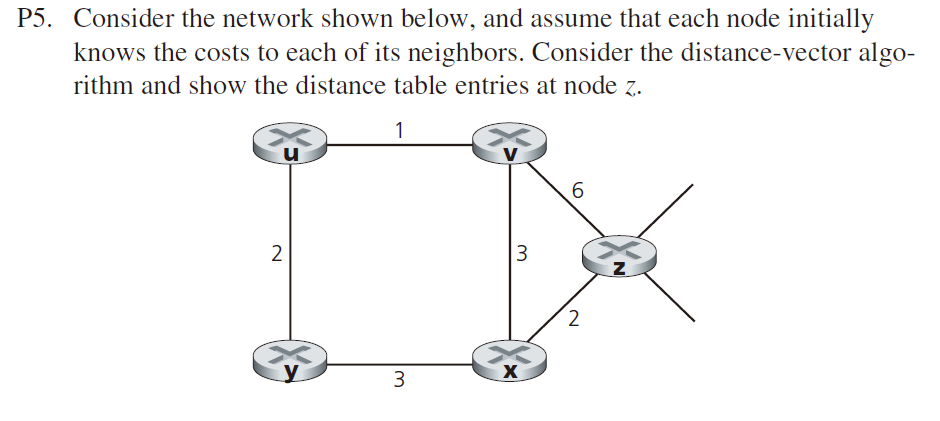
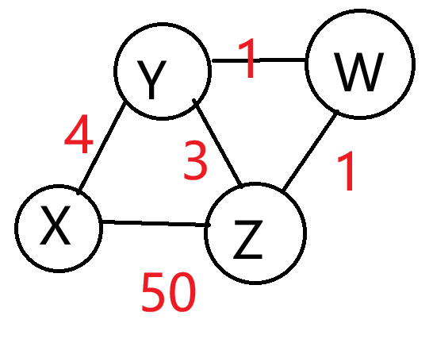
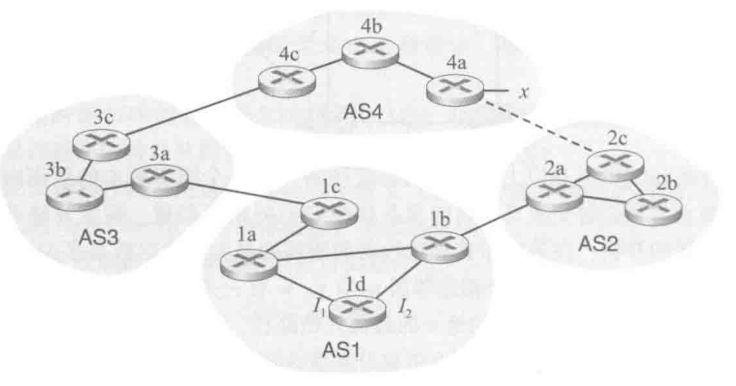
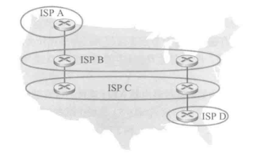
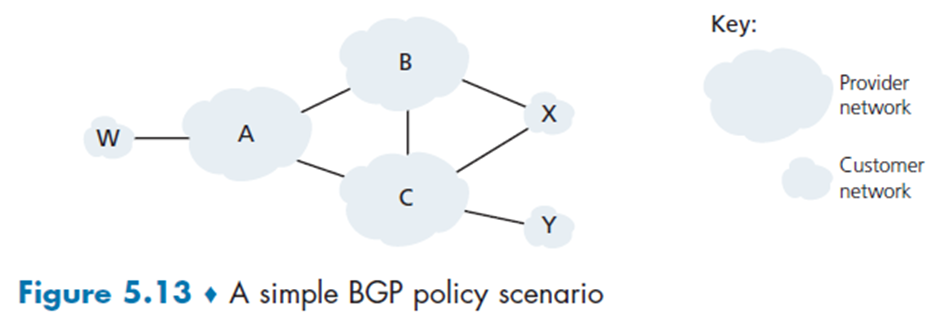
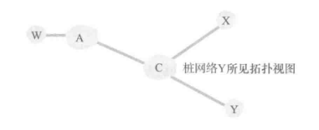
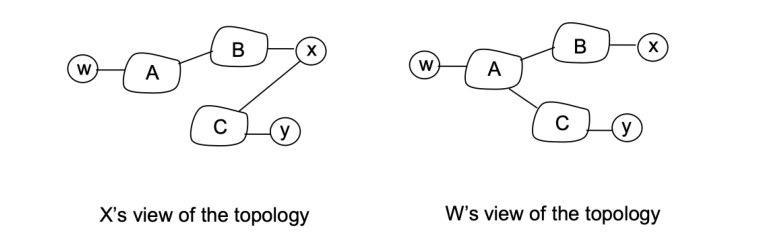
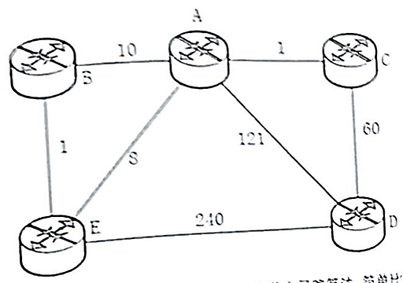

# 1	期末重点
- 主要是那几个路由算法，基本上LS和DV一定会考
- 复杂度分析可能会考
- 路由的一些问题，比如震荡，diffusion
- 好消息传得快，毒性逆转
- OSPF，BGP，知道域内域间怎么协商的
- BGP route selection
- 知道ICMP。知道他的原理

# 2	计算机网络第五章：网络层控制平面 - 习题课笔记
## 2.1	背书题

### 2.1.1	iBGP 与 eBGP 的作用

- **iBGP (Internal BGP):** 用于在**同一个自治系统（AS）内部**的路由器之间交换 BGP 路由信息。其主要目的是确保 AS 内部的所有 BGP 路由器对外部路由有一致的视图。
- **eBGP (External BGP):** 用于在**不同的自治系统（AS）之间**交换路由信息。它是互联网及大型数据中心不同管理域之间实现通信的基础。

### 2.1.2	BGP 避免路由环路的方法

BGP 防止 **AS 间环路**的核心机制是利用 **AS_PATH 属性**：

- 当 BGP 路由器将路由发布到其他 AS 时，会将自己的 AS 号添加到路由条目的 `AS_PATH` 列表开头。
- 当路由器收到一条路由更新报文时，会检查 `AS_PATH` 列表。如果**发现列表中包含自己的 AS 号**，则说明该路由已经过本 AS，存在环路风险，于是会**丢弃**该更新报文。

## 2.2	1. 路由器架构与垂直集成（R1）

在传统的网络架构中，每一个路由器都集成了控制平面和数据平面的功能。这意味着每一个路由器既要负责计算路由表（控制平面），又要根据路由表进行数据的转发（数据平面）。

这种架构被称为**垂直集成**。它通常是集成在一个设备上的，从底层的硬件、到操作系统、再到上层的软件，全部由同一个厂商（如思科、华为等）完成。控制平面和数据平面通过路由表进行交互：控制平面计算出路由表，数据平面依据路由表进行查表转发。

---
R1 基于每路由器控制的控制平面意味着什么？在这种情况下，当我们说网络控制平面和数据平面是整体地实现时，是什么意思？

答：每路由器控制意味着路由算法在每个路由器中运行；转发和路由功能都受限于每个路由器。每个路由器都有一个路由选择组件，与其他路由器中的路由选择组件通信，以计算其转发表的值。在这种情况下，我们说网络控制和数据平面是“整体地”实现的，因为每个路由器都作为一个独立的实体工作，实现自己的控制和数据平面。

## 2.3	2. 链路状态（LS）与距离向量（DV）算法的比较（R4）

我们需要对比链路状态算法（Link State）和距离向量算法（Distance Vector）。

*   **全局性与局部性**：链路状态算法是一个全局算法，它需要网络中每个节点都获得完整的网络拓扑结构和链路代价，这通常是一次性计算完成的（如Dijkstra算法）。而距离向量算法是一个局部算法，节点只与邻居交换信息，是一个迭代的过程。
*   **计算方式**：LS算法在拿到拓扑和代价后，可以一次性算出最短路径。DV算法则需要随着时间的推移，经过一次次的迭代，最终收敛到一个稳定的真实状态。
*   **性能指标对比**：
    *   **消息复杂度**：DV算法通常优于LS算法。
    *   **收敛时间**：LS算法通常优于DV算法（DV存在收敛慢的问题）。
    *   **健壮性（鲁棒性）**：LS算法优于DV算法。DV算法存在“坏消息传得慢”以及“计数到无穷大”的问题，某个节点的错误信息可能会扩散并影响整个网络。

- **链路状态算法 (Link State, LS)：** 使用的是 **Dijkstra 算法**（最短路径优先算法）。
- **距离向量算法 (Distance Vector, DV)：** 使用的是 **Bellman-Ford 算法**。

**链路状态 (LS) 与 距离向量 (DV) 算法的区别：**

| **比较维度** | **链路状态算法 (LS)**          | **距离向量算法 (DV)**          |
| -------- | ------------------------ | ------------------------ |
| **掌握信息** | 每个节点掌握**全局**拓扑结构和所有链路代价。 | 每个节点仅知道与其**相邻**节点的距离和方向。 |
| **收敛速度** | 收敛速度快，算法运行复杂度相对较高。       | 收敛速度较慢，且可能出现“计数到无穷”问题。   |
| **健壮性**  | 较好。节点只广播自己的链路状态，故障扩散有限。  | 较差。一个节点向全网传播错误的路径代价。     |
| **消息开销** | 链路状态改变时广播，消息量较大（全网广播）。   | 仅在相邻节点间交换路由表，消息量相对较小。    |

## 2.4	3. 自治系统内部与自治系统间的路由（R7）

网络路由分为自治系统内部（Intra-AS）和自治系统之间（Inter-AS）两种，为什么需要这两种不同的机制？

*   **自治系统内部（Intra-AS）**：
    *   **关注点**：主要关注**性能**。同一个网络拥有者（如一个机构或ISP）希望内部的数据传输尽可能快、代价尽可能低，让分组尽快互通互达。
    *   **策略**：不关心策略（Policy），大家都是自己人。
    *   **规模性**：规模性不是一个特别突出的问题。如果内部网络太大，可以通过划分子网或小的区域来解决，路由器的数量相对可控。
*   **自治系统之间（Inter-AS）**：
    *   **关注点**：主要关注**策略**（Policy）。也就是要控制网络资源谁在使用、谁可以使用。例如，包含了“金策略”（收费）和“政策略”（竞争关系或政治原因导致的拒绝过路）。
    *   **规模性**：这是一个巨大的问题。全球有大量的自治系统，必须解决规模问题，否则路由表会大到无法处理，导致分组无法传送到目的地。BGP协议就是为了解决这一问题设计的。

## 2.5	4. OSPF协议的泛洪范围（R8）

针对一个判断题：OSPF路由器是否只向其邻居散播链路状态分组？

**答案是否定的**。OSPF路由器不仅仅向邻居发送，而是要在**整个自治系统内**（或者更准确地说是同一个OSPF区域 Area 内）进行泛洪。虽然像OSPF这样的协议会将大的AS划分为小的Area，在Area内部做泛洪，但绝对不仅仅局限于邻居之间。

## 2.6	R12高层ISP管理BGP

**R12. 描述一个较高层 ISP 的网络管理员在配置 BGP 时是如何实现策略的。**

在互联网层次结构中，较高层 ISP（如 Tier-1 或 Tier-2 运营商）的网管并不只是让路由器自动寻找“最短路径”。相反，BGP（边界网关协议）被视为一种**基于策略的路由协议**。

### 2.6.1	1. BGP 策略实施的核心机制：路由映射 (Route Maps)

管理员几乎所有的策略逻辑都是通过 **Route Maps** 实现的。它类似于编程中的 `if-then` 语句：

- **Match 语句**：识别特定的路由（例如：特定的前缀、特定的来源 AS）。
- **Set 语句**：一旦匹配成功，就修改该路由的 BGP 属性，从而改变流量的方向。

---

### 2.6.2	2. 影响路径选择的关键属性 (Path Attributes)

管理员通过修改以下属性来实现特定的流量工程目标：

#### 2.6.2.1	A. 操控流出流量 (Outbound Traffic) —— Local Preference

这是 ISP 最常用的工具。
- **原理**：数值越高越优先。仅在本自治系统（AS）内传播。
- **策略应用**：如果 ISP 有两个出口，一个是昂贵的“付费过境（Transit）”，另一个是免费的“对等连接（Peering）”，管理员会为 Peer 传来的路由设置更高的 Local Preference（如 200），而为 Transit 设置较低的值（如 100）。

#### 2.6.2.2	B. 操控流入流量 (Inbound Traffic) —— AS-Path Prepending

管理员无法直接命令外部网络如何发包，但可以“诱导”它们。

- **原理**：BGP 偏好 AS-Path 长度更短的路径。
- **策略应用**：如果管理员希望流量不从某个特定接口进入，他会在向外发布路由时，人为地重复添加自己的 AS 号（例如：将 `AS 100` 变为 `AS 100 100 100`），使该路径看起来很长，从而降低其吸引力。

#### 2.6.2.3	C. 细粒度控制流入流量 —— MED (Multi-Exit Discriminator)

- **原理**：数值越低越优先。用于告知邻居 AS 应该从哪个入口进入本网络。
- **策略应用**：当两个 ISP 在多个城市都有物理互联点时，管理员通过设置 MED 来指定流量应从北京还是上海进入。
---

### 2.6.3	3. 路由过滤与安全性 (Filtering)

较高层 ISP 必须严格控制接收和发送的信息，以防止路由黑洞或劫持。

- **前缀列表 (Prefix Lists)**：
    - 管理员会配置精确的 IP 掩码范围。
    - **策略**：拒绝接收私有 IP 地址（RFC 1918）或本不该由该客户拥有的 IP 段。
- **AS-Path 过滤器**：
    - 使用正则表达式（Regex）匹配 AS 路径。
    - **策略**：例如 `^$` 表示仅接收源自直接邻居的路由，防止邻居将整个互联网的路由表都发给自己。
        

---

### 2.6.4	4. 社区属性 (BGP Communities) 的高级运用

这是大型 ISP 实现自动化策略的精髓。**Community** 是一个 32 位的标记（Tag），附加在路由条目上。
- **客户控制**：ISP 给客户提供特定的 Community 值。例如，如果客户发送的路由带有 `65000:80` 标记，ISP 的路由器会自动匹配并将该路由的 Local Preference 设为 80。
- **区域标记**：管理员会给所有从欧洲收到的路由打上“欧洲”标签，以便后续针对整个地理区域统一调整策略。

---

### 2.6.5	5. 策略实施的完整流程 (The Implementation Flow)

当一条路由更新进入路由器时，管理员设置的策略按以下顺序执行：

1. **入站过滤 (Inbound Filtering)**：使用 Prefix-list 或 AS-Path filter 决定是否允许该路由进入。
2. **入站属性修改**：通过 Route Map 修改 Local Preference 或打上 Community 标签。
3. **BGP 决策算法 (Decision Process)**：
    - 1. 最高 Weight (Cisco 私有)
    - 2. 最高 Local Preference
    - 3. 本地发起的路由
    - 4. 最短 AS-Path
    - 5. 最低 Origin 类型 (IGP < EGP < Incomplete)
    - 6. 最低 MED
    - 7. eBGP 优于 iBGP
    - 8. 最近的 IGP 邻居 (Hot Potato Routing)
4. **出站属性修改**：在向邻居通告前，决定是否要进行 AS-Path Prepending 或设置 MED。
5. **出站过滤 (Outbound Filtering)**：决定哪些路由不应该发给邻居（例如，不能把从一个 Transit 供应商收到的路由发给另一个 Transit 供应商，否则会变成免费中转站）。

---

### 2.6.6	6. 商业策略的体现：商业关系模型

ISP 管理员在配置时严格遵循以下准则：

- **从客户处收到的路由**：发布给所有人（客户、对等体、供应商）。
- **从对等体 (Peer) 或供应商 (Provider) 收到的路由**：**仅**发布给自己的客户。
- **目的**：确保自己只为能带来收益的流量提供中转服务，避免承担昂贵的第三方流量支出。
    

### 2.6.7	课本答案
A tier-1 ISP $B$ may not to carry transit traffic between two other tier-1 ISPs, say $A$ and $C$, with which $B$ has peering agreements. To implement this policy, ISP $B$ would not advertise to $A$ routes that pass through $C$; and would not advertise to $C$ routes that pass through $A$.

## 2.7	R13
R13.是非判断题：当BGP路由器从它的邻居接收到一条通告的路径时，它必须对接收路径增加上它自已的标识，然后向其所有邻居发送该新路径。解释理由

FALSE;
A BGP router can choose not to add its own identity to the received path and then send that new path on to all of its neighbors, as BGP is a policy-based routing protocol. This can happen in the following scenario. The destination of the received path is some other AS, instead of the BGP router’s AS, and the BGP router does not want to work as a transit router.

## 2.8	ICMP两个题

### 2.8.1	R19. 列举4种不同类型的ICMP报文。

- Echo reply (to ping), type 0, code 0
- Destination network unreachable, type 3 code 0
- Destination host unreachable, type 3, code 1.
- Source quench (congestion control), type 4 code 0.

### 2.8.2	R20. 在发送主机执行Traceroute程序，收到哪两种类型的ICMP报文？
ICMP warning message (type 11 code 0) and a destination port unreachable ICMP message (type 3 code 3).

## 2.9	距离向量算法计算实例（P5）

这道题考察距离向量（Distance Vector）算法的更新过程。

*   **初始状态**：以节点Z为例。Z知道到自己的代价是0。Z能测量到直接邻居（如V和X）的链路代价（例如到V是2，到X是6）。此时，Z到其他非邻居节点的代价是无穷大。
*   **信息交换与更新**：
    *   V测量并计算出自己的距离向量后，会发给Z。
    *   X测量并计算出自己的距离向量后，也会发给Z。
    *   Z收到邻居的向量后，利用Bellman-Ford方程进行计算：$D_z(y) = min \{ C(z,v) + D_v(y), \dots \}$。即Z到某个目的地的代价，等于Z到邻居的代价加上邻居到该目的地的代价，取最小值。
*   **时空概念**：距离向量算法可以看作是一个随着时间（迭代次数）推移，在空间（节点）上传递信息的过程。
*   **考试说明**：通常不会要求计算大规模网络的完整收敛过程（那需要计算机来做），一般只要求计算某个节点收到邻居信息后的一次更新结果。

Cost to

| From | u   | v   | x   | y   | z   |
|------|-----|-----|-----|-----|-----|
| v    | ∞   | ∞   | ∞   | ∞   | ∞   |
| x    | ∞   | ∞   | ∞   | ∞   | ∞   |
| z    | ∞   | 6   | 2   | ∞   | 0   |

Cost to

| From | u   | v   | x   | y   | z   |
|------|-----|-----|-----|-----|-----|
| v    | 1   | 0   | 3   | ∞   | 6   |
| x    | ∞   | 3   | 0   | 3   | 2   |
| z    | 7   | 5   | 2   | 5   | 0   |

Cost to

| From | u   | v   | x   | y   | z   |
|------|-----|-----|-----|-----|-----|
| v    | 1   | 0   | 3   | 3   | 5   |
| x    | 4   | 3   | 0   | 3   | 2   |
| z    | 6   | 5   | 2   | 5   | 0   |

Cost to

| From | u   | v   | x   | y   | z   |
|------|-----|-----|-----|-----|-----|
| v    | 1   | 0   | 3   | 3   | 5   |
| x    | 4   | 3   | 0   | 3   | 2   |
| z    | 6   | 5   | 2   | 5   | 0   |

## 2.10	P6DV算法最多进行多少轮
考虑一个一般性拓扑（即不是以上所显示的特定网络）和一个同步版本的距离向量算法。假设每次迭代时，一个节点与其邻居交换其距离向量并接收它们的距离向量。假定算法开始时，每个节点只知道到其直接邻居的开销，在该分布式算法收敛前所需的最大迭代次数是多少？评估你的答案。

### 2.10.1	核心结论

在一个拥有 $N$ 个节点的网络中，该算法收敛所需的最大迭代次数为 **$N-1$** 次。

---

### 2.10.2	详细评估与分析

#### 2.10.2.1	1. 算法的工作原理

距离向量算法是基于 **Bellman-Ford 算法**的分布式实现。其核心特性是**信息的逐跳传递**：在同步算法的每一次迭代中，每个节点都会向邻居发送自己的距离向量。这意味着，关于某个目的地的信息每经过一次迭代，就会向外传播 **1 跳（Hop）**。

#### 2.10.2.2	2. 最坏情况分析（线性拓扑）

为了确定“最大迭代次数”，我们需要考虑网络直径最大的情况，即**线性拓扑（Line Topology）**或链状拓扑：

节点1 - 节点2 - 节点3 - ... - 节点N

- **初始状态（第 0 次迭代前）**：题目已知，每个节点只知道到其**直接邻居**的开销。这意味着每个节点已经掌握了所有距离为 **1 跳** 的路径信息。
- **第 1 次迭代**：节点通过交换向量，学习到距离为 **2 跳** 的最短路径。
- **第 $k$ 次迭代**：节点学习到距离为 **$k+1$** 跳的最短路径。
- **目标**：在一个 $N$ 节点的网络中，任意两点间的最短路径最多包含 **$N-1$ 条边**（即 $N-1$ 跳）。
    

#### 2.10.2.3	3. 计算迭代次数

- 要学习到 $N-1$ 跳的路径，根据上述推导，需要满足 $k+1 = N-1$，即 **$k = N-2$** 次迭代。
    
- **收敛的定义**：在分布式系统中，“收敛”通常意味着所有节点的路由表不再发生变化。虽然在 $N-2$ 次迭代时所有最短路径已经找到，但在第 **$N-1$** 次迭代中，节点仍会进行一次交换以确认没有任何路径开销发生变化。只有当这次交换完成后，算法才正式进入稳定（收敛）状态。
    

### 2.10.3	评估结论

- **理论最大值**：$N-1$。这是基于网络中存在 $N-1$ 跳的最长路径（线性拓扑）且需要一次额外迭代来确认稳定性的结论。
- **实际依赖性**：算法收敛的次数实际上取决于**网络的直径 $D$**（即网络中任意两点间最短路径的最大跳数）。在更复杂的拓扑（如全互连或网状拓扑）中，收敛速度会快得多（通常为 $D$ 或 $D-1$ 次）。
- **注意点**：此结论假设链路开销是静态的或减小的。如果链路开销增大，可能会引发“计数到无穷大”（Count-to-Infinity）问题，导致收敛时间极长，但在纯粹的初始收敛场景下，上限依然由节点数决定。

## 2.11	P11. 毒性翻转
考虑图5-7。假定有另一台路由器$w$，与路由器$y$和$z$连接。所有链路的开销给定如下：$c(x,y)=4$，$c(x,z)=50$，$c(y,w)=1$，$c(z,w)=1$，$c(y,z)=3$。假设在距离向量路由选择算法中使用了毒性逆转。

a. 当距离向量路由选择稳定时，路由器$w$、$y$和$z$向$x$通知它们之间的距离。它们告诉彼此什么样的距离值？

b. 现在假设$x$和$y$之间的链路开销增加到60。如果使用了毒性逆转，将会存在无穷计数问题吗？为什么？如果存在无穷计数问题，距离向量路由选择需要多少次迭代才能再次到达稳定状态？评估你的答案。

c. 如果$c(y,x)$从4变化到60，怎样修改$c(y,z)$才能不存在无穷计数问题？

---

### 2.11.1	a. 稳定状态下的距离通知

在算法稳定时，每个路由器都会找到到达 $x$ 的最短路径。我们先计算各点到 $x$ 的最短路径：

- **$y$ 到 $x$：** 直接链路 $y \to x$，开销为 **4**。
- **$w$ 到 $x$：** 路径 $w \to y \to x$，开销为 $1 + 4 =$ **5**。
- **$z$ 到 $x$：** 路径 $z \to w \to y \to x$，开销为 $1 + 1 + 4 =$ **6**。（注：$z \to y \to x$ 为 7，$z \to x$ 为 50，均不是最短）。

**毒性逆转规则：** 如果节点 $A$ 通过节点 $B$ 到达目的地 $D$，则 $A$ 向 $B$ 通告其到 $D$ 的距离为 $\infty$。

根据此规则，路由器 $w, y, z$ 向彼此通知的距离值如下：

| **通知方向**      | **实际路径**              | **是否通过接收者** | **通知 x 的距离值** |
| ------------- | --------------------- | ----------- | ------------- |
| **$y \to w$** | $y \to x$             | 否           | **4**         |
| **$y \to z$** | $y \to x$             | 否           | **4**         |
| **$w \to y$** | $w \to y \to x$       | **是**       | **$\infty$**  |
| **$w \to z$** | $w \to y \to x$       | 否           | **5**         |
| **$z \to w$** | $z \to w \to y \to x$ | **是**       | **$\infty$**  |
| **$z \to y$** | $z \to w \to y \to x$ | 否           | **6**         |

---

### 2.11.2	b. 链路开销 $c(x,y)$ 增加到 60 后的详细过程

#### 2.11.2.1	1. 为什么存在无穷计数问题？

**存在。** 正如图像所示，$y, w, z$ 三个节点之间形成了路径环路。毒性逆转（Poison Reverse）只能解决两个节点间的直接环路（如 $A-B$ 互跳），但在本题中，$z$ 到达 $x$ 的路径是 $z \to w \to y \to x$。

- 当 $y$ 失去到 $x$ 的低开销路径时，它会向 $z$ 寻求帮助。
- 由于 $z$ 的直接下一跳是 $w$ 而不是 $y$，毒性逆转不会触发（即 $z$ 不会向 $y$ 通报 $\infty$）。
- $y$ 误以为 $z$ 有一条不经过自己的路，导致三者陷入 $y \to z \to w \to y$ 的持续增量更新中。

---

#### 2.11.2.2	2. 到达稳定状态的详细推导步骤

我们将根据图像中的 $t_n$ 时间轴，严格推导每一跳的开销变化。环路的总增加步长为 **5**（即 $c(y,z) + c(z,w) + c(w,y) = 3+1+1=5$）。

##### 2.11.2.2.1	初始阶段（$t_0$ 到 $t_4$）：
- **$t_0$ (链路变化前稳定态):**
    - $y$ 到 $x$ 开销为 4。
    - $w$ 通过 $y$ 到达 $x$，$D_w(x) = 1+4=5$。向 $y$ 通报 $\infty$（毒性逆转），向 $z$ 通报 5。
    - $z$ 通过 $w$ 到达 $x$，$D_z(x) = 1+5=6$。向 $w$ 通报 $\infty$（毒性逆转），向 $y$ 通报 6。
        
- **$t_1$ ($y$ 更新):** $c(x,y)$ 变为 60。$y$ 检查邻居，$z$ 通报的 6 最优。
    - $D_y(x) = c(y,z) + 6 = 9$。
    - $y$ 向 $w$ 通报 **9**；向 $z$ 通报 **$\infty$**（因为 $y$ 现在用 $z$ 走）。
- **$t_2$ ($w$ 更新):** $w$ 收到 $y$ 的 9。
    - $D_w(x) = c(w,y) + 9 = 10$。
    - $w$ 向 $z$ 通报 **10**；向 $y$ 通报 **$\infty$**。
- **$t_3$ ($z$ 更新):** $z$ 收到 $w$ 的 10。
    - $D_z(x) = c(z,w) + 10 = 11$。
    - $z$ 向 $y$ 通报 **11**；向 $w$ 通报 **$\infty$**。
- **$t_4$ ($y$ 更新):** $y$ 收到 $z$ 的 11。
    - $D_y(x) = 3 + 11 = 14$。

##### 2.11.2.2.2	迭代规律与最终稳定（$t_4$ 到 $t_{31}$）：

通过观察，每经过 3 个时间单位，各节点的距离值增加 5。

- **临界点计算：** $z$ 有一条直接连接 $x$ 的链路，开销为 **50**。当环路计算出的开销超过 50 时，$z$ 将切换到直接链路。
- **$t_{24}$：** 经过多轮循环后，$z$ 向 $y$ 通报 $D_z(x) = 46$。
- **$t_{25}$：** $y$ 更新并通报 $w$，$D_y(x) = 46 + 3 = 49$。
- **$t_{26}$：** $w$ 更新并通报 $z$，$D_w(x) = 49 + 1 = 50$。
- **$t_{27}$ ($z$ 的转折点):** * $z$ 计算：$\min(c(z,x), c(z,w) + 50) = \min(50, 51) = 50$。
    - $z$ 放弃环路，选择直接链路，向 $w$ 和 $y$ 通报 **50**。
- **$t_{29}$ ($w$ 更新):** $w$ 收到 $z$ 的 50。
    - $D_w(x) = c(w,z) + 50 = 51$。
- **$t_{30}$ ($y$ 更新):** $y$ 收到 $w$ 的 51。
    - $D_y(x) = c(y,w) + 51 = 52$。（注：通过 $z$ 则是 $3+50=53$，通过 $x$ 是 60，故 52 最优）。
- **$t_{31}$:** 所有通报完成，路径不再变化，系统进入稳定状态。
    
**评估结果：** 距离向量路由选择需要 **31 次迭代（或时间单位）** 才能再次到达稳定状态。

---

### 2.11.3	c. 修改 $c(y, z)$ 以避免无穷计数

要避免无穷计数，必须破坏 $y$ 在 $c(y, x)$ 失效时选择 $z$ 作为“快捷方式”的幻想。

当 $c(y, x)$ 变为 60 时，$y$ 计算通过 $z$ 的开销为 $c(y, z) + D_z(x)$。

为了让 $y$ 直接选择 $c(y, x)=60$ 或者等待其他节点发现正确路径，而不进入环路，需要满足：

$$c(y, z) + D_z(x) > 60$$

已知在链路变化前，$D_z(x) = 6$。

修改方案：将 $c(y, z)$ 的值增加到 54 以上。

$$c(y, z) > 54$$

如果 $c(y, z) > 54$，那么当 $x-y$ 链路变动时，$y$ 计算通过 $z$ 的开销 $c(y, z) + 6$ 会大于 60。此时 $y$ 会直接选择 $D_y(x) = 60$，从而避免了选择环路，消除无穷计数问题。

**或者课本答案更粗暴，直接切断yz**

## 2.12	BGP 路由选择策略与层级（P14 / 3C问题和P15）

这道题涉及跨自治系统的BGP路由选择。假设有AS1, AS2, AS3, AS4。目标网络X在AS4中。

答:
a、路由器 3c 从路由器 4c 处学习到前缀 $x$，所以是外部 BGP（eBGP）。
b、路由器 3a 从路由器 3c 处学习到前缀 $x$，所以是内部 BGP（iBGP）。
c、路由器 1c 从路由器 3a 处学习到前缀 $x$，所以是外部 BGP（eBGP）。
d、路由器 1d 从路由器 1c 处学习到前缀 $x$，所以是内部 BGP（iBGP）。

---

参考上一习题,一旦路由器1d知道了$x$的情况,它将一个表项$(x,I)$放入其转发表中。

a. 对这个表项而言,$I$将等于$I_1$还是$I_2$? 用一句话解释其原因。
b. 现在假定在 AS2 和 AS4 之间有一条物理链路,显示为图中的虚线。假定路由器 1d 知道经 AS2 以及经 AS3 能够访问到$x$。$I$将设置为$I_1$还是$I_2$? 用一句话解释其原因。
c. 现在假定有另一个 AS,它称为 AS5,其位于路径 AS2 和 AS4 之间 (没有显示在图中)。假定路由器 1d 知道经 AS2 AS5 AS4 以及经 AS3 AS4 能够访问到$x$。$I$将设置为$I_1$还是$I_2$? 用一句话解释其原因。

答:
a、$I$等于 $I_1$，因为 $I_1$ 离 1c 的距离更近。
b、$I$等于 $I_2$, 通过 1c, 1b 都需要两大跳, AS-PATH 相同, 但是在自治区内部 1b 距离 1d 更近, 最靠近 NEXT-HOP 路由器。
c、$I$等于 $I_1$, 通过 1c 需要自治区之间的两大跳, 通过 1b 需要三大跳, 通过 1c 的 AS-PATH 更短。

## 2.13	P16

考虑下面的网络。ISP B为地区ISP A提供国家级主干服务。ISP C为地区ISP D提供国家级主干服务。每个ISP由一个AS组成。B和C使用BGP，在两个地方互相对等。考虑从A到D的流量。B愿意将流量交给C传给西海岸（使得C将承担承载跨越整个国家的流量的开销），而C愿意经其东海岸与B对等的站点得到这些流量（使得B将承载跨越整个国家的流量）。C可能会使用什么样的BGP机制，使得B将通过东海岸对等点传递A到D的流量？要回答这个问题，你需要钻研BGP规范。

One way for C to force B to hand over all of B’s traffic to D on the east coast is for C to only advertise its route to D via its east coast peering point with C.

## 2.14	BGP路由选择策略

本题展示了一个包含 6 个自治系统的网络拓扑：**A、B、C 是主干提供商网络（互为对等关系）**，而 **W、X、Y 是客户网络（桩网络）**。其中 W 连接到 A，Y 连接到 C，而 **X 是一个双归属（Multi-homed）网络**，同时连接到 B 和 C。

策略的核心在于：X 不会向 B 通告它通往 C 的路径，反之亦然，以防自己变成 B 和 C 之间的免费中转站；同理，主干网 A、B、C 之间也只为各自的客户提供中转。

- **W 是 A 的客户**：W 作为一个接入 ISP，通过 A 连接到主干网。
- **Y 是 C 的客户**：Y 也是一个接入 ISP，通过 C 连接到主干网。
- **X 是 B 和 C 的客户**：这是一个**多宿（multi-homed）**客户，它同时连接了两个不同的提供商（B 和 C）。
- **A、B、C 互为对等（Peer）关系**：它们是主干网（backbone providers），彼此平等交换流量，但不互为客户。

### 2.14.1	P17.
在图5-13中，考虑到达 stub 网络 W、X 和 Y 的路径信息。基于 W 与 X 处的可用信息，它们分别看到的网络拓扑是什么？评估你的答案。Y 所见的拓扑视图如下图所示。

In the above solution, X does not know about the AC link since X does not receive an advertised route to w or to y that contain the AC link (i.e., X receives no advertisement containing both AS A and AS C on the path to a destination ）

理解这个图的关键在于：**AS 不会为两个“对等点”提供免费的中转服务。**

---

#### 2.14.1.1	1. 为什么 X 看不到 A-C 之间的连接？

在图中，A、B、C 是主干提供商且互为 **对等（Peer）关系**。

- **对等不中转规则**：AS A 不会向对等点 B 通告它通往对等点 C 的路径。 理由是：如果 A 告诉 B“我能到 C”，那么 B 可能会把发往 C 的流量丢给 A，导致 A 免费为竞争对手 B 搬运流量。
- **结果**：
    - **B 视角**：B 只知道 A（及 A 的客户 W），但不知道 A 后面还连着 C。
    - **C 视角**：C 只知道 A（及 A 的客户 W），但不知道 A 后面还连着 B。
- **对 X 的影响**：X 是 B 和 C 的客户。B 只会把自己知道的路径告诉 X。因为 B 根本不知道“A-C”这条链路的存在，它通告给 X 的路由里自然就不会包含这条线。

所以，在 **X 的视图**中，它看到的是通过 B 到达 A，或者通过 C 到达 Y，但它看不到 A 和 C 是直接相连的。

#### 2.14.1.2	2. 为什么 W 能看到 A-B 和 A-C 两条线？

这取决于 W 与 A 的关系：**W 是 A 的客户。**

- **提供商通告规则**：作为一个提供商（A），为了保证客户（W）能上全网，A 会把自己知道的所有路径都告诉 W。
- **结果**：A 知道自己左手连着对等点 B，右手连着对等点 C。 因为 W 是付钱的客户，A 会告诉 W：“我能带你到 B（去 X），也能带你到 C（去 Y）”。
- **对 W 的影响**：W 的视图里完整地保留了 A 发散出去的两条链路。

### 2.14.2	P18.
考虑图5-13。B将不会基于BGP路由选择，经过X以Y为目的地转发流量( B would never forward traffic destined to Y via X based on BGP routing. )。但是有某些极为流行的应用程序，其数据分组先朝向X，然后再流向Y。指出一种这样的应用程序，描述数据分组是如何经这条未由BGP路由选择所给定的路径传输的。

BitTorrent file sharing and Skype P2P applications.
Consider a BitTorrent file sharing network in which peer 1, 2, and 3 are in stub networks W, X, and Y respectively. Due the mechanism of BitTorrent's file sharing, it is quire possible that peer 2 gets data chunks from peer 1 and then forwards those data chunks to 3. This is equivalent to B forwarding data that is finally destined to stub network Y.

### 2.14.3	P19.
在图5-13中，假定有另一个新网络V，它为ISP A的客户。假设B和C具有对等关系，并且A是B和C的客户。假设A希望发向W的流量仅来自B，并且发向V的流量来自B或C。A如何向B和C通告其路由？C收到什么样的AS路由？

A should advise to B two routes, AS-paths A-W and A-V.
A should advise to C only one route, A-V.
C receives AS paths: B-A-W, B-A-V, A-V.
### 2.14.4	P20.
假定AS X和Z不直接连接，但与AS Y连接。进一步假定X与Y具有对等协定，Y与Z具有对等协定。最后，假定Z要传送所有有Y的流量但不传送X的。BGP允许Z实现这种策略吗？

Since Z wants to transit Y's traffic, Z will send route advertisements to Y. In this manner, when Y has a datagram that is destined to an IP that can be reached through Z, Y will have the option of sending the datagram through Z. However, if Z advertizes routes to Y, Y can re-advertize those routes to X. Therefore, in this case, there is nothing Z can do from preventing traffic from X to transit through Z.

这个答案想表达的是：**BGP 的路由过滤主要发生在“告知”阶段。** 如果 Z 想要 Y 的流量，就必须告诉 Y 路由；一旦告诉了 Y，Z 就失去了对这条路由传播的“绝对控制权”。如果 Y 把这条路泄露给了 X，X 的流量就会像“搭便车”一样通过 Y 灌进 Z 的网络里。

# 3	往年卷
## 3.1	2020国际化比较DV和LS
如图所示，某个计算机网络部分的拓扑图如下，边上的数字代表路由代价。各节点均为路由器

---

### 3.1.1	(2) 路由器 B 的路由表更新过程 (链路状态算法)

根据链路状态算法（Dijkstra），路由器 B 会计算到所有其他节点的最短路径。

已知链路权重： $(B,A)=10, (B,E)=1, (A,E)=8, (A,C)=1, (A,D)=121, (C,D)=60, (E,D)=240$。

注：图中 A-E 之间的数字视作 8。

算法执行步骤：

设 $S$ 为已确定最短路径的节点集合，$D(v)$ 为 B 到节点 $v$ 的当前最短距离。

1. **初始化：**
    - $S = \{B\}$
    - $D(A) = 10, D(E) = 1, D(C) = \infty, D(D) = \infty$
        
2. **第一步：** 在未访问节点中选择 $D(v)$ 最小的节点 **E** ($D(E)=1$)。
    - $S = \{B, E\}$
    - 更新 E 的邻居（A, D）：
        - $D(A) = \min(10, D(E) + cost(E, A)) = \min(10, 1 + 8) = \mathbf{9}$（路径：B-E-A）
        - $D(D) = \min(\infty, D(E) + cost(E, D)) = \min(\infty, 1 + 240) = \mathbf{241}$（路径：B-E-D）
            
3. **第二步：** 在未访问节点中选择 $D(v)$ 最小的节点 **A** ($D(A)=9$)。
    
    - $S = \{B, E, A\}$
    - 更新 A 的邻居（C, D）：
        - $D(C) = \min(\infty, D(A) + cost(A, C)) = \min(\infty, 9 + 1) = \mathbf{10}$（路径：B-E-A-C）
        - $D(D) = \min(241, D(A) + cost(A, D)) = \min(241, 9 + 121) = \mathbf{130}$（路径：B-E-A-D）
4. **第三步：** 在未访问节点中选择 $D(v)$ 最小的节点 **C** ($D(C)=10$)。
    - $S = \{B, E, A, C\}$
    - 更新 C 的邻居（D）：
        - $D(D) = \min(130, D(C) + cost(C, D)) = \min(130, 10 + 60) = \mathbf{70}$（路径：B-E-A-C-D）
            
5. **第四步：** 剩余节点 **D** ($D(D)=70$) 加入 $S$。
    - $S = \{B, E, A, C, D\}$，算法结束。

**最终路由器 B 的路由表信息：**

|**目的节点**|**最短代价**|**下一跳 (Next Hop)**|
|---|---|---|
|A|9|E|
|C|10|E|
|D|70|E|
|E|1|E|

---

### 3.1.2	(3) 距离向量算法中的计数到无穷问题

引起问题的链路改变方式：

链路 (C, D) 发生故障（代价变为无穷大）或代价大幅度增加。

**理由说明：**
1. **毒性逆转（Poisoned Reverse）的局限性：** 毒性逆转只能解决**两个直接相邻节点**之间的简单路由环路。例如：如果 A 通过 C 到达 D，A 会告诉 C 它的距离是无穷大。
2. **多节点环路：** 在本拓扑中，节点 A、C、D、E 构成了复杂的环状连接。当链路 (C, D) 断开时，C 可能会发现通过 A 还有路径到达 D。
3. **形成环路：** 即使有毒性逆转，如果路径依赖关系形成了一个涉及 **3 个或更多节点**的环（例如 C 认为可以通过 A 走，A 认为可以通过 E 走，E 认为可以通过某路径绕回 C），节点间会不断交换错误的、逐渐增加的代价信息，导致路由代价缓慢上升直到预定义的“无穷大”（通常是 16），这就是计数到无穷问题。
    