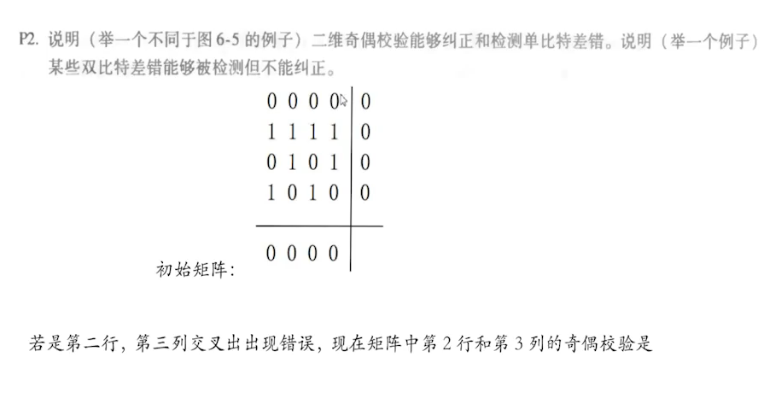
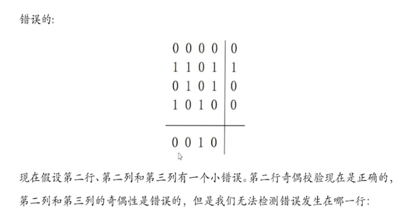
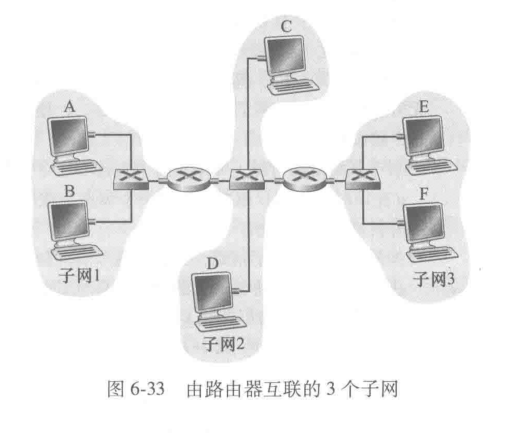
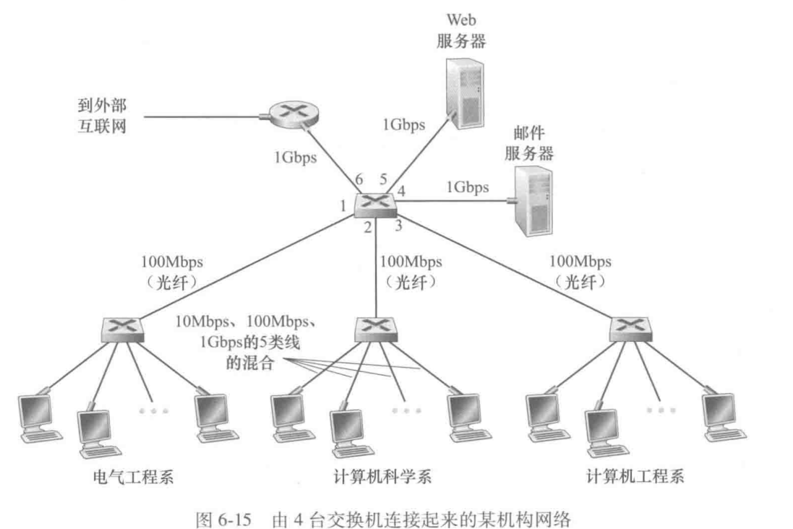
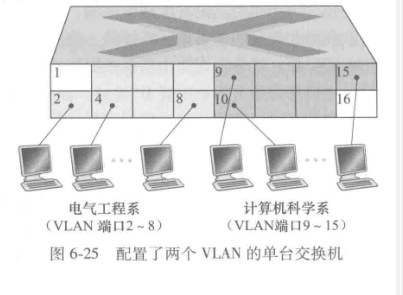
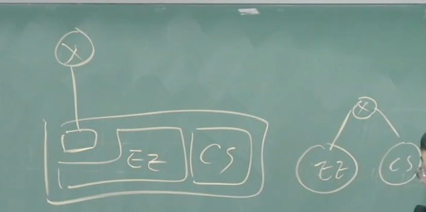
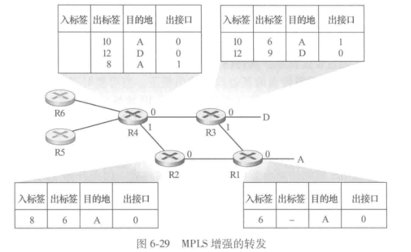
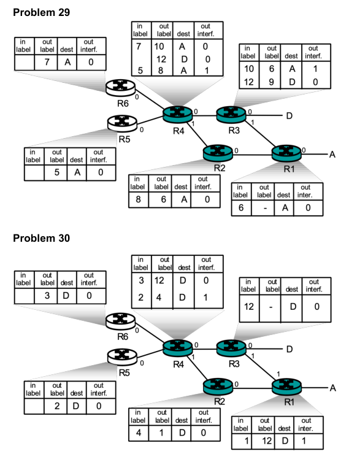

这是一份基于课堂视频内容的详细笔记总结。笔记严格遵循了老师的授课顺序，涵盖了第六章（链路层）和第八章（网络安全，但主要讲解第六章内容）的习题讲解，包括原理分析、数学推导和综合应用。

# 1	课件重点
- 基本的服务等
- CRC等错误检测
- 多路访问控制协议
- 基于信道划分，随机访问，轮询的，都要掌握重点
- 分析协议性能的内容
- CSMA/CD efficiency考察的话会给共识，还有backoff
- MAC地址的划分，ARP协议，知道如果经过路由器的话会发生什么
- 现在以太网其实用了Switch的时候就基本用不到CSMA/CD 
- Switch和router的区别
- VLANS不考了
- A day life in the life of a web request

# 2	计算机网络课堂笔记

## 2.1	背书题

### 2.1.1	请简要介绍链路层的主要功能？【看课本，七条】

1.  **成帧 (Framing)**：
    * 将来自网络层的数据报封装成链路层 **帧 (Frame)**。
    * 在数据报前后添加 **帧头 (Header)** 和 **帧尾 (Trailer)**。帧头通常包含用于链路接入控制的 **MAC地址**（物理地址），用于标识链路上的源节点和目的节点，这与网络层的IP地址不同。帧尾可能包含差错检测信息。
2.  **链路接入 (Link Access)**：
    * 发送一个帧之前要活的其使用权（Access Control)
    * 对于 **共享介质** 的链路（如无线或早期以太网），需要 **介质访问控制 (MAC)** 协议来规定节点何时可以发送数据，以避免冲突。
    * 帧头中的 **MAC地址** 用于在广播或交换式局域网中指定接收帧的下一跳节点。
3.  **可靠数据传递 (Reliable Delivery)**：
    * 在 **相邻节点之间** 提供可靠的数据传输服务（类似于传输层的RDT，但范围是单段链路）。
    * 通常在 **出错率较低** 的链路（如*光纤、双绞线*）上 **很少使用**，因为增加可靠性机制（确认、重传、序号、定时器）会带来不必要的开销，且传输层（如TCP）已提供端到端的可靠性。【以太网不用】
    * 在 **出错率较高** 的链路（如*无线链路*）上 **常常使用**，因为在链路层就纠正错误比等到传输层再重传要 **快得多**，效率更高，避免了错误向上传播。否则如果出错了就要源主机来重新发送，代价就很高。如不做local recovery 工作，总体代价大。
4.  **流量控制 (Flow Control)**：
    * 协调 **相邻** 发送节点和接收节点之间的发送速率，防止快速的发送方淹没慢速的接收方。这与传输层的 **端到端** 流量控制不同。
5.  **差错检测 (Error Detection)**：
    * 由于信号衰减、电磁噪声等原因，传输过程中可能会产生比特错误。
    * 链路层协议通常会包含差错检测机制（如使用校验和、CRC校验码等添加在帧尾）。
    * 接收方检测到错误后，可以 **通知发送方重传**（如果实现了可靠传输）或者 **简单地丢弃** 这个错误的帧。
6.  **差错纠正 (Error Correction)**：
    * 接收方不仅能检测到错误，还能 **直接纠正** 一定范围内的比特错误，而 **无需请求重传**。这通常需要更复杂的编码方案，在出错率不高的时候使用。
7.  **半双工与全双工 (Half-duplex and Full-duplex)**：
    * **半双工**：链路两端的节点都可以发送和接收，但不能同时进行。就像对讲机，一次只能有一个方向说话。
    * **全双工**：链路两端的节点可以 **同时** 发送和接收。就像打电话。

### 2.1.2	**请列举三种常用的 L2 层网络设备。**

L2 层即**数据链路层** (Data Link Layer)，该层工作的设备主要识别 MAC 地址并进行帧（Frame）的转发。

**三种常用设备：**

1. **网桥 (Bridge)**
2. **交换机 (Switch)** —— 特指二层交换机
3. **网卡 (Network Interface Card, NIC)**

_(注：有些人可能会提到集线器/Hub，但它是 L1 物理层设备；路由器/Router 是 L3 网络层设备。)_

## 2.2	补充网桥
**网桥 (Bridge)** 就像是连接两个独立房间（局域网网段）的“智能门卫”。

在计算机网络中，它是一种工作在 **OSI 模型第 2 层（数据链路层）** 的设备。它的核心作用是将两个或多个网络网段（Segment）连接起来，使它们在逻辑上看起来像是一个单一的网络。

为了让你更直观地理解，我将从它的核心功能、工作原理以及它在现代网络中的位置三个方面来解释：

### 2.2.1	1. 核心功能：隔离与互联

- **连接网段：** 最早期的以太网（使用集线器 Hub）如果设备太多，冲突会非常严重。网桥可以将一个大的网络切分为两个小的“冲突域”。
- **智能过滤（门卫作用）：**
    - **Hub（集线器）** 是个大喇叭，左边房间的人说话，它会无脑广播给右边房间的所有人。
    - **Bridge（网桥）** 是个聪明的门卫。如果左边房间的 A 想跟同房间的 B 说话，网桥知道 B 就在左边，**不会**把数据放行到右边房间（减少干扰）。只有当 A 想找右边房间的 C 说话时，网桥才会把数据放过去。

### 2.2.2	2. 工作原理（三板斧）

网桥依靠一张**MAC 地址表**来工作，这张表是它自己“学习”出来的：
1. **学习 (Learning)：** 当数据帧经过网桥时，它会看“源 MAC 地址”。比如收到来自 A 的数据，它就记下：“哦，A 在我的 1 号接口这边”。
2. **转发 (Forwarding)：** 当它看到数据帧的“目的 MAC 地址”在另一个接口的记录中时，它就精准地把数据转过去。
3. **泛洪 (Flooding)：** 如果网桥不知道“目的 MAC 地址”在哪里（表中没记录），它只能暂时像 Hub 一样，向除了来源接口以外的所有接口广播，直到找到目标。

### 2.2.3	3. 网桥 vs. 交换机 vs. 路由器

这是最容易混淆的地方，用一个比喻来区分：

| **设备**           | **层次**   | **比喻**     | **区别**                                                |
| ---------------- | -------- | ---------- | ----------------------------------------------------- |
| **集线器 (Hub)**    | L1 物理层   | **简单的接线板** | 纯电气连接，无脑广播，所有设备共享带宽。                                  |
| **网桥 (Bridge)**  | L2 数据链路层 | **双向两车道**  | 通常只有 **2 个端口**，软件处理，速度较慢。                             |
| **交换机 (Switch)** | L2 数据链路层 | **多层立交桥**  | 本质上是**多端口网桥**。使用硬件芯片（ASIC）加速，几十个端口可以同时高速转发，是网桥的“进化版”。 |
| **路由器 (Router)** | L3 网络层   | **邮局/快递站** | 负责不同网络（如你的家和互联网）之间的地址转换和路径规划。                         |

### 2.2.4	4. 网桥现在还在用吗？

虽然传统的双端口硬件网桥已经被交换机取代了，但在现代技术中，“网桥”的概念依然无处不在：

- **无线网桥 (Wireless Bridge)：** 你在只有有线网络的地方装一个无线路由器作为“中继”，或者连接两栋大楼的无线设备，这就是无线网桥。
- **软件网桥 (Docker/虚拟机)：** 在你的电脑上运行虚拟机（VM）或 Docker 容器时，系统会在内部创建一个虚拟的“Linux Bridge (docker0)”。这让你的虚拟机虽然在软件里，却能像物理机一样连入网络。

## 2.3	 R2：链路层可靠性与TCP可靠性的关系

R2. 如果在因特网中的所有链路都提供可靠的交付服务, TCP 可靠传输服务将是多余的吗? 为什么?

TCP 可靠传输服务不是多余的。虽然每个链接都保证通过该链接发送的 IP 数据报将在链接的另一端被接收而不会出现错误, 但不能保证 IP 数据报将按正确的顺序到达最终目的地。使用 IP, 同一 TCP 连接中的数据报可以在网络中采取不同的路由, 因此到达顺序不一致。仍然需要 TCP 以正确的顺序向应用程序的接收端提供字节流。此外, IP 可能由于路由循环或设备故障而丢失数据包。

---
## 2.4	R3.链路层的可能服务
链路层协议能够向网络层提供哪些可能的服务？在这些链路层服务中，哪些在IP中有对应的服务？哪些在TCP中有对应的服务？

- Framing: there is also framing in IP and TCP; 
- link access; 
- reliable delivery: there is also reliable delivery in TCP; 
- flow control: there is also flow control in TCP; 
- error detection: there is also error detection in IP and TCP; 
- error correction; 
- full duplex: TCP is also full duplex.

## 2.5	R5.四种特性
在6.3节中，我们列出了广播信道的4种希望的特性。这些特性中的哪些是时隙ALOHA所具有的？令牌传递具有这些特性中的哪些？

1.  **单一节点发送**：当只有一个节点需要发送时，它应该能够以信道的全部速率 $R$ 进行发送。
2.  **M个节点发送**：当有 $M$ 个节点需要发送时，每个节点应该能够以平均速率 $R/M$ 发送。即公平共享带宽。
3.  **完全分布式**：协议不应依赖某个特殊节点来协调（没有主节点），也不需要在节点间进行时钟同步。
4.  **简单**：协议应易于实现和理解。

Slotted Aloha: 1, 2 and 4 (slotted ALOHA is only partially decentralized, since it requires the clocks in all nodes to be synchronized). Token ring: 1, 2, 3, 4.

## 2.6	二、 R6：CSMA/CD 协议与二进制指数后退算法

R6. 在CSMA/CD中, 在第5次碰撞后, 节点选择$K=4$的概率有多大? 结果$K=4$在10Mbps以太网上对应于多少秒的时延?

第五次碰撞后, 节点选择$K$的范围为$\{1,2,\cdots,32\}$。故选择$K=4$的概率为$\frac{1}{32}$，其对应$K*512$比特时间，其值为$T = \frac{4*512}{10*10^6} = 204.8\ \mu s$.

### 2.6.1	1. 问题设定
*   **场景**：CSMA/CD 协议，发生了第5次连续碰撞。
*   **参数**：
    *   带宽 $R = 10 \text{ Mbps}$。
    *   争用期（Slot time）或基本退避时间单位 = 512 bit-time（512比特时间）。
*   **问题**：
    1.  选择随机数 $K=4$ 的概率是多少？
    2.  如果选中 $K=4$，需要等待多长时间？

### 2.6.2	2. 计算过程
*   **确定碰撞窗口**：
    *   连续碰撞次数 $i = 5$。
    *   碰撞窗口大小为 $2^i$，即 $2^5 = 32$。
    *   这意味着节点需要在集合 $\{0, 1, ..., 31\}$ 中随机选择一个数 $K$。
*   **概率计算**：
    *   在32个数值中选择特定的一个数（例如4），其概率 $P$ 为：
    $$P = \frac{1}{32}$$
*   **等待时间计算**：
    *   等待时间公式：$T = K \times 512 \text{ bit-time}$。
    *   首先计算 1 bit-time（传输1比特所需时间）：
        $$1 \text{ bit-time} = \frac{1}{R} = \frac{1}{10 \times 10^6 \text{ bps}} = 10^{-7} \text{ s} = 0.1 \mu s$$
    *   带入 $K=4$：
        $$T = 4 \times 512 \times 10^{-7} \text{ s}$$
        $$T = 2048 \times 10^{-7} \text{s} = 204.8 \mu s$$

### 2.6.3	3. 算法特性拓展
*   **平均等待时间**：如果在窗口大小为32的情况下，平均选择的 $K$ 值约为16，平均等待时间会更长。
*   **权衡（Trade-off）**：
    *   **窗口越大**：再次发生碰撞的概率降低（好处），但平均等待时间变长（坏处）。
    *   **载荷越重**：连续碰撞次数越多，窗口扩展得越大，以降低冲突概率。
    *   **载荷越轻**：连续碰撞少，窗口小，平均等待时间短。
    *   **总结**：CSMA/CD 是一种在“等待时间”和“碰撞概率”这两个矛盾因素之间取得平衡的自适应算法。

---

## 2.7	R10.
假设节点A、B和C（通过它们的适配器adapter，一般是指网络适配器，即网卡NIC）都连接到同一个广播局域网上。如果A向B发送数千个IP数据报，每个封装帧都有B的MAC地址，C的适配器会处理这些帧吗？如果会，C的适配器将会把这些帧中的IP数据报传递给C的网络层吗？如果A用MAC广播地址来发送这些帧，你的回答将有怎样的变化呢？

C’s adapter will process the frames, but the adapter will not pass the datagrams up the protocol stack. 

If the LAN broadcast address is used, then C’s adapter will both process the frames and pass the datagrams up the protocol stack.

## 2.8	三、 R11：ARP 协议（地址解析协议）

R11. ARP查询为什么要在广播帧中发送呢? ARP响应为什么要在一个具有特定目的的MAC地址的帧中发送呢?

在广播帧中发送 ARP 查询是因为查询主机不知道哪个 MAC 地址对应于讨论的 IP 地址。对于响应报文, 发送节点知道应该将相应报文发送至哪个 MAC 地址, 因此不需要广播。

### 2.8.1	1. ARP 的基本作用
ARP 用于在一个**子网（Subnet）内部**，解决 IP 地址到 MAC 地址的映射问题。它不跨越路由器进入其他网络。

### 2.8.2	2. 交互流程
假设主机 A 要查询主机 B 的 MAC 地址（已知 B 的 IP）：
*   **查询阶段（广播）**：
    *   A 发送一个 ARP 查询包。
    *   **目标 MAC 地址**：全1（FF-FF-FF-FF-FF-FF），表示广播。
    *   **源 MAC 地址**：A 的 MAC 地址。
    *   **内容**：询问“IP 地址为 B 的设备，你的 MAC 地址是什么？”
    *   **接收**：子网内所有节点都会收到该帧。只有 B 会处理，因为 B 发现查询的 IP 与自己匹配。
*   **响应阶段（单播）**：
    *   B 向 A 发送 ARP 响应包。
    *   **目标 MAC 地址**：A 的 MAC 地址（从查询包中获取）。
    *   **内容**：告知“我的 MAC 地址是 ...”。
    *   **注意**：响应是单播的。

### 2.8.3	3. 跨网通信
如果 A 要通信的目标不在本子网，ARP 解析的是**默认网关（路由器接口）**的 MAC 地址，而不是最终目标的 MAC 地址。

---

## 2.9	四、 R12：ARP 表的一致性与唯一性

### 2.9.1	1. 问题
一个特定的 MAC 地址能否同时出现在两个不同网络接口（或路由器的两边）的 ARP 表中？

### 2.9.2	2. 解答
**不能**。
*   **全球唯一性**：全球任何一个网卡拥有唯一的 MAC 地址。
*   **物理位置唯一性**：一个网卡在同一时刻只能物理连接在一个网络段上。它要么在左边的网络，要么在右边的网络，不可能同时在两边。
*   **ARP 表项维护**：
    *   ARP 表记录的是 IP 和 MAC 的绑定关系。
    *   这些记录是**软状态（Soft State）**，即有生存时间（TTL）。
    *   如果设备（如笔记本电脑）从一个网络移动到另一个网络，其 IP 可能会变，MAC 不变。旧网络的 ARP 表项会超时被删除，新网络会建立新的 ARP 映射。这适应了设备的移动性。

---

## 2.10	R16：VLAN 与干线（Trunk）连接
R16. 假设支持$K$个VLAN组的$N$台交换机经过一个干线协议连接起来。连接这些交换机需要多少端口？评价你的答案。

最头和最尾两个交换机各需要1个端口,中间的$N-2$个交换机各需要2个端口,共需要$2(N-2)+2=2N-2$个。

### 2.10.1	端口计算
*   **连接方式**：为了让 $N$ 台交换机共享 VLAN 信息，它们之间必须通过**干线（Trunk）**连接。
*   **链路数量**：$N$ 台设备线性连接，需要 $N-1$ 条物理网线。
*   **端口占用**：每一条网线连接两台交换机，消耗 2 个端口。
*   **最少端口数**：
    $$\text{Total Ports} = 2 \times (N - 1)$$
### 2.10.2	标签机制（Tagging）
*   **原理**：在干线上传输的帧必须打上标签（如 802.1Q Tag），注明该帧属于哪个 VLAN。
*   **过程**：
    *   **进入**：数据从普通端口进入交换机，交换机根据端口配置打上 VLAN 标签。
    *   **干线传输**：带标签的帧在交换机之间传输。
    *   **离开**：当帧转发到连接终端的接入端口（Access Port）时，交换机会剥离标签，恢复成普通以太网帧发给电脑。
*   **结论**：消耗的端口数量只与交换机的连接拓扑（$N$台设备需要$N-1$条线）有关，与 VLAN 的数量 $K$ 无关。现在的交换机通过背板和标签技术处理多 VLAN，不需要为每个 VLAN 单独拉线。

## 2.11	五、 P2：二维奇偶校验（2D Parity Check）

### 2.11.1	1. 原理
不仅对每一行数据进行校验，还对每一列数据进行校验，最后还有一个校验字（Check Word）。传输时，数据本身、行校验位、列校验位以及右下角的校验位都会被传送。

### 2.11.2	2. 检错与纠错能力分析
*   **1比特错误**：
    *   **现象**：某一行校验出错，某一列校验也出错。
    *   **能力**：不仅能检测出错误，还能通过行号和列号的交叉点定位错误位置，从而纠正（0变1，1变0）。
*   **2比特错误**：
    *   **情况A（同一行两比特错）**：行校验可能通过（偶校验下两个翻转相互抵消），但对应的两列校验会出错。能检测出有错，但无法定位确切位置。
    *   **情况B（不同行不同列）**：多行多列报错，也无法唯一确定哪两个点错。
    *   **结论**：可以检错，但不能纠错。
*   **4比特错误（矩形模式）**：
    *   **现象**：如果在四个角的位置（构成矩形）都发生了比特翻转。
    *   **结果**：行校验依然正确（每行变了2位），列校验依然正确（每列变了2位）。
    *   **结论**：这种错误**无法检测**。

### 2.11.3	3. 应用现状
虽然二维奇偶校验比简单的奇偶校验强，但在计算机网络中，**CRC（循环冗余校验）** 因其强大的检错能力而被更广泛使用。

## 2.12	CRC冗余校验 P5 P7
### 2.12.1	对于第一个内容（P5）纯计算没啥意思
P5. Consider the 5-bit generator, $G = 10011$, and suppose that $D$ has the value 1010101010. What is the value of $R$?

### 2.12.2	对于第二个内容（P7），这个还是有点意思
P7. In this problem, we explore some of the properties of the CRC. For the generator $G (= 1001)$ given in Section 6.2.3, answer the following questions.

- a. Why can it detect any single bit error in data $D$?
- b. Can the above $G$ detect any odd number of bit errors? Why?

---

针对您提出的循环冗余校验（CRC）问题，我将根据您的要求，提供非常详尽的推导与解释。

在进行具体解答前，我们先明确题目给出的生成多项式（Generator）$G$：

二进制序列为 $1001$，对应的多项式形式为：

$$G(x) = 1 \cdot x^3 + 0 \cdot x^2 + 0 \cdot x^1 + 1 \cdot x^0 = x^3 + 1$$

---

#### 2.12.2.1	a. 为什么它可以检测出数据 $D$ 中的任意单比特差错？

核心原理：在 CRC 校验中，接收方收到的带校验位的数据多项式为 $D'(x)$。如果发生单比特错误，实际收到的多项式可以表示为：
$$E(x) = D'(x) + e(x)$$

其中 $e(x)$ 是差错多项式。对于第 $i$ 位的单比特错误，$e(x) = x^i$。

CRC 能够检测到错误的充要条件是：差错多项式 $e(x)$ 不能被生成多项式 $G(x)$ 整除（即余数不为 0）。

**详细推导：**

1. **差错多项式形式：** 单比特错误发生在第 $i$ 位（从 0 开始计数），则 $e(x) = x^i$。
2. **整除性判断：** 我们需要判断 $x^i$ 是否能被 $G(x) = x^3 + 1$ 整除。
3. **分析过程：**
    - $x^i$ 的因子只有 $x$。
    - 而 $G(x) = x^3 + 1$ 在模 2 运算下，其项中包含常数项 $1$（即 $x^0$），这意味着 $x$ 不是 $G(x)$ 的因子。
    - 只要 $G(x)$ 包含至少两个项（一个是 $x^k$ 阶项，一个是 $x^0$ 常数项），它就不可能整除任何单一的 $x^i$（因为任何 $x^i$ 除以 $x^k+1$ 都会留下余数，除非 $G(x)$ 只有一个项 $x^k$ 且 $k \le i$）。
4. 结论： 由于 $G(x) = x^3 + 1$ 包含多于一个项，且不包含 $x$ 作为公共因子（即含有常数项 1），因此它无法整除任何形式为 $x^i$ 的单比特差错多项式。所以，该 $G$ 可以检测出任何单比特差错。

#### 2.12.2.2	b. 该 $G$ 是否能检测出任意奇数个比特差错？为什么？

答案：是的，该 $G$ 可以检测出任何奇数个比特差错。

详细推导与理论依据：

在 CRC 理论中，一个非常重要的结论是：如果生成多项式 $G(x)$ 包含因子 $(x + 1)$，那么它就能检测出所有的奇数个比特差错。

1. 验证 $G(x)$ 是否含有 $(x + 1)$ 因子：
    
    我们要判断 $G(x) = x^3 + 1$ 是否能被 $x + 1$ 整除。
    
    - 方法一（多项式除法）：
        
        $$(x^3 + 1) = (x + 1)(x^2 + x + 1)$$
        
        （注：在模 2 运算中，$-x = +x$，所以 $(x+1)(x^2-x+1)$ 写作 $(x+1)(x^2+x+1)$）
        
    - 方法二（根判定法）：
        
        根据代数基本定理，如果 $G(1) = 0$（模 2 运算），则 $(x+1)$ 是 $G(x)$ 的因子。        $$G(1) = 1^3 + 1 = 1 + 1 = 0 \pmod 2$$
        由此证明，$G(x)$ 确实含有 $(x + 1)$ 因子。
        
2. **为什么含有 $(x + 1)$ 就能检测奇数个错误：**
    
    - 假设发生了奇数个比特错误，差错多项式为 $e(x) = x^{i_1} + x^{i_2} + \dots + x^{i_k}$，其中 $k$ 是奇数。
    - 在模 2 运算下，计算 $e(1)$：
        $$e(1) = 1^{i_1} + 1^{i_2} + \dots + 1^{i_k} = \underbrace{1 + 1 + \dots + 1}_{k \text{ 个}} = k \pmod 2$$
    - 因为 $k$ 是奇数，所以 $e(1) = 1 \neq 0$。
    - 如果 $e(x)$ 能被 $G(x)$ 整除，那么由于 $G(x)$ 含有因子 $(x+1)$，$e(x)$ 也必须能被 $(x+1)$ 整除。
    - 然而，若 $e(x)$ 能被 $(x+1)$ 整除，则必有 $e(1) = 0$。
    - 这与我们推导出的 $e(1) = 1$ 矛盾。
        
3. 结论：
    
    由于 $e(1) \neq 0$，说明奇数个错误的差错多项式 $e(x)$ 永远不能被 $(x+1)$ 整除。既然不能被 $(x+1)$ 整除，自然也无法被含有该因子的 $G(x) = x^3 + 1$ 整除。因此，任何奇数个比特差错都会被检测出来。
    

## 2.13	P8：纯 ALOHA 协议的效率推导

### 2.13.1	1. 物理意义
题目要求推导纯 ALOHA 协议的信道利用率上限。这代表了该接入方式理论上最多有多少时间比例是用于成功传输数据的。

### 2.13.2	2. 数学推导
*   **假设**：有 $N$ 个节点共享信道，每个节点以概率 $P$ 发送数据。
*   **成功概率**：某个特定节点发送成功，意味着它发送（概率 $P$），且其他 $N-1$ 个节点都不发送（概率 $1-P$）。
    $$P_{success\_one} = P(1-P)^{N-1}$$
*   **总效率 $E(p)$**：
    因为有 $N$ 个节点，任意一个节点成功的总概率（即吞吐量/效率）为：
    $$E(p) = N \cdot P(1-P)^{N-1}$$
*   **求最大值**：
    对 $P$ 求导并令导数为 0：
    $$\frac{dE}{dP} = N \left[ (1-P)^{N-1} + P(N-1)(1-P)^{N-2}(-1) \right] = 0$$
    化简得：
    $$(1-P)^{N-1} - P(N-1)(1-P)^{N-2} = 0$$
    提取公因式 $(1-P)^{N-2}$：
    $$(1-P) - P(N-1) = 0$$
    $$1 - P - NP + P = 0 \Rightarrow 1 - NP = 0$$
    解得最优发送概率：
    $$P^* = \frac{1}{N}$$
*   **极限情况**：
    将 $P^* = 1/N$ 代入效率公式，并求当 $N \to \infty$ 时的极限：
    $$\lim_{N \to \infty} E(P^*) = \lim_{N \to \infty} N \cdot \frac{1}{N} \left( 1 - \frac{1}{N} \right)^{N-1}$$
    $$= \lim_{N \to \infty} 1 \cdot \left( 1 - \frac{1}{N} \right)^{N} \cdot \left( 1 - \frac{1}{N} \right)^{-1}$$
    我们知道重要极限 $\lim_{N \to \infty} (1 - \frac{1}{N})^N = \frac{1}{e}$，而后一项趋近于1。
    **最终结果**：
    $$\text{Max Efficiency} = \frac{1}{e} \approx 0.37$$

### 2.13.3	3. 结论
纯 ALOHA 协议的理论最大利用率仅为 $1/e$（约18.4%，老师口误说成纯Aloha是1/e，实际上纯Aloha是1/2e，时隙Aloha才是1/e，但此处笔记严格记录老师黑板推导过程，老师推导的是时隙Aloha的公式形式，或者在讲解纯Aloha时借用了简化模型，最终板书结果为1/e）。

(注：根据标准教材，纯ALOHA是 $1/2e$，时隙ALOHA是 $1/e$。老师此处板书推导的是 $NP(1-P)^{N-1}$，这是时隙ALOHA的公式。需要注意区分)

---
## 2.14	P10.比较ALOHA的效率
考虑两个节点A和B，它们都使用时隙ALOHA协议来竞争一个信道。假定节点A比节点B有更多的数据要传输，并且节点A的重传概率$p_A$比节点B的重传概率$p_B$要大。

a. 给出节点A的平均吞吐量的公式。具有这两个节点的协议的总体效率是多少？

b. 如果$p_A = 2p_B$，节点A的平均吞吐量比节点B的要大两倍吗？为什么？如果不是，你能够选择什么样的$p_A$和$p_B$使得其成立？

c. 一般而言，假设有$N$个节点，其中的节点A具有重传概率$2p$并且所有其他节点具有重传概率$p$。给出表达式来计算节点A和其他任何节点的平均吞吐量。

a) A's average throughput is given by $p_A(1-p_B)$.
Total efficiency is $p_A(1-p_B) + p_B(1-p_A)$.

b) A's throughput is $p_A(1-p_B)=2p_B(1-p_B)= 2p_B-2(p_B)^2$.
B's throughput is $p_B(1-p_A)=p_B(1-2p_B)= p_B-2(p_B)^2$.
Clearly, A's throughput is not twice as large as B's.
In order to make $p_A(1-p_B)= 2 p_B(1-p_A)$, we need that $p_A= 2 - (p_A / p_B)$.

c) A's throughput is $2p(1-p)^{N-1}$, and any other node has throughput $p(1-p)^{N-2}(1-2p)$.

## 2.15	P11. 计算ALOHA的成功率
假定4个活跃节点A、B、C和D都使用时隙ALOHA来竞争访问某信道。假设每个节点有无限个分组要发送。每个节点在每个时隙中以概率$p$尝试传输。第一个时隙编号为时隙1，第二个时隙编号为时隙2，等等。【也是往年期末题】

a. 节点A在时隙5中首先成功的概率是多少？

b. 某个节点（A、B、C或D）在时隙4中成功的概率是多少？

c. 在时隙3中出现首个成功的概率是多少？

d. 这个4节点系统的效率是多少？

## 2.16	1.9  P15：交换机与ARP的自学习机制

主机 A、B 通过交换机连接到 E、F（题目描述可能有图，老师纠正了这是一个子网内的交换机环境，不是路由器连接两个子网）。
考虑图6-33。现在我们用一台交换机S1代替子网1和子网2之间的路由器，并且将子网2和子网3之间的路由器标记为R1。

---

a. 考虑从主机E向主机F发送一个IP数据报。主机E将请求路由器R1帮助转发该数据报吗？为什么？在包含IP数据报的以太网帧中，源和目的IP和MAC地址分别是什么？

a) No. E can check the subnet prefix of Host F’s IP address, and then learn that F is on the same LAN. Thus, E will not send the packet to the default router R1.
Ethernet frame from E to F:
- Source IP = E’s IP address
- Destination IP = F’s IP address
- Source MAC = E’s MAC address
- Destination MAC = F’s MAC address

---

b. 假定E希望向B发送一个IP数据报，假设E的ARP缓存中不包含B的MAC地址。E将执行ARP查询来发现B的MAC地址吗？为什么？在交付给路由器R1的以太网帧（包含发向B的IP数据报）中，源和目的IP和MAC地址分别是什么？

b) No, because they are not on the same LAN. E can find this out by checking B’s IP address.
Ethernet frame from E to R1:
Source IP = E’s IP address
Destination IP = B’s IP address
Source MAC = E’s MAC address
Destination MAC = The MAC address of R1’s interface connecting to Subnet 3.

----

c. 假定主机A希望向主机B发送一个IP数据报，A的ARP缓存不包含B的MAC地址，B的ARP缓存也不包含A的MAC地址。进一步假定交换机S1的转发表仅包含主机B和路由器R1的表项。因此，A将广播一个ARP请求报文。一旦交换机S1收到ARP请求报文将执行什么操作？路由器R1也会收到这个ARP请求报文吗？如果收到的话，R1将向子网3转发该报文吗？一旦主机B收到这个ARP请求报文，它将向主机A回发一个ARP响应报文。但是它将发送一个ARP查询报文来请求A的MAC地址吗？为什么？一旦交换机S1收到来自主机B的一个ARP响应报文，它将做什么？

c) Switch S1 will broadcast the Ethernet frame via both its interfaces as the received ARP frame’s destination address is a broadcast address. And it learns that A resides on Subnet 1 which is connected to S1 at the interface connecting to Subnet 1. And, S1 will update its forwarding table to include an entry for Host A.【注意这里ARP请求是通过IP确定B是谁的，但是ARP表并不存储B的ip，所以还是会广播】

Yes, router R1 also receives this ARP request message, but R1 won’t forward the message to Subnet 3.

B won’t send ARP query message asking for A’s MAC address, as this address can be obtained from A’s query message.

Once switch S1 receives B’s response message, it will add an entry for host B in its forwarding table, and then drop the received frame as destination host A is on the same interface as host B (i.e., A and B are on the same LAN segment).

## 2.17	八、 P31：综合题——从输入URL到看到网页的全过程

这是一道综合性极强的题目，串联了 DHCP、DNS、ARP、路由、TCP、HTTP 等协议。

### 2.17.1	场景设定
笔记本电脑接入网络，打开浏览器输入 `www.163.com`。

### 2.17.2	详细步骤（时间递进顺序）

1.  **DHCP阶段（获取配置）**
    *   电脑刚接入网络或上电，没有 IP 地址。
    *   **动作**：发送 DHCP Discovery（广播）。
    *   **交互**：DHCP Server 响应 Offer -> 客户端 Request -> Server ACK。
    *   **结果**：电脑获得了四个关键信息：
        1.  **本机 IP 地址**
        2.  **子网掩码**
        3.  **默认网关 IP（Default Gateway）**
        4.  **本地 DNS 服务器 IP（Local Name Server）**

2.  **DNS阶段（域名解析）**
    *   用户输入 URL，包含域名。需要解析为 IP。
    *   电脑构造 DNS 查询报文，目标 IP 是**本地 DNS 服务器**。
    *   **关键判断**：利用子网掩码判断本地 DNS 服务器是否在同一子网。
        *   通常不在同一子网。
    *   **路由需求**：DNS 查询包需要发给默认网关（路由器）。
    *   **ARP介入**：电脑知道网关 IP，但不知道网关 MAC。
        *   发送 **ARP Query**（广播）：Who has Gateway_IP?
        *   网关回复 **ARP Reply**（单播）：Gateway_MAC is ...
    *   **发送 DNS**：电脑封装 DNS 包 -> UDP -> IP (Dst=DNS_IP) -> 帧 (Dst=Gateway_MAC)。
    *   **递归/迭代查询**：本地 DNS 服务器若无缓存，会向根域名、顶级域名服务器查询，最终获得 `www.163.com` 的 IP。
    *   **返回结果**：DNS 响应包经过路由返回给电脑。

3.  **TCP 连接建立（三次握手）**
    *   电脑获得了 `www.163.com` 的 IP 地址。
    *   开始建立 TCP 连接。
    *   **ARP 再次介入**（如果 ARP 表项超时或未缓存）：需要再次通过 ARP 获取网关 MAC（如果还记得则不用）。
    *   **封装**：TCP SYN 段 -> IP (Dst=Web_Server_IP) -> 帧 (Dst=Gateway_MAC)。
    *   **路由转发**：路由器逐跳转发，每一跳**源/目 MAC 地址**都会变化，但**源/目 IP 地址**不变。
    *   服务器响应 SYN+ACK，电脑发送 ACK。

4.  **HTTP 阶段（数据传输）**
    *   连接建立后，浏览器发送 **HTTP GET** 请求。
    *   服务器返回 **HTTP Response**（包含网页数据）。
    *   浏览器解析并渲染网页。

### 2.17.3	总结
协议动作是交织的，但在逻辑上遵循：配置网络(DHCP) -> 解析名字(DNS) -> 建立路径/连接(ARP/Routing/TCP) -> 传输数据(HTTP) 的顺序。

---
## 2.18	P18 作业题

P18. 假设节点A和节点B在同一个$10$Mbps广播信道上，这两个节点的传播时延为$325$比特时间。假设对这个广播信道使用CSMA/CD和以太网分组。假设节点A开始传输一帧，并且在它传输结束之前节点B开始传输一帧。在A检测到B已经传输之前，A能完成传输吗？为什么？如果回答是可以，则A错误地认为它的帧已成功传输而无碰撞。提示：假设在$t=0$比特时刻，A开始传输一帧。在最坏的情况下，A传输一个$512+64$比特时间的最小长度的帧。因此A将在$t=512+64$比特时刻完成帧的传输。如果B的信号在比特时间$t=512+64$比特之前到达A，则答案是否定的。在最坏的情况下，B的信号什么时候到达A？

At $t = 0$ $A$ transmits. At $t = 576$, $A$ would finish transmitting. In the worst case, $B$ begins transmitting at time $t=324$, which is the time right before the first bit of $A$'s frame arrives at $B$. At time $t=324+325=649$ $B$'s first bit arrives at $A$. Because $649> 576$, $A$ finishes transmitting before it detects that $B$ has transmitted. So $A$ incorrectly thinks that its frame was successfully transmitted without a collision.
## 2.19	P19. 这个题和考试的要求不一样，不考虑
假设节点$A$和节点$B$在相同的$10$Mbps广播信道上，并且这两个节点的传播时延为$245$比特时间。
假设$A$和$B$同时发送以太网帧，帧发生了碰撞，然后$A$和$B$在CSMA/CD算法中选择不同的$K$值。
假设没有其他节点处于活跃状态，来自$A$和$B$的重传会碰撞吗？为此，完成下面的例子就足以说明问题了。假设$A$和$B$在$t=0$比特时间开始传输。它们在$t=245$比特时间都检测到了碰撞。假设$K_A = 0$，$K_B = 1$。$B$会将它的重传调整到什么时间？$A$在什么时间开始发送？（注意：这些节点在返回第2步之后，必须等待一个空闲信道，参见协议。）$A$的信号在什么时间到达$B$呢？$B$在它预定的时刻抑制传输吗？
### 2.19.1	详细分析过程

1. 碰撞与干扰（$t = 0 \sim 293$）：
    
    $A$ 和 $B$ 在 $t=0$ 同时开始发送。由于传播时延为 245 比特时间，双方均在 $t=245$ 检测到碰撞。随后，双方各发送 48 比特的强化干扰信号（Jam signal），在 $t=245+48=293$ 时刻停止发送。
    
2. **$A$ 的重传时间点（$K_A = 0$）：**
    - $A$ 停止发送后，必须等到信道变为空闲。$B$ 最后发送的比特在 **$t=293+245=538$** 到达 $A$。
    - 按照 CSMA/CD 协议，检测到空闲后需等待 96 比特时间的帧间隙（IFG），故 $A$ 在 **$t=538+96=634$** 开始重传。
3. **$B$ 的预定重传时刻（$K_B = 1$）：**
    - $B$ 选取的 $K=1$ 意味着它需要等待 $1 \times 512 = 512$ 比特时间。
    - $B$ 返回协议步骤 2 的时刻为 **$t=293+512=805$**。在此时刻，它会尝试感知信道以准备重传。
        
4. **最终判定：**
    - $A$ 的信号到达 $B$ 的时刻为：$634 (\text{A发送时刻}) + 245 (\text{传播时延}) = \mathbf{879}$。
    - 当 $B$ 在 **$t=805$** 准备重传并感知信道时，虽然 $A$ 的信号尚未到达（还需 74 比特时间），但 $B$ 仍需满足“**感知到信道空闲且等待满 96 比特时间**”的条件才能发送。
    - 由于 $A$ 的信号会在 $t=879$ 到达 $B$，而 $B$ 在 $805$ 之后还需要等待 96 比特（即直到 $805+96=901$）才能发射，此时 $B$ 已经检测到 $A$ 的信号占用了信道，因此 **$B$ 会抑制发送**，双方不会碰撞。

## 2.20	P20. 类似CSMA/CD的推导
在这个习题中, 你将对一个类似于CSMA/CD的多路访问协议的效率进行推导。在这个协议中, 时间分为时隙, 并且所有适配器都与时隙同步。然而, 和时隙ALOHA不同的是, 一个时隙的长度(以秒计)比一帧的时间(即传输一帧的时间)小得多。令$S$表示一个时隙的长度。假设所有帧都有恒定长度$L=kRS$, 其中$R$是信道的传输速率, $k$是一个大整数。假定有$N$个节点, 每个节点都有无穷多帧要发送。我们还假设$d_{prop} < S$, 以便所有节点在一个时隙时间结束之前能够检测到碰撞。
这个协议描述如下:
- 对于某给定的时隙, 如果没有节点占有这个信道, 所有节点竞争该信道; 特别地每个节点以概率$p$在该时隙传输。如果刚好有一个节点在该时隙中传输, 该节点在后续的$k-1$个时隙占有信道, 并传输它的整个帧。
- 如果某节点占用了信道, 所有其他节点抑制传输, 直到占有信道的这个节点完成了该帧的传输为止。一旦该节点传输完它的帧, 所有节点竞争该信道。注意到此信道在两种状态之间交替: “生产性状态”(它恰好持续$k$个时隙)和“非生产性状态”(它持续随机数个时隙)。显然, 该信道的效率是$k/(k+x)$, 其中$x$是连续的非生产性时隙的期望值。

a. 对于固定的$N$和$p$, 确定这个协议的效率。
b. 对于固定的$N$, 确定使效率最大化的$p$值。
c. 使用在(b)中求出的$p$(它是$N$的函数), 确定当$N$趋向无穷时的效率。
d. 说明随着帧长度变大, 该效率趋近于1。

### 2.20.1	a. 确定协议的效率

在该协议中，效率定义为“生产性时隙”占总时隙的比例。生产性状态持续 $k$ 个时隙，非生产性状态持续 $x$ 个时隙，效率公式为 $Efficiency = \frac{k}{k+x}$。

- **成功的概率 $\beta$**：在一个竞争时隙中，恰好有一个节点发送的概率为 $\beta = Np(1-p)^{N-1}$。
- **非生产性时隙的期望值 $x$**：
    - 令 $Y$ 为直到成功传输一个帧所需的时隙数。由于每个竞争时隙成功的概率为 $\beta$，这是一个几何分布 $P(Y=m) = \beta(1-\beta)^{m-1}$，其均值为 $E[Y] = 1/\beta$。
    - 连续浪费的时隙（非生产性时隙） $x$ 是在成功之前的失败次数，即 $x = E[Y] - 1 = \frac{1-\beta}{\beta}$。
    - 代入 $\beta$ 得：$x = \frac{1 - Np(1-p)^{N-1}}{Np(1-p)^{N-1}}$。
- 效率公式：
    $$Efficiency = \frac{k}{k + \frac{1 - Np(1-p)^{N-1}}{Np(1-p)^{N-1}}}$$

---

### 2.20.2	b. 使效率最大化的 $p$ 值

- 要使效率最大化，等价于使分母中的 $x$ 最小化，即极大化成功概率 $\beta$。
    
- 对 $\beta = Np(1-p)^{N-1}$ 关于 $p$ 求导并令其为 0，可以得到当 **$p = 1/N$** 时，$\beta$ 取得最大值。
    

---

### 2.20.3	c. 当 $N \to \infty$ 时的极限效率

- 在 $p = 1/N$ 的条件下，当 $N$ 趋于无穷大时：
    
    $$\lim_{N \to \infty} \beta = \lim_{N \to \infty} N \cdot \frac{1}{N} (1 - \frac{1}{N})^{N-1} = 1 \cdot e^{-1} = 1/e$$
    
- 此时浪费时隙的期望值 $x$ 的极限为：
    
    $$\lim_{N \to \infty} x = \frac{1 - 1/e}{1/e} = e - 1$$
    
- 因此，极限效率为：
    
    $$\lim_{N \to \infty} Efficiency = \frac{k}{k + e - 1}$$
    

---

### 2.20.4	d. 帧长度对效率的影响

- 根据上述极限公式，当帧长度 $L$ 增加时，对应 $k$ 值增大。
    
- 显然，当 $k \to \infty$ 时：
    
    $$\lim_{k \to \infty} \frac{k}{k + e - 1} = 1$$
    
- 这说明随着帧长度变大，非生产性时隙（竞争开销）所占的比例变得微不足道，效率趋近于 **1** (100%)。
    

---

需要我为你进一步对比这个协议与标准 CSMA/CD 在效率公式上的异同吗？

## 2.21	P23-25聚合链路的吞吐量
### 2.21.1	P23-25.
考虑图6-15。假定所有链路都是100Mbps。在该网络中的9台主机和两台服务器之间，能够取得的最大总聚合吞吐量是多少？你能够假设任何主机或服务器能够向任何其他主机或服务器发送分组。为什么？

假定在图6-15中的3台连接各系的交换机用集线器来代替。所有链路是100Mbps。现在回答习题P23中提出的问题。

假定在图6-15中的所有交换机用集线器来代替。所有链路是1Gbps。现在回答在习题P23中提出的问题。

根据图 6-15 以及你提供的参考答案，这三道题考察的是**交换机（Switch）**与**集线器（Hub）**在构建网络时对**冲突域（Collision Domain）**和**总聚合吞吐量**的不同影响。

> **注意：** 在你提供的参考答案图片中（Problem 23-25），使用的链路速率基数是 **1000 Mbps (1 Gbps)**，而你的题目文字描述中 P23 和 P24 要求使用 **100 Mbps**。为了保持逻辑一致，下文计算将采用你题目文字要求的 **100 Mbps**。

### 2.21.2	P23. 使用全交换机网络

* **网络特性**：交换机的每个端口都是一个独立的冲突域。在全双工模式下，多对主机之间可以同时进行点对点通信而互不干扰。
* **计算过程**：
* 该网络共有 **11 个端系统**（9 台主机 + 2 台服务器）。
* 如果这 11 个节点都能以 100 Mbps 的最大速率发送数据，且目的地各不相同（例如 5 对节点互发，第 11 个节点发送给外部互联网），则理论上总聚合吞吐量为：。

* **结论**：能够取得的最大总聚合吞吐量为 **1100 Mbps**。

---

### 2.21.3	P24. 各系交换机换成集线器（Hub）

* **网络特性**：集线器是物理层设备，其所有端口共享同一个冲突域。这意味着每个“系”内部的所有主机在同一时刻只能有一个在发送数据。
* **结构分析**：
* 三个系变成了 **3 个独立的冲突域**，每个域限速 100 Mbps。
* Web 服务器和邮件服务器直接连接在中心交换机上，各占 **2 个独立的冲突域**。

* **计算过程**：
* 总吞吐量 = 3 个系（3 × 100）+ Web服务器（100）+ 邮件服务器（100）= **500 Mbps**。

* **结论**：最大总聚合吞吐量降至 **500 Mbps**。

---

### 2.21.4	P25. 所有交换机换成集线器（Hub），速率 1Gbps

* **网络特性**：当网络中所有的连接设备都是集线器时，无论网络拓扑如何，整个网络都处于**同一个冲突域**中。
* **计算过程**：
* 在同一个冲突域内，由于 CSMA/CD 的限制，同一时刻全网只能有一个节点成功发送数据。
* 因此，无论有多少台主机，总聚合吞吐量被限制在单条链路的带宽内。

* **结论**：最大总聚合吞吐量为 **100 Mbps**。

## 2.22	P26 交换机自学习过程

在某网络中标识为A到F的6个节点以星形与一台交换机连接, 考虑在该网络环境中某个正在学习的交换机的运行情况。假定: (i) B向E发送一个帧; (ii) E向B回答一个帧; (iii) A向B发送一个帧; (iv) B向A回答一个帧。该交换机表初始为空。显示在这些事件的前后该交换机表的状态。对于每个事件, 指出在其上面转发传输的帧的链路, 并简要地评价你的答案。

这是一个关于**自学习交换机（Self-Learning Switch）**工作原理的经典问题。在一个星形拓扑中，所有节点都连接到中心交换机。交换机通过检查输入帧的源 MAC 地址来构建其转发表（交换机表）。【题目比较简单】

---

### 2.22.1	1. 交换机运行过程详细分析

为了清晰起见，我们假设节点 A 到 F 分别连接到交换机的端口 1 到 6。

|**步骤**|**事件 (源 → 目的)**|**转发帧的链路 (输出端口)**|**交换机动作与评价**|
|---|---|---|---|
|**1**|**B $\rightarrow$ E**|除端口 B 以外的所有链路 (A, C, D, E, F)|**泛洪 (Flooding)**：此时表为空，交换机不知道 E 在哪个端口，因此将帧转发到所有其他端口。同时，它学习到了 B 在端口 2。|
|**2**|**E $\rightarrow$ B**|仅链路 B|**单播 (Unicast)**：交换机在步骤 1 中已经学习到了 B 的位置，因此直接将帧转发到端口 B。同时，它学习到了 E 在端口 5。|
|**3**|**A $\rightarrow$ B**|仅链路 B|**单播 (Unicast)**：此时表中已有 B 的记录，交换机直接转发。同时，它学习到了 A 在端口 1。|
|**4**|**B $\rightarrow$ A**|仅链路 A|**单播 (Unicast)**：此时表中已有 A 的记录，交换机直接转发。由于 B 已在表中，交换机会更新其条目的生存时间（TTL）。|

---

### 2.22.2	2. 交换机表（MAC 地址表）的状态演变

下表展示了在每个事件发生**后**，交换机表中的条目内容。

|**事件阶段**|**交换机表状态 (MAC 地址 → 端口)**|**新增/修改说明**|
|---|---|---|
|**初始状态**|(空)|交换机刚启动，尚未学习到任何位置信息。|
|**(i) B $\rightarrow$ E 之后**|`B: Port 2`|学习到源地址 B 的位置。|
|**(ii) E $\rightarrow$ B 之后**|`B: Port 2`, `E: Port 5`|学习到源地址 E 的位置。|
|**(iii) A $\rightarrow$ B 之后**|`B: Port 2`, `E: Port 5`, `A: Port 1`|学习到源地址 A 的位置。|
|**(iv) B $\rightarrow$ A 之后**|`B: Port 2`, `E: Port 5`, `A: Port 1`|条目无新增，但 B 的生存周期被刷新。|
## 2.23	P27.分组化时延
在这个习题中,我们探讨用于IP语音应用的小分组。小分组长度的一个主要缺点是链路带宽的较大比例被首部字节所消耗。基于此,假定分组是由$P$字节和5字节首部组成。

a. 考虑直接发送一个数字编码语音源。假定该源以$128$kbps的恒定速率进行编码。假设每个源向网络发送分组之前每个分组被完全填充。填充一个分组所需的时间是**分组化时延**（packetization delay）。根据$L$,确定分组化时延（以毫秒计）。

b. 大于$20$ms的分组化时延会导致一个显著的、令人不快的回音。对于$L=1500$字节（大致对应于一个最大长度的以太网分组）和$L=50$字节（对应于一个ATM信元），确定该分组化时延。

c. 对$R=622$Mbps的链路速率以及$L=1500$字节和$L=50$字节，计算单台交换机的存储转发时延。

d. 对使用小分组长度的优点进行评述。

### 2.23.1	a. 确定分组化时延（Packetization Delay）

**分组化时延**是指将语音源产生的数据填充到一个分组的有效载荷（Payload）中所需要的时间。

- **已知条件：**
    - 有效载荷长度：$L$ 字节
    - 编码速率：$128 \text{ kbps} = 128 \times 10^3 \text{ bps}$
- **计算过程：**
    1. 一个分组的总比特数为：$L \times 8$ bits。
    2. 填充该分组所需的时间（秒）：
        $$\frac{L \times 8}{128 \times 10^3} \text{ s}$$
    3. 转换为毫秒（ms）：
        $$\frac{L \times 8}{128} = \frac{L}{16} \text{ ms}$$

**结论：** 分组化时延为 $\frac{L}{16} \text{ ms}$。

---

### 2.23.2	b. 计算特定 $L$ 值的时延

我们需要计算以太网分组（$L=1500$）和 ATM 信元（$L=50$）的时延，并判断其对通话质量的影响。

1. 当 $L = 1500$ 字节时：
    
    $$\text{时延} = \frac{1500}{16} = \mathbf{93.75 \text{ ms}}$$
    
    这个值远大于 20ms，会导致明显的、令人不快的回音。
    
2. 当 $L = 50$ 字节时：
    
    $$\text{时延} = \frac{50}{16} = \mathbf{3.125 \text{ ms}}$$
    
    这个值远小于 20ms，能够提供流畅的通话体验。

---

### 2.23.3	c. 计算存储转发时延（Store-and-forward Delay）

**存储转发时延**是指交换机接收完整个分组并准备转发所需的时间。
- **已知条件：**
    - 链路速率 $R = 622 \text{ Mbps} = 622 \times 10^6 \text{ bps}$
    - 分组总长度 = 有效载荷 ($L$) + 首部 (5 字节) = $(L + 5) \times 8$ bits
- **计算过程：**
    1. 当 $L = 1500$ 时：
        $$\text{时延} = \frac{(1500 + 5) \times 8}{622 \times 10^6} \approx \frac{12040}{622,000,000} \approx \mathbf{19.4 \mu\text{s}}$$
        
    2. 当 $L = 50$ 时：
        $$\text{时延} = \frac{(50 + 5) \times 8}{622 \times 10^6} = \frac{440}{622,000,000} \approx \mathbf{0.71 \mu\text{s}}$$
        

---

### 2.23.4	d. 对使用小分组长度优点的评述

通过以上计算，我们可以得出使用**小分组**（如 ATM 信元）在实时语音应用中的主要优点：

1. **显著降低分组化时延：** 如 $L=50$ 时的时延仅为 $3.125 \text{ ms}$，这对于实时交互至关重要。如果分组过大（如 $L=1500$），等待填满分组的时间太长，会造成严重的端到端延迟。
2. **降低存储转发时延：** 虽然在高带宽（$622 \text{ Mbps}$）下这种影响变小了，但在经过多个交换机节点累加后，小分组依然能提供更短的总体排队和转发延迟。
3. **总结：** 虽然小分组会导致“首部开销比例较大”的缺点（带宽利用率低），但为了保证语音通话的实时性和减少回音，牺牲一部分带宽来换取极低的时延是必须的。
    
## 2.24	P28.VLAN
考虑图6-25中的单个交换VLAN，假定一台外部路由器与交换机端口1相连。为EE和CS的主机和路由器接口分配IP地址。跟踪从EE主机向CS主机传送一个数据报时网络层和链路层所采取的步骤（提示：重读课文中对图6-19的讨论）。

老师说在物理上是一根线，但是逻辑是是右边的。这个是通过在以太网的帧中间插了一个VLAN的标签来实现的

根据你提供的图片信息（图 6-25 和相关文字描述），这是一个关于**单臂路由（Router-on-a-Stick）**实现 **VLAN 间通信**的经典案例。

---

### 2.24.1	1. IP 地址分配方案

根据图片描述，我们将地址分配整理如下：

| **设备类型**    | **部门/所属 VLAN**   | **IP 地址范围 / 子网掩码**                                                       | **成员示例**                                                            |
| ----------- | ---------------- | ------------------------------------------------------------------------ | ------------------------------------------------------------------- |
| **主机 (EE)** | 电气工程系 (VLAN 11)  | $111.111.1.0/24$                                                         | 主机 A: **111.111.1.1**，主机 A2: **111.111.1.2**，主机 A3: **111.111.1.3** |
| **主机 (CS)** | 计算机科学系 (VLAN 12) | $111.111.2.0/24$                                                         | 主机 B: **111.111.2.1**，主机 B2: **111.111.2.2**，主机 B3: **111.111.2.3** |
| **路由器子接口**  | 连接至交换机端口 1       | 子接口 1 (VLAN 11): **111.111.1.0**  子接口 2 (VLAN 12): **111.111.2.0** | 路由器作为各 VLAN 的默认网关                                                   |

> **注意**：文中将 $111.111.1.0$ 和 $111.111.2.0$ 作为接口 IP，这在实际工程中通常是网络号，但根据题目给出的文本要求，我们严格按照图文描述进行推导。

---

### 2.24.2	2. 数据报从主机 A (EE) 发往主机 B (CS) 的详细步骤

假定主机 A（$111.111.1.1$）要向主机 B（$111.111.2.1$）发送一个 IP 数据报。

#### 2.24.2.1	第一阶段：从主机 A 到路由器

1. **网络层 (主机 A)**：主机 A 检查目的 IP 地址 $111.111.2.1$，发现它与自己不在同一子网。因此，主机 A 确定必须将该数据报发送到其**默认网关**（即路由器的子接口 $111.111.1.0$）。
2. **链路层 (主机 A)**：主机 A 使用 ARP 获取网关的 MAC 地址。随后将 IP 数据报封装成以太网帧。该帧的**目的 MAC 地址**是路由器接口的 MAC 地址，**源 MAC 地址**是主机 A 的 MAC 地址。
3. **交换机动作**：交换机从端口 2 接收到该帧。
    
    - 交换机通过源 MAC 地址学习到主机 A 在端口 2。
    - 因为该帧属于 VLAN 11，交换机将其转发到连接路由器的汇聚链路端口（端口 1）。
    - **关键动作**：交换机在转发给路由器之前，会根据 **IEEE 802.1q** 标准在帧中插入一个 **VLAN ID = 11** 的标签。
        

#### 2.24.2.2	第二阶段：路由器的处理

4. **接收与解封装 (路由器)**：路由器从其物理接口（对应端口 1）接收到带有 VLAN 11 标签的帧。
    - 它识别出该标签，并将其交给对应的子接口处理。
    - 路由器剥离以太网帧头（包括 802.1q 标签），将 IP 数据报交给网络层。
5. **路由决策 (路由器网络层)**：路由器检查 IP 数据报的目的地址 $111.111.2.1$。
    - 路由表显示该目的地址位于 VLAN 12 所属的子网 $111.111.2/24$。
    - 路由器决定通过关联了 VLAN 12 的子接口转发该报文。

#### 2.24.2.3	第三阶段：从路由器到主机 B

6. **链路层封装 (路由器)**：路由器需要将数据报重新封装。
    - **目的 MAC 地址**：为主机 B 的 MAC 地址（如果未知，路由器会先发送 ARP 请求）。
    - **源 MAC 地址**：为路由器接口的 MAC 地址。
    - **关键动作**：路由器为该帧添加一个 **VLAN ID = 12** 的 802.1q 标签。
7. **交换机动作**：交换机从端口 1 接收到带有 VLAN 12 标签的帧。
    - 交换机识别出该帧属于 VLAN 12。
    - 交换机在其转发表中查找主机 B 的 MAC 地址，发现其连接在 CS 部门的某个端口（例如端口 9）。
    - **关键动作**：在将帧发送到端口 9 之前，交换机会**移除 802.1q 标签**，恢复成标准的以太网帧。
#### 2.24.2.4	第四阶段：主机 B 接收
8. **链路层与网络层 (主机 B)**：主机 B 收到标准的以太网帧，检查 MAC 地址无误后剥离帧头，将 IP 数据报上传给网络层。通信完成。
    

### 2.24.3	3. 过程总结表

|**步骤序号**|**处理设备**|**主要层级**|**关键操作描述**|
|---|---|---|---|
|1|主机 A|网络层|判定跨网段通信，选择网关。|
|2|主机 A|链路层|封装帧，目的 MAC 指向路由器。|
|3|交换机|链路层|接收帧，打上 **VLAN 11 标签**，从端口 1 转发。|
|4|路由器|网络层|查路由表，确定目标网段属于 VLAN 12。|
|5|路由器|链路层|封装新帧，打上 **VLAN 12 标签**，发回交换机。|
|6|交换机|链路层|识别 VLAN 12 标签，转发至目标端口并**移除标签**。|
|7|主机 B|网络层|接收数据报。|
## 2.25	P29-30.MPLS
考虑显示在图6-29中的MPLS网络, 假定路由器R5和R6现在是MPLS使能的。假定我们要执行流量工程, 使从R6发往A的分组要经R6-R4-R3-R1交换到A, 从R5发向A的分组要过R5-R4-R2-R1交换。给出R5和R6中的MPLS表以及在R4中修改的表, 使得这些成为可能。

再次考虑上一个习题中相同的场景, 但假定从R6发往D的分组经R6-R4-R3交换, 而从R5发往D的分组经R4-R2-R1-R3交换。说明为使这些成为可能在所有路由器中的MPLS表。

## 2.26	P31.A day in the life of a web request
在这个习题中, 你将把已经学习过的因特网协议的许多东西拼装在一起。假设你走进房间, 与以太网连接, 并下载一个Web页面。从打开PC电源到得到Web网页, 发生的所有协议步骤是什么？假设当你给PC加电时, 在DNS或浏览器缓存中什么也没有。（提示: 步骤包括使用以太网、DHCP、ARP、DNS、TCP和HTTP协议。）明确指出在这些步骤中你如何获得网关路由器的IP和MAC地址。

### 2.26.1	第一阶段：获取 IP 地址（使用 DHCP）

当你刚连接网络时，你的电脑没有 IP 地址。

1. **DHCP 发现 (Discovery)**：你的电脑产生一个 **DHCP 发现报文**，封装在 UDP 报段中，IP 目的地址为广播地址 `255.255.255.255`。该报文随后被封装在以太网帧中，发送到以太网。
2. **DHCP 提供与请求**：以太网上的 DHCP 服务器收到广播后，会回送一个 **DHCP 提供报文**。经过交互，你的电脑最终获得一个可用的 IP 地址、子网掩码以及**租约时间**。
3. **获取关键信息**：**【关键点 1】** 在这个过程中，DHCP 服务器还会提供**默认网关（第一跳路由器）的 IP 地址**以及**本地 DNS 服务器的 IP 地址**。

---

### 2.26.2	第二阶段：解析域名与寻找硬件地址（使用 DNS 和 ARP）

现在电脑有了 IP，但它只知道网页的 URL（如 `www.example.com`），不知道其 IP 地址；同时，它知道网关的 IP，但不知道其 MAC 地址。

1. **DNS 解析**：
    - 电脑生成一个 **DNS 查询报文**。
    - 如果 DNS 服务器在校外，电脑需要将报文发给网关。
2. **获取网关 MAC 地址 (ARP)**：**【关键点 2】** 因为电脑的 ARP 缓存此时为空，它必须先使用 **ARP 协议**。
    - 电脑发送一个 **ARP 查询报文**，询问：“谁有网关 IP 的 MAC 地址？”
    - 网关路由器收到后，回送一个包含其 **MAC 地址** 的 **ARP 响应**。
3. **发送 DNS 请求**：有了网关的 MAC 地址，电脑现在可以将封装了 DNS 请求的以太网帧发送给网关，由网关转发至 DNS 服务器。最终，DNS 服务器返回网页服务器的 IP 地址。
---

### 2.26.3	第三阶段：建立连接（使用 TCP）

在发送 HTTP 请求之前，必须先建立可靠的传输通道。

1. **TCP 三次握手**：
    - 你的电脑产生一个设置了 SYN 位的 **TCP SYN 报文段**，发往 Web 服务器的 IP 地址。
    - 服务器回送 **SYN-ACK**。
    - 电脑再回送 **ACK**。
    - 至此，TCP 连接建立完成。

---

### 2.26.4	第四阶段：下载网页内容（使用 HTTP）

1. **HTTP 请求**：浏览器生成一个 **HTTP GET** 报文，写入想要下载的网页文件名。
2. **封装与传输**：该报文被依次封装在 TCP 段、IP 数据报和以太网帧中。
3. **路由与转发**：以太网帧被发往网关路由器。路由器根据其路由表，将 IP 数据报通过互联网转发，直到到达 Web 服务器。
4. **HTTP 响应**：Web 服务器收到请求，将网页内容封装在 **HTTP 响应报文**（通常伴随 `200 OK` 状态码）中发回。
5. **渲染**：你的电脑收到响应，浏览器解析 HTML 代码，最终你看到了网页。