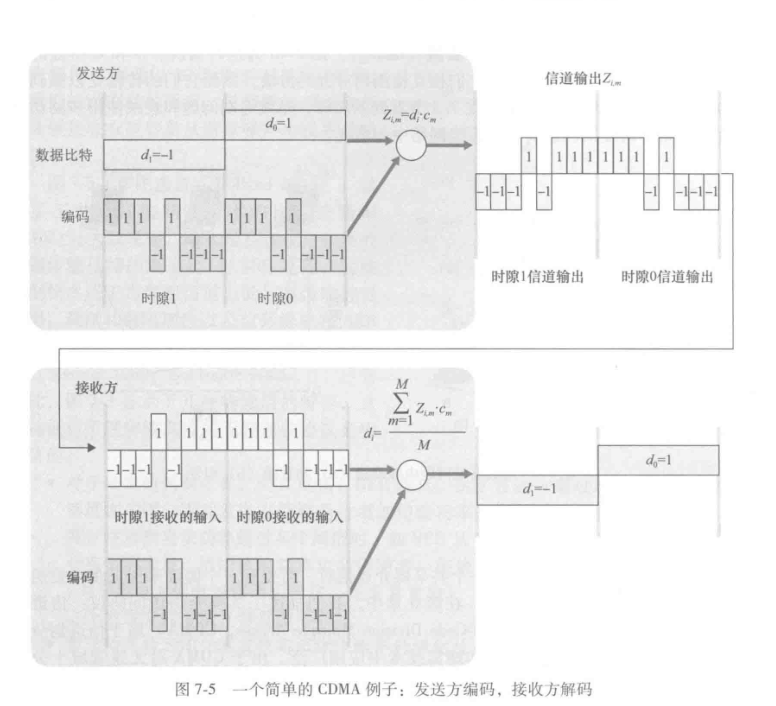
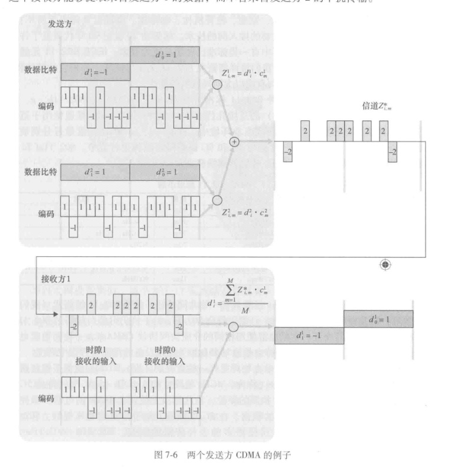
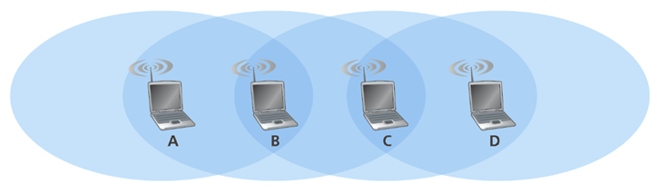
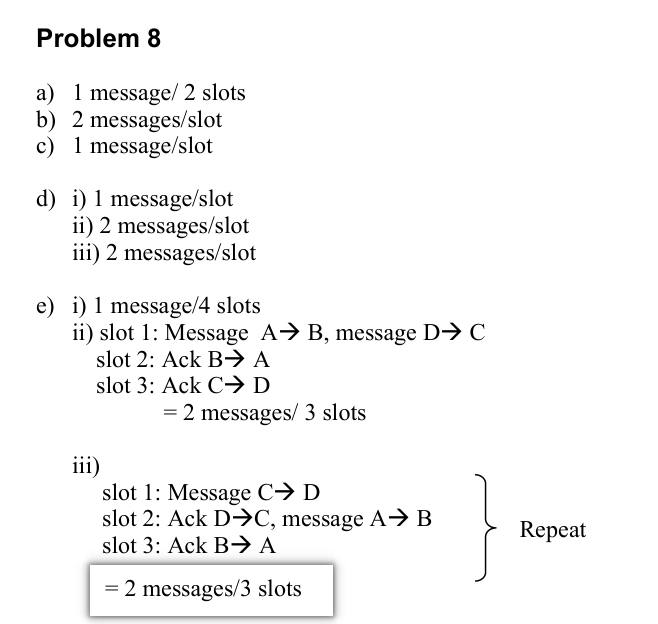

# 重点
- 基本组成
- link和wiredlink的区别，信号衰减等隐藏终端
- 码分多址会考
- 802.11的三个地址，基本的协议和option的协议（RTS/CTS)
- 知道蓝牙是怎么划分的即可

# 课后题
## R1和R2

R1. 一个无线网络运行在“基础设施模式”下是什么意思？如果某网络不是运行在基础设施模式下，那么它运行在什么模式下？这种运行模式与基础设施模式之间有什么不同？

R2. 在7.1节中的分类法中，所确定的四种类型的无线网络是什么？你用过这些类型中的哪一种？

1. In infrastructure mode of operation, each wireless host is connected to the larger network via a base station (access point). If not operating in infrastructure mode, a network operates in ad-hoc mode. In ad-hoc mode, wireless hosts have no infrastructure with which to connect. In the absence of such infrastructure, the hosts themselves must provide for services such as routing, address assignment, DNS-like name translation, and more.

2. a) Single hop, infrastructure-based
   b) Single hop, infrastructure-less
   c) Multi-hop, infrastructure-based
   d) Multi-hop, infrastructure-less

## 一些问答题

### CSMA/CD 协议与 CSMA/CA 协议的区别是什么？

这两个协议都是为了解决多个节点共享传输介质时的冲突问题，但它们的应用场景和处理方式有显著不同：

- **全称与核心思想不同：**
    - **CSMA/CD** (Carrier Sense Multiple Access with Collision Detection)：**载波监听多路访问/冲突检测**。它的特点是“边发边听”，即在发送数据的同时检测是否发生冲突。
    - **CSMA/CA** (Carrier Sense Multiple Access with Collision Avoidance)：**载波监听多路访问/冲突避免**。它的特点是“尽量避免冲突”，通过预约信道和确认机制来减少碰撞概率。
- **应用场景不同：**
    - **CSMA/CD** 主要用于**有线局域网**（如经典的以太网 802.3）。在有线环境下，节点可以轻易检测到电压变化来判断冲突。
    - **CSMA/CA** 主要用于**无线局域网**（如 Wi-Fi 802.11）。因为无线信号存在“隐蔽站”问题，且节点无法在发送的同时接收（检测碰撞），所以必须采用避免机制。
        
- **冲突处理方式不同：**
    
    - **CSMA/CD**：发现冲突后立即停止发送，并发送人为干扰信号（Jamming signal），然后等待一段随机时间（指数退避算法）后再重发。
    - **CSMA/CA**：在发送前先侦听，即使信道空闲也要等待一段随机时间（DIFS）；通常配合 **RTS/CTS**（请求发送/清除发送）握手协议来预留信道，并要求接收方返回 **ACK** 确认包。

### 请简要对比一下 CDMA 和 CSMA/CD。

这两者都是解决“多个用户如何共享信道”的技术，但原理完全不同：

|**特性**|**CDMA (码分多址)**|**CSMA/CD (载波监听多点接入/碰撞检测)**|
|---|---|---|
|**工作原理**|依靠不同的**正交码**来区分用户。所有用户在同一时间使用相同频率。|采用**“先听后发，边发边听”**。检测到冲突后停止发送，随机重发。|
|**应用场景**|主要用于**无线通信**（如 3G、卫星通信）。|传统上用于**有线以太网**。|
|**效率**|效率高，支持多人同时发送且互不干扰。|效率随用户增多而下降，因为冲突概率会增加。|
|**环境要求**|适用于高干扰、多路径的复杂无线环境。|适用于信号传播延迟极小的有线环境。|
#### 简述 CSMA/CD 原理及为何不适用于无线网络

**第一部分：CSMA/CD (Carrier Sense Multiple Access with Collision Detection) 原理** CSMA/CD 即“载波监听多点接入/碰撞检测”，其工作流程可总结为“先听后说，边听边说，冲突停止，随机重发”：

1. **多点接入 (MA)：** 多个站点连接在同一条总线上，共享信道。
2. **载波监听 (CS)：** 发送数据前，先检测总线上是否有其他站点在发送（监听信道）。如果信道忙，则等待；如果信道空闲，则立即发送。
3. **碰撞检测 (CD)：** 在发送数据的过程中，继续监听信道。如果检测到由于多个站点同时发送导致的信号电压摆动值超过阈值（即发生了碰撞），则：
    - 立即停止发送数据。
    - 发送人为干扰信号（Jamming Signal）以强化碰撞，通知所有站点。
    - 执行指数退避算法（Exponential Backoff），等待一段随机时间后再次尝试发送。
        

**第二部分：为何不适用于无线网络** CSMA/CD 不适用于无线局域网，主要原因有二：
1. **无法实现碰撞检测 (Detection Difficulty / Near-Far Problem)：** 在无线通信中，发送设备自身的信号强度远远大于接收到的远端设备信号强度（可能相差百万倍）。如果设备一边发送一边接收，自身的强信号会完全淹没远端的弱信号，导致无法检测到冲突。
2. **隐蔽站问题 (Hidden Station Problem)：** 无线电波传播受距离和障碍物影响。例如 A 和 C 都想发给 B，但 A 和 C 互不可见（听不到对方）。此时 A 监听信道认为空闲并发送，C 也认为空闲并发送，结果两者在 B 处发生碰撞。CSMA/CD 的“载波监听”无法解决这种因为听不到对方而导致的冲突。 _(注：无线网络因此使用 CSMA/CA 协议，即碰撞避免。)_

### 无线信道的额外特性：
- 递减的信号强度
- 来自其他源的干扰
- 多路径传播

### **隐蔽终端问题及缓解方法：**

- **定义：** 指两个节点都在接入点的覆盖范围内，但彼此互不在覆盖范围内，同时发送数据会导致在接入点碰撞。
- **方法：** 采用 **RTS/CTS**（请求发送/允许发送）握手协议。

### AS (接入系统/基站) 如何为正在远离的设备减少丢包？

当无线设备远离基站（信号变弱）时，可以通过以下手段减少丢包：

- **速率自适应 (Rate Adaptation)：** 动态调整**调制编码方案 (MCS)**。当信号变差时，从高阶调制（如 256QAM）切换到更简单的调制（如 BPSK），虽然速度变慢但抗干扰能力增强，能有效降低误码丢包。
- **功率控制 (Power Control)：** 增加基站或移动端的发射功率（在允许范围内）以提高信噪比。
- **切换/漫游 (Handover)：** 在信号彻底丢失前，协助设备切换到距离更近、信号更好的相邻 AP 或基站。

## R5-R12
这些题看书吧

### R5 描述802.11中信标帧的作用。
APs transmit beacon frames. An AP’s beacon frames will be transmitted over one of the 11 channels. The beacon frames permit nearby wireless stations to discover and identify the AP

### 以太网帧和802.11使用的帧格式

- **地址数量：** 以太网帧有 2 个地址（源、目的）；802.11 帧最多有 **4 个地址**（包括 BSSID 等）。
- **控制字段：** 802.11 包含用于持续时间（Duration）、序列控制和电源管理的特殊字段。
- **协议不同：** 802.11 头部包含用于网络分配向量（NAV）的信息，这在以太网中是不存在的。

### R9. 描述 RTS 门限值的工作过程。

**RTS 门限值（RTS Threshold）** 是站点定义的一个字节长度标准：

1. **比较：** 站点在发送数据帧前，先检查该帧的长度。
2. **条件触发：**
    - 如果 **帧长 > 门限值**：站点启动 RTS/CTS 握手程序，预留信道后再发送数据。
    - 如果 **帧长 ≤ 门限值**：站点跳过 RTS/CTS，直接竞争信道并发送数据帧。
3. **目的：** 在减少隐藏终端碰撞风险（大帧）和降低协议开销（小帧）之间取得平衡。

## P1-P3

P1. 考虑图7-5中单一发送方CDMA的例子。如果发送方的CDMA码是$(1, -1, 1, -1, 1, 1, -1)$，那么其输出（对于所显示的两个数据比特）是什么？【太简单了就不写答案了】

P2. 考虑图7-6中的发送方2，发送方对信道$Z_m^2$的输出是什么（在它被加到来自发送方1的信号前）？

P3. 假设图7-6中的接收方希望接收由发送方2发送的数据。说明通过使用发送方2的代码，（经计算）接收方的确能够将发送方2的数据从聚合信道信号中恢复出来。

### P2：多用户干扰前的信号（针对图 7-6）

**题目问的是：** 在图 7-6 中，发送方 2（Sender 2）在信号进入信道并与发送方 1 混合**之前**，它自己产生的输出信号 $Z^2_{i,m}$ 是什么？

- **观察图 7-6：** * 找到下方 Sender 2 的部分。
    - 它的码 $c^2$ 是 $(1, -1, 1, 1, 1, -1, 1, 1)$（通过观察“编码”一栏的脉冲高低得出）。
    - 它的数据比特 $d^2_1 = 1, d^2_0 = 1$（图中灰色长条标注的值）。
- **计算方法：** 因为数据比特都是 $1$，所以输出信号其实就是它的码序列本身。
    
---

### P3：解调与抗干扰证明（针对图 7-6）

**题目要求：** 证明接收方通过使用“发送方 2 的码”，可以从那一堆乱七八糟的混合信号（聚合信道信号）中，把发送方 2 的数据 $d^2$ 还原出来。

- **核心原理：** 正交性。
    - 混合信号 $Z^* = (Sender 1 \text{的信号}) + (Sender 2 \text{的信号})$。
    - 解码公式：把 $Z^*$ 与 $c^2$ 相乘并求和。
        
- **计算步骤建议：**
    1. 列出 $d^1_1 \cdot c^1$ 和 $d^2_1 \cdot c^2$ 的结果。
    2. 将它们相加，得到信道总信号 $Z^*$（这步图中已经画出来了，就是那一串 $[0, -2, 0, 2, 0, 0, 2, 2]$）。
    3. **关键点：** 将这个 $Z^*$ 的每一位与 $c^2$ 的对应位相乘。
    4. 最后求和并除以 8（码长）。如果结果等于 $d^2_1$（即 $1$），就证明还原成功了。

## P5. 假设存在两个ISP在一个特定的咖啡馆内都提供WiFi接入，并且每个ISP有其自己的AP和IP地址。
a. 进一步假设，两个ISP都意外地将其AP配置运行在信道11。在这种情况下，802.11协议是否将完全崩溃？讨论一下当两个各自与不同ISP相关联的站点试图同时传输时，将会发生什么情况。
b. 现在假设一个AP运行在信道1，而另一个运行在信道11。你的答案将会有什么变化？

当两个 ISP 的 AP 运行在同一信道（Case a）与不同信道（Case b）时，虽然它们逻辑上是隔离的（不同的 SSID 和 MAC 地址），但在物理层的表现截然不同。

### **a. 两个 ISP 均运行在信道 11 时**

- **关联与寻址：** 两个 AP 拥有不同的 SSID 和 MAC 地址。无线站点会关联到其中一个 AP（假设为 AP1），建立虚拟链路。当站点发送帧时，目标地址指向 AP1。A wireless station arriving to the café will associate with one of the SSIDs (that is, one of the APs).After association, there is a virtual link between the new station and the AP
    
- **帧处理机制：** 虽然 AP2 也会接收到该帧（因为在同一频率），但由于帧的目标地址不是 AP2，AP2 会丢弃而不处理该帧。因此，两个 ISP **可以在同一信道上并行工作**。
- **带宽共享与冲突：** 两个 ISP 必须**共享相同的无线带宽**。如果不同 ISP 的站点试图同时传输数据，将会发生**冲突（Collision）**。
- **传输速率限制：** 对于 802.11b 协议，由于介质共享，两个 ISP 的**总计最大传输速率限制在 11 Mbps**。

> [!NOTE] “Associate with one of the SSIDs” (关联 SSID)
> 
> 这相当于你在手机上**点击 Wi-Fi 名称并连接**的过程。
> - **SSID**：就是你平时看到的 Wi-Fi 名字（比如 "Starbucks_Free"）。
> - **过程**：咖啡馆里有两个 ISP（网络服务提供商），各自有一个 AP（接入点）。当你进入咖啡馆时，你的手机会扫描到两个不同的 SSID，你必须选择其中一个进行“关联”（Association）。
> - **结果**：一旦关联成功，你的设备就告诉了网络：“我是属于 ISP A 的成员，不是 ISP B 的”。

### **b. 一个 AP 在信道 1，另一个在信道 11 时**

- **冲突消除：** 由于信道 1 和信道 11 在频率上互不重叠，即使两个不同 ISP 的站点同时传输，也**不会发生冲突**。
- **传输速率翻倍：** 两个 ISP 不再竞争同一物理资源，每个 ISP 都能达到该协议的理论峰值。对于 802.11b 协议，两个 ISP 的**总计最大传输速率提升至 22 Mbps** (即 $11 \text{ Mbps} + 11 \text{ Mbps}$)。

### **原理解析：为什么是 1、6、11？**

在 2.4GHz 频段下，每个信道占用的频率宽度是 **22MHz**，但相邻信道中心频率仅相隔 **5MHz**。这导致信道之间会严重重叠。为了实现“互不干扰”的并行传输（如本题 b 选项），工程师通常选择 **1、6、11** 这三个完全不重叠的信道。

## P6. 为什么要回退？
在 CSMA/CA 协议的第 4 步，成功传输一个帧的站点在第 2 步（而非第 1 步）开始 CSMA/CA 协议。通过不让这样一个站点立即传输第 2 个帧（如果侦听到该信道空闲），CSMA/CA 的设计者是基于怎样的基本原理来考虑的呢？

在 CSMA/CA 协议（通常用于 IEEE 802.11 无线局域网）中，设计者规定即便站点刚刚成功发送了一个帧且检测到信道空闲，也不能立即发送第二个帧，而是必须进入“退避程序”（Step 2）。

这种设计的核心基本原理是 **为了保证网络中所有站点访问信道的公平性（Fairness）**，并 **防止“信道俘获”（Channel Capture）现象**。

---

### 1. 核心原理：保证公平性 (Ensuring Fairness)

在无线网络中，可能有多个站点（如 A、B、C）都在等待发送数据。
- **假设场景：** 站点 A 刚刚完成了一次成功的传输。此时，站点 B 可能已经在等待队列中，并且它的退避计时器（Backoff Timer）已经倒计时了一部分。
- **如果不限制 A：** 如果 A 在收到 ACK 后发现信道空闲（经过 DIFS 时间后），由于它没有处于退避状态，它可以立即发送第二个帧。
- **结果：** 站点 A 会持续占用信道。由于 A 每次都能在 DIFS 后立即抢占信道，而正在进行退避倒计时的站点 B 永远无法将计时器减到零。

通过强制 A 在成功传输后也必须执行随机退避（这被称为 **"Post-backoff"**），A 就必须和 B 一起竞争下一个传输时机。这确保了每个站点都有平等的概率获得信道访问权。

---

### 2. 防止信道俘获 (Preventing Channel Capture)

**信道俘获**是指一个高流量的站点由于其传输的连续性，使得其他站点完全无法接入信道，导致其他站点“饥饿”（Starvation）。

- **逻辑推导：**
    1. 当站点 A 完成传输时，它感知的信道状态是从“忙”变为“闲”。
    2. 其他站点（如 B）此时可能正处于退避过程中。
    3. 如果 A 不进行退避，A 在 DIFS 后的竞争窗口起始点就发送；而 B 必须等待其剩余的退避时间（哪怕只剩 1 个 Slot）。
    4. **结论：** A 总是会比 B 先发送，从而“俘获”了信道。强制退避打破了这种循环。
---

## P7. 802.11的延迟计算
假设一个$802.11\text{b}$站点被配置为始终使用RTS/CTS序列预约信道。假设该节点突然要发送1500字节的数据，并且所有其他站点此时都是空闲的。作为SIFS和DIFS的函数，忽略传播时延并假设无比特差错，计算发送该帧和收到确认需要的时间。

A frame without data is 32 bytes long. Assuming a transmission rate of $11$ Mbps, the time to transmit a control frame (such as an RTS frame, a CTS frame, or an ACK frame) is $(256 \text{ bits})/(11 \text{ Mbps}) = 23$ usec. The time required to transmit the data frame is $(12384 \text{ bits})/(11 \text{ Mbps}) = 1125.82$

$\text{DIFS + RTS + SIFS + CTS + SIFS + FRAME + SIFS + ACK}$

$= \text{DIFS + 3SIFS + }(3*23 + 1125.82)\text{ usec = DIFS + 3SIFS + 1194.82 usec}$
## P8. 综合题目
考虑图7-31中的场景，其中有4个无线节点A、B、C和D。这四个节点的无线覆盖范围显示为椭圆形阴影，所有节点共享相同的频率。当A传输时，仅有B能听到/接收到；当B传输时，A和C能听到/接收到；当C传输时，B和D能听到/接收到；当D传输时，仅有C能听到/接收到。

假定现在每个节点都有无限多的报文要向其他节点发送。如果报文的目的地不是近邻，则该报文必须要中继。例如，如果A要向D发送，那么来自A的报文必须首先发往B，B再将该报文发送给C，C再将其发向D。时间是能够被下列所传之传输时间正好一个时隙，如它在报文中的情况一样。

在一个时隙中，节点能够：做工作的之一：①发送一个报文（如果时隙Aloba转发）；②接收一个报文（如果正好一个报文要向它发送）；③保持静默。如同通常的情况那样，如果一个节点听到了两个或更多的节点同时发送，出现冲突并且重传的报文没有一个能成功收到。这时能够假定没有比特级的差错，因此如果正好只有一个报文在发送，它将被位于发送方传输半径之内的站点正确收到。

a. 现在假定一个无所不知的控制器（即一个知道网络中每个节点的状态的控制器）能够命令每个节点去做它（无所不知的控制器）希望做的事情，例如发送报文、接收报文或保持静默。给定这种无所不知的控制器，数据报文能够从C到A传输的最大速率是多少（假定在任何其他源/目的地之间没有其他报文）？
b. 现在假定A向B发送报文，并且D向C发送报文。数据报文能够从A到B且从D到C流动的组合最大速率是多少？
c. 现在假定A向B发送报文且C向D发送报文。数据报文能够从A到B且从C到D流动的组合最大速率是多少？
d. 现在假定无线链路由有线链路代替。在有线的情况下，重复问题a~c。
e. 现在假定我们又在无线状态下，对于从源到目的地的每个数据报文，目的地将向源回送一个ACK报文（例如，如同在TCP中）。对这种情况重复上述问题a~c。

# 往年卷

## 1. 为什么 802.11 有 ACK，而 Ethernet 没有？

主要原因在于无线环境的不可靠性：

1. **高比特错误率（BER）：** 无线链路受干扰、衰落和多径效应影响严重，数据帧损坏的概率远高于有线电缆。
2. **隐藏终端问题：** 两个站点可能无法互相听到对方，导致在 AP 处发生碰撞。
3. **无法检测碰撞：** 无线适配器在发送信号时由于自身信号强度太大，无法同时检测到微弱的冲突信号（无法实现 CSMA/CD）。因此，必须通过接收方的 **ACK 显式确认**来判断发送是否成功。
---

## 2. 为什么 CSMA/CA 要在 DIFS 后回退（Backoff）？

DIFS（分布式帧间间隙）是站点在检测到信道空闲后必须等待的基础时间。而在 DIFS 之后还要增加一个**随机回退时间（Random Backoff）**，主要目的是**避免多个站点同时抢占信道导致的“同步冲突”**。
- **场景描述：** 假设站点 A 正在发送数据，此时站点 B 和 C 都想发送数据，它们会监测信道。
- **如果不回退：** 当 A 发送完毕，信道变为空闲，B 和 C 如果都在等待 DIFS 结束后立刻发送，那么 B 和 C 必定会发生冲突。
- **回退的作用：** B 和 C 会各自取一个随机数（回退计数器）。谁的随机数小，谁就先发送；另一个站点在检测到信道被占用后会暂停计时，等信道再次空闲后再继续倒计时。这极大地降低了多个站点同时起步导致冲突的概率。
    
---

## 3. 描述暴露终端（Exposed Terminal），以及解决方案

**暴露终端问题**是指：由于检测到了信道忙，某个节点错误地认为自己不能发送数据，但实际上它的发送并不会干扰到其他的通信。
- **描述：** 假设有四个节点 A ← B 和 C → D。B 正在给 A 发送数据。C 在 B 的覆盖范围内，它听到了 B 的信号，于是认为信道忙，不敢发数据给 D。但实际上，D 在 B 的覆盖范围之外，C 发给 D 的信号并不会干扰 A 接收 B 的信号。这导致了带宽的浪费。
- **解决方案：使用 RTS/CTS 机制。**
    - B 在发数据前先发 **RTS**（请求发送），A 回复 **CTS**（清除发送）。
    - C 虽然能听到 B 的 RTS，但它听不到 A 的 CTS（因为 A 离它远）。
    - 只要 C 听不到接收方（A）发的 CTS，它就知道自己虽然在发送方（B）附近，但并不会干扰到接收方的接收工作，因此 C 可以安全地向 D 发送数据。
        

---

## 4. 一个人拿着电脑走来走去（AS 不变）是 mobile 的吗？

这取决于你对“移动性（Mobility）”的严谨定义。在计算机网络（尤其是 Mobile IP 协议）的语境下，通常将其区分如下：
- **如果是指广义的移动：** 是的，他在物理上是移动的。
- **如果是指网络技术上的“移动性”：** 这种情况通常被称为 **“游牧式移动（Nomadic/Portability）”** 或 **“链路层切换（Roaming）”**，而不是严格意义上的“移动 IP（Mobile IP）”。
    - **原因：** 如果 **AS（自治系统）不变** 且用户的 **IP 地址不改变**（只是从一个 AP 切换到另一个 AP），网络层协议栈并不觉得它移动了。数据包依然路由到同一个子网。
    - **真正的 Mobility：** 通常指用户跨越了不同的子网（IP 变化），但在移动过程中能保持正在进行的 TCP 连接不断开（通过家乡代理 Home Agent 等机制实现）。

**结论：** 在同一个子网/AS 内走动，技术上更多被称为 **“便携性（Portability）”** 或 **“二层漫游”**，因为不涉及三层路由的重定向。