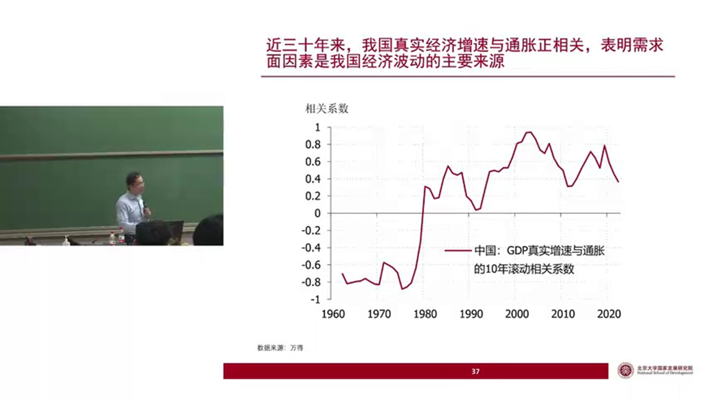

### 第一章：宏观经济学的起点：代表性个体模型及其局限

假设经济体中只有一个微观主体，即一个国家就是一个公司，或是一个人。这是最简单的回溯方法。因此，我们可以用公司经营的思路来理解国家的生产行为，或者用个人的消费与储蓄决策来理解国家层面的消费、储蓄和投资等需求面的行为。

实际上，这正是当前西方主流宏观经济学的做法，他们使用的是所谓的“代表性个体模型”（Representative Agent Model）。该模型假设经济体中只有一个代表性的人或一个代表性的公司。

这种做法的理由是什么呢？
首先，它足够简单。假设只有一个人，等价于假设所有居民或所有企业的行为模式完全一致。这样，宏观现象就可以被还原或回溯为一个微观主体的决策行为。这不仅在思维上简化了问题，在数学建模上也更为便捷。尽管目前宏观经济学的前沿发展开始探索异质性个体模型（Heterogeneous Agent Model），即承认人与人之间存在差异，但这些模型距离实际应用还有很长的路要走。

其次，其合理性不仅仅在于简单。理论上可以证明，当经济达到均衡状态（即所有微观主体都达到其最优状态）时，所有微观主体的行为将趋于一致。因此，在均衡状态下，任何一个微观主体都可以被视为代表性的消费者或主体。

这就是西方主流宏观经济学的核心思想。换言之，当前西方主流宏观经济学的大部分结论都建立在“一致性加总”的思路上。其本质是把宏观经济直接当作一个微观主体来研究，将一个经济体视为一个公司或一个人。这种方法将宏观经济学建立在微观基础上，相比于过去将宏观与微观割裂开的IS-LM模型，无疑是一大进步。

然而，仅仅把宏观经济当作微观主体的加总，存在着巨大的局限性，这也是当前西方主流经济学的局限所在。

### 第二章：宏观与微观的鸿沟：为何国家不是公司？

这种局限性体现在哪里？如果你仅仅将宏观经济当作一个微观主体，你就无法真正理解凯恩斯的“挖坑理论”。

在凯恩斯的《通论》中，有一段被广为引用的话，其大意是：如果经济不景气，财政部可以雇人在地上挖坑，挖完之后再雇人把坑填上，如此循环往复。凯恩斯认为，这样做可以解决失业问题，并且其带来的影响，会使社会的实际所得与资本财富比现状要大得多。当然，凯恩斯并非真的认为只应该挖坑，他指出兴办基建（如我们国家现在所做的）是更合理的选择。但如果由于政治或现实困难无法大兴土木，那么“挖坑”也聊胜于无。

如果你将国家看作一个企业，你就无法理解挖坑的道理何在。但由于凯恩斯是宏观经济学的祖师爷，没有人敢轻易质疑他的理论。因此，那些无法理解“挖坑理论”的经济学家通常会选择绕开它。

为什么从微观层面看毫无意义的挖坑行为（挖了再填，不产生任何回报），在宏观层面却可能成为一个不错的选择呢？

我们可以引用诺贝尔经济学奖得主保罗·克鲁格曼的一篇文章来解释，文章的标题是《成功的商人不懂宏观经济》。其核心思想是：国家不是一个公司，不能用理解微观经济主体的思维模式去理解宏观经济的运行。因为宏观经济中各个微观主体之间存在复杂的反馈效应，会产生出微观层面难以理解的宏观现象。

克鲁格曼在文章中写道：“商界领袖给出的经济建议常常出奇地坏，尤其是在经济状况糟糕的时候。”他解释说：“答案就是国家并不是公司。国民经济政策即使是在一个小国，也需要考虑在商业活动中常常无关紧要的某些类型的反馈。”

**他进一步指出了关键差异：“即使是最大的公司，也只会把一小部分产品卖给自己的员工。而即使是极小的国家，大多数商品和服务也主要是卖给国内的。”**

**这就点明了本质区别。一个企业在做决策时，通常不会考虑自身行为对外部宏观环境的影响。**

例如，一个企业家发现市场对自己产品的需求下降，收入和利润减少。在这种情况下，他正确的应对方式是缩减开支、降本增效，甚至裁员减薪，以维持利润率，渡过寒冬。他绝不会选择给员工涨工资，因为即便他的员工购买力增强了，也无法显著提振整个市场对他产品的需求。

然而，当整个宏观经济面临总需求不足，各行各业产品都卖不动时，情况就完全不同了。这时，那些成功的企业家往往会建议政府也像企业一样，节衣缩食、过紧日子。但如果政府真的这么做，经济就会彻底崩溃。

为什么？因为在一个国家内部，支出在很大程度上决定了收入。政府削减财政支出，意味着民间收入的进一步下降，从而导致民间支出进一步走弱，使总需求不足的压力雪上加霜。经济将在总需求不足的陷阱里越陷越深。

因此，当经济陷入总需求不足时，政府正确的应对恰恰与企业的做法相反：应该扩大开支。政府通过增加财政支出来增加民间部门的收入，进而提振民间部门的支出，从而缓解需求不足的问题。

宏观层面的应对与微观层面正好相反，其根源在于宏观经济中存在“支出=收入”的反馈效应，就像一个回旋镖，政府的支出扔出去，在经济中转了一圈又会飞回来。而企业没有这种效应，给员工加的工资如同石沉大海，无法感受到对市场需求的明显影响。

这种宏观与微观的差别，无法通过简单的一致性加总来把握。它必然涉及不同经济主体之间的差异以及它们之间复杂的联系。要理解宏观经济，尤其是需求不足的局面，就必须进入更高层次的思维，认识到宏观现象不能被完全还原为微观主体的优化决策。只有当你的思维达到这一层次，你的宏观分析才算登堂入室。

### 第三章：破窗理论：宏观政策的“审时度势”

我们再举一个例子来加深对宏观与微观差异的理解——“破窗理论”。

假设我把教室的窗户砸碎了，这件事到底是好事还是坏事？

从微观层面看，这无疑是坏事。窗户破了，刮风下雨会影响上课，学校也需要耗费额外的资源去修复它，凭空制造了麻烦。

但从宏观层面看，这件事的好坏则不一定，它甚至可能是好事。**这取决于经济所处的具体环境。**

**1. 当经济处于总需求不足的状态时，砸窗户是好事。**
- 在这种情况下，经济中存在大量非自愿失业（即人们愿意在当前工资水平下工作但找不到机会）。砸碎窗户创造了修窗户的需求，一个原本失业的工人因此获得了工作和收入。他会把这笔收入花出去，用于生活消费，这又为其他人创造了工作和收入。这个过程会像涟漪一样一轮轮扩散开去，这就是凯恩斯所说的“乘数效应”。从这个角度看，砸窗户和前面提到的挖坑是同一个道理。

**2. 当经济处于总需求充足（充分就业）的状态时，砸窗户是坏事。**
- 在这种情况下，社会上没有非自愿失业，所有劳动力都有工作。修窗户的工人原本可能在为新房子安装玻璃。现在，由于修补教室窗户的事情更紧急，他不得不放下手头的工作。砸窗户虽然创造了“修补教室窗户”的需求，但却“挤出”了“为新房子安装玻璃”的需求。总需求、总产出和总收入都没有变化，社会只是平白无故地损失了一扇窗户。

这个例子告诉我们，在分析宏观问题时，必须要有宏观思维。**同一个政策（如砸窗户、挖坑、财政扩张），在不同的宏观环境里，其结果和我们对它的评价是截然不同的。**

### 第四章：问题的核心：被主流经济学忽视的“有效需求”

通过以上分析可以发现，砸窗户变成好事这种反直觉的现象，只发生在总需求不足的状态下。因为在此时，需求可以“无中生有”地被创造出来。但供给如果不足，则无法凭空创造，因为它受制于劳动力、资本和技术水平。因此，在需求不足时，宏观经济的运行规律会和我们微观层面的经验产生巨大差异。

然而，总需求不足这一状况，在西方主流经济学中却很少被讨论。不仅是现代主流经济学，从亚当·斯密、大卫·李嘉图等古典经济学家开始，就鲜有提及。在古典经济学家中，能找到的探讨总需求不足的两位著名人物是马尔萨斯和马克思。

**1. 马尔萨斯与有效需求**
马尔萨斯最早提出了“有效需求”的概念。他认为，有效需求由“购买力”和“购买愿望”两个部分构成。一个国家必然拥有购买其全部产品的购买力（因为总产出等于总收入），但他不一定拥有购买这些产品的愿望。

为什么会这样？我们每个人的欲望可以说是无限的（比如我想买100架飞机在天上飞），供给再多也是有限的，怎么会存在需求不足呢？这里的关键在于，经济学上的需求是“有效需求”，即有购买力支撑且表现为购买行为的需求。空想没有意义。

一个国家的总购买力就是它的总产出或总收入，从总量上看足以买下全部产品。但问题出在**收入分配**上。如果收入分配不合理，可能导致有购买力的人（或主体）没有购买欲望，而有购买欲望的人又没有购买力。这样一来，总量上充足的购买力与支出欲望结合后，有购买力支撑的总支出就可能小于总产出，从而产生总需求不足。

**2. 马克思与生产过剩危机**
马克思的生产过剩理论，本质上也是关于有效需求不足的故事。他认为，在资本主义私有制下，资本由少数资本家占有。资本家获取了大部分收入，但他们的支出主要是投资，而投资的目的是为了获取回报率。当投资回报率过低时，即使他们手握重金也不愿再投资。另一方面，占人口绝大多数的劳工阶级虽然有消费欲望，但由于只能获得微薄的工资，缺乏足够的购买力。随着资本不断替代劳动，劳工阶层的总收入占经济的比重下降，导致资本家生产出的产品卖不出去，投资回报率进一步降低，形成恶性循环，最终爆发生产过剩的经济危机。

**3. 凯恩斯革命及其后的回归**
尽管有马尔萨斯和马克思的论述，但在凯恩斯之前，有效需求不足的问题始终未成为西方经济学的主流。古典经济学家对市场运行效率抱有高度信仰，认为经济可以自行调节，不会出现持续的需求不足。

凯恩斯在《通论》中明确指出，古典经济学的基本思想就是“我们可以忽略总需求函数”，并批评这种乐观思想导致经济学家们忽视了有效需求不足拖累经济繁荣的可能。凯恩斯认为，由于工资刚性等因素，市场无法自动出清，导致有效需求长期不足，因此政府必须通过需求管理来干预经济。

凯恩斯的理论在二战后主导了西方经济学，直到1970年代的“理性预期革命”。这次革命重新强调了人的优化决策在宏观经济现象中的重要地位。当把人的理性提到极高位置后，经济学家们再次相信市场是有效的，收入分配不成问题，有效需求不足的状况不会发生。

因此，当代西方主流经济学在很大程度上又回到了我们之前所说的第二重思维——将宏观现象还原为微观主体的优化问题。其根源在于对人的理性和市场效率的高度信仰。

### 第五章：理解中国经济：为何必须超越主流范式

中国经济的特殊性在于，我们是一个从计划经济向市场经济转轨的经济体。在这个过程中，市场运行受到很多计划经济残余因素的约束，远未达到西方理论所假设的“有效”状态。因此，中国会长期面临有效需求不足的状况。如果套用西方主流经济学理论来分析中国，往往会得出南辕北辙的结论。

我们如何用数据来证明中国经济的波动主要来自需求面呢？可以借助一个简单的供需交叉图工具。
* **需求驱动的波动**：需求曲线移动导致价格和数量**正相关**（价涨量涨，价跌量跌）。
* **供给驱动的波动**：供给曲线移动导致价格和数量**负相关**（价跌量涨，价涨量跌）。

我们可以观察两个市场：
1.  **房地产市场**：数据显示，中国房价涨幅与房屋销售面积涨幅呈显著**正相关**。这说明过去十几年房地产市场的波动主要来自需求面。政府的调控政策也大多在需求端发力：房价高了就限购限贷打压需求，房价跌了就放松管制刺激需求。
2.  **猪肉市场**：数据显示，猪肉价格涨幅与生猪出栏量（供给）涨幅呈显著**负相关**。这说明猪肉市场的波动主要来自供给面（如猪瘟导致供给锐减，价格飙升）。面对这种由供给冲击引发的通胀，央行的货币政策（主要调控需求）是无能为力的。

将此分析框架应用于整个宏观经济，我们计算中国真实GDP增速（量）与通货膨胀（价）的滚动相关系数。可以清晰地看到：
* **改革开放前**：二者显著**负相关**。这说明当时中国是短缺经济，经济波动主要来源于供给侧的冲击。
* **改革开放后（尤其1990年代中期以来）**：二者转为长期稳定的**正相关**。1990年代中期，随着邓小平南巡后掀起的投资热潮项目建成投产，中国供给能力大增，从短缺经济进入了过剩经济。在过剩经济中，如何把产品卖出去（需求问题）比如何把产品生产出来（供给问题）更具挑战性。

数据表明，中国经济在过去二十多年里的主要矛盾在需求面。
【通过通胀的分析】

而停留在第二重思维境界的西方主流经济学更多从供给面理解经济，因此难以准确把握中国的现实。我们未来的课程将先从供给面分析，但会用更多的篇幅从需求面去探讨和理解中国经济。

### 第六章：课程安排与学习理念

**1. 课程后勤**
* **适合人群**：对中国经济充满好奇，并具备经济学原理和中级微观经济学基础的同学。本课程不涉及复杂的数学推导。
* **成绩评定**：期末考试（80%），课后作业（15%），课堂及勘误表现（5%）。
* **上课时间与地点**：每周一晚在理教208。**特别注意：**因中秋节调课，第二次课在本周六（9月14日）。
* **期末考试时间**：明年1月6日（周一）晚，请务必确保能参加。
* **课程资料**：PPT、讲义会在课前发布。参考书为我2019年出版的《宏观经济二十五讲：中国视角》，但非必须，本学期的讲义基本构成一本新书。2019年的课程视频可作参考，但本学期内容将有至少50%的更新和深化。

**2. 教学的四重目标**
* **第一层：知识点**。学习具体概念，例如通过价量关系判断波动来源。但孤立的知识点用处不大。
* **第二层：知识体系**。将知识点组织起来，形成可以学以致用的分析框架，帮助你理解身边发生的经济现象。
* **第三层：知识体系的生命**。理解理论体系是如何围绕真实世界的重大问题生长起来的。我希望通过问题导向的教学，展现我对中国经济的系统性理解框架是如何形成的，并启发你们构建自己的分析框架。
* **第四层：熏陶与塑造**。学习的过程本身，包括分析问题的视角、习惯甚至激情，都会对人产生潜移默化的影响。当你忘记所有为考试而背诵的细节后，那些沉淀下来的东西才真正有用。

**3. 学习者的目标：成为经济学大师**
凯恩斯曾评价其老师马歇尔时说，优秀的经济学家凤毛麟角，因为大师必须是多种天赋的综合体：既是数学家，又是历史学家、政治家和哲学家；既能理解符号，又能诉诸言语；既富有激情，又排除偏见；既像艺术家一样思考，又像政治家一样脚踏实地。

如何向这个目标努力？其实很简单：**了解经济现实，找到能激发你好奇心的问题，然后诚实地回答它们。**“诚实”意味着不自欺欺人，不满足于肤浅的解释，直到找到能真正说服自己的答案。当你发现一个别人没问过或没答好的重要问题，并成功地回答了它，这就是好的研究。

**4. 大师的情怀**
最后，大师必须有情怀。凯恩斯讲述过马歇尔立志研究经济学的故事，源于他看到一幅描绘穷苦落魄者的油画，并决心让世上所有这样的人都能过上幸福生活。

我们研究经济学，不仅仅是为了满足智力上的好奇心，更是为了经济数字背后那一个个真实的人。失业率0.1个百分点的变化，就意味着数百万人的生活发生重大改变。当你将这份情怀根植于心，它就会成为你学习和运用经济学最强大的动力。

这就是我们这学期希望带领同学们走上的道路。