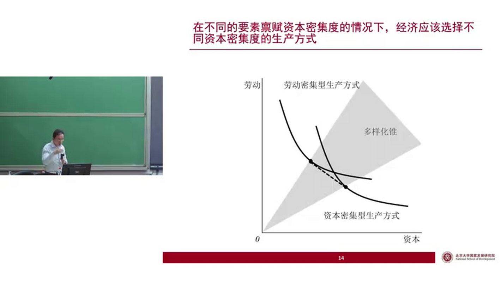

好的，这是根据您提供的课程录音字幕转录，润色成的书面内容：

# **课程内容整理**

本次课程将包含三部分内容。首先，是对上节课关于经济学科学性的一个非常简短的补充说明。然后，今天课程的重点是介绍发展战略经济学，主要用于解释改革开放之前中国经济体制形成的内生逻辑，并会延伸探讨一些其他问题，例如在技术层面如何看待增长计量。最后，再来谈谈产业政策的必要性，因为关于产业政策的效果——即产业政策到底有没有效、应不应该使用——存在很多争论。今天我们会涉及这方面的内容。

---

## **一、 对经济学科学性的补充说明**

首先我们来谈经济学的科学性。上次课程已经解释过我们为什么要使用“理性人”的假设，因为如果不使用这个假设，我们就无法绕开“人性”这个黑箱。

因此，在经济学中，建立在理性人假设之上的均衡经济学是当前的主流。但在主流之外，也存在一些研究非理性前提下经济现象的经济学分支，例如大家熟知的行为经济学、行为金融学，以及演化经济学。

**1. 行为经济学与演化经济学**

行为经济学在近些年非常热门，它基于心理学所发现的一些人类普遍存在的行为偏差。例如，人们倾向于过度自信，同时又倾向于损失厌恶。

* **过度自信 (Overconfidence)**：举个例子，我们可以做一个调查。私下让每位同学写一张选票，回答“你是否认为自己在这学期课程的期末考试中能够排到前50%”。一般情况下，调查结果会显示大部分人都认为自己能排在前50%。这便是在许多心理学研究中都得到证实的过度自信倾向。
* **损失厌恶 (Loss Aversion)**：另一个例子是，得到10元钱带给你的效用增进，会远远小于失去10元钱带给你效用损失的绝对程度。

基于这些心理学发现的普遍存在的行为偏差，便构建了行为经济学。

而演化经济学则是借用生物学中“演化”的思路来研究经济现象。

所以，经济学中也包含了研究非理性的分支。但这些分支都存在其固有的问题，它们从方法论上讲，不可能取代均衡经济学的主流地位，只能成为均衡经济学的一种有益补充。

**2. 非理性研究的局限性**

原因是什么呢？我们知道，“理性”通常指向“最优”。在宽泛的假设之下，最优解通常只有一个；但“非最优”则有无穷多种可能性。我们可以研究人向理性状态收敛的过程，但最终收敛的那个理性状态只是一个点，而通往这个点的路径却可能有无数条。有的路径可能很快收敛，有的则可能来回反复，迟迟无法收敛。

因此，一旦进入非理性的范畴，若要科学地研究人的非理性行为，就必须首先提出一些假设。而这类假设，一般都是武断的，并且未必能够长期成立。

举个例子，为什么行为经济学在近些年才真正发展起来？难道几十年前的人们不知道人有非理性的行为吗？当然不是。但在更早之前，我们没有办法用科学的方法去研究非理性。研究者可以随意假设人的非理性模式，比如，你假设人喜欢看股票上涨，以此来解释股价上涨的现象；我也可以反过来假设人喜欢看股票下跌，能从中获得非理性的快乐。你能说我错了吗？不能，因为两者都是非理性的。如果可以任意假设人的非理性行为，研究就无法进行。

直到近几十年，经济学家借用了心理学家发现的那些普遍存在的行为偏差，并以此为共识基础和假设，来推演非理性状态下的经济现象，这才构建起了行为经济学。所以，对于非理性，如果假设可以任意设置，那么表面上你可以解释任何事情，但实际上你什么也解释不了。必须对假设施加约束，但这种约束本身又是武断的。你凭什么说人是过度自信的？我完全可以说人是过度不自信的，我甚至可以找到一群人，通过实验证明他们确实过度不自信，并以此为基础构建我的行为经济学理论体系。那么，你的理论和我的理论，到底谁对呢？不知道，没有评价的标准。

而且，这些所谓的“普遍存在的行为偏差”，当大众普遍意识到其存在时，它本身就可能慢慢消失。比如在资本市场，当大量文章指出“人因为过度自信而容易亏损”时，随着这个理论影响力扩大，越来越多人知道了这种行为偏差的后果，他们的行为就可能会改变，变得不再那么过度自信。

因此，研究非理性的经济学分支，必然建立在某些武断且未必能长期成立的假设之上，所以它们只能成为均衡经济学的一种补充。我认为，在可预见的未来，经济学的主流仍将是建立在理性人假设之上的均衡经济学。

**3. 均衡经济学的方法论：静态分析**

均衡经济学的研究方法，本质上就是计算均衡——即计算当所有人都和谐地达到了各自的理性状态时，社会所形成的均衡。

均衡经济学相信世界时时刻刻都处于均衡之中。为什么？因为如果一个状态不是均衡的，那就意味着该状态中至少有某些个体没有达到自身的最优（即没有实现其理性）。当个体没有达到最优时，他就会有动机去改变自己的行为，从而让自己变得更好，这个行为的改变就会让那个非均衡的状态消失。因此，经济学家相信，这种有人没有达到最优的非均衡状态是稍纵即逝的。那些能够稳定存在、以至于能被我们观察到的真实世界经济状态，一定是处于均衡之中的。

所以，我们通过计算均衡，也就找到了世界应该所处且将会所处的状态。这当然是一种假设，现实未必如此，不排除真实世界中长期存在非均衡状态的可能性。但问题在于，对于那种非均衡状态，我们没有办法用科学的方法去研究它。

经济学的研究过程，就是求解均衡的过程。如何求解？分两步：
1.  **求解所有个体的最优化问题**：找到在给定的目标函数和约束条件下，个体会做出什么样的最优行为。
2.  **分析行为间的相互作用**：看这些最优化的行为如何相互影响，最终形成一种所有人都和谐地达到自身理性的状态，即市场均衡。

所以，在研究现实问题时，我们首先要思考该经济现象所涉及的个体，他们的目标函数和约束条件是什么，会做出什么样的最优行为；然后再分析这些行为如何相互影响，最终形成某种市场状态。

最后再补充一点，均衡分析本质上是一种静态分析，如果类比物理学，它对应的是静力学分析。当然，以后同学们如果学习高级课程，尤其是高级宏观经济学，会发现求解的都是动态模型，因为人的行为一定是基于对未来的预期来决定今天的行动，所以需要求解动态规划。但即便求解的是动态规划，宏观经济学本质上也仍然是一种“静态的动态经济学”。

这是什么意思呢？我举个例子大家就明白了。假设这里有一个碗，碗里有一个小球。问题是：这个小球会停在碗里的什么位置？

* **均衡经济学家的回答**：小球一定会处在一个自身没有动机偏离当前状态的位置上，这才是均衡。在碗里，唯一满足这个条件的位置就是碗底。在碗底，小球受到的重力和碗的支撑力正好相互抵消，处在静力学平衡状态。如果小球落在这个位置且本身没有初速度，它就会停在那里。所以，均衡经济学家会说，小球就在碗底，因为只有在那里，状态才能长期存在并被我们观察到。

* **物理学家的看法**：物理学家会说，这种看法不全面。小球可以在碗的任何一个位置，只不过在碗壁等非碗底位置时，它没有处在静力学平衡状态，会有一个加速度，从而开始运动。所以，小球很可能是在碗里来回晃荡，这在物理学中是常见现象。

经济学家之所以认为晃动的状态不会被看到，或者说无法研究，是因为经济学里没有物理学中牛顿第二定律（$F=ma$）的对应物。在物理学中，即使物体受力不均衡（合力不为零），我们依然可以通过牛顿第二定律计算出它的运动轨迹。但在经济学里，牛顿第二定律的对应物应该是什么？是当人处于非均衡（或非理性）状态时的行为规律。

我前面已经说过，当人处于非理性状态时，你无法给他一个普适的行为规律，任何给出的规律都只能是武断的假设，因为非理性的可能性是无穷的，人的本性也是自由的，不可能有一种固定的非理性机制。

因此，经济学从方法论的意义上讲，它只可能是一种静态分析，只能研究处于理性、达到均衡的状态。这不是说真实世界不存在非均衡、非理性的状态，而是说那些状态我们用现有的经济学方法研究不了。

如果你想超越静力学分析，比如在我开设的投资学课程中，要研究真实世界的投资。如果你相信世界时时刻刻都处于均衡之中，所有人都达到了最优，那就没有任何打败市场的机会，主动型投资者也就没有了存在的必要。要想打败市场，就必须跳出均衡的框架，去发掘市场中那些非有效、非最优的状态所带来的投资机会。但对这种机会的把握，就无法通过纯粹的科学手段进行，而进入了“艺术”的领域。

我曾为本科生开设《金融经济学》，是在均衡框架下研究金融市场，那属于科学范畴。我也为研究生开设《证券投资：从理论到实践》，那就进入了非均衡状态，更多地涉及艺术的成分。我常说，需要将金融的理论与金融的艺术结合起来，才有可能打败市场。

这个话题有些远了，我们回到正题。总结一下，均衡经济学的本质是一种静力学分析。这不是因为我们不知道这种分析方法的局限性，而是因为对于经济学家而言，偏离了碗底的小球，我们研究不了，所以我们只能假设它在碗底。

以上就是对经济学科学性的一点补充。

---

## **二、 发展动力与经济绩效：增长计量分析**

接下来，我们进入这节课的主要内容。在上一课中，我们介绍了一种叫做“增长计量”的方法，它可以将GDP的增长分解为三个来源的贡献：劳动力的贡献、资本的贡献以及技术的贡献。这三者的贡献之和等于GDP的增速。

$$\text{GDP增速} = \text{劳动力贡献} + \text{资本贡献} + \text{技术贡献}$$

我也向大家展示过，改革开放以来直到次贷危机前，我国的经济增速是持续加快的。而在次贷危机之后（2009-2023年），经济增速明显放缓，比危机前的八年低了接近四个百分点。这个降幅主要来自于“技术项”贡献的下滑。

今天，我们把视线聚焦于改革开放前后。我将时间重新分组，分为改革开放前和改革开放后。

| **时期** | **GDP年均增速** | **劳动力贡献** | **资本贡献** | **技术贡献** |
| :--- | :--- | :--- | :--- | :--- |
| **改革开放前 (1953-1977)** | 6.5% | 1.6% | 2.6% | 2.3% |
| **改革开放后 (1978-2023)** | 9.0% | 0.8% | 3.6% | 4.6% |
| **增速变化** | **+2.5%** | **-0.8%** | **+1.0%** | **+2.3%** |

从数据中可以清晰地看到：

1.  **GDP增速差异显著**：改革开放前年均增速为6.5%，改革开放后四十多年间年均增速达到了9.0%。
2.  **劳动力不是加速原因**：改革开放后，随着人口老龄化加剧，劳动年龄人口和就业人数的增长率都在减缓，近年甚至出现负增长。因此，经济增长的加速显然不能从劳动力上找原因。
3.  **资本可以解释一部分**：改革开放后，我国的投资率更高，资本积累速度也更快，其贡献从2.6个百分点上升到3.6个百分点。
4.  **技术是核心解释变量**：增长最显著的是技术项，其贡献从2.3个百分点增长到4.6个百分点，增加了2.3个百分点。在GDP整体增速加快的2.5个百分点中，有2.3个百分点可以被技术项的增长所解释。

由此可见，无论是对比改革开放前后，还是对比次贷危机前后，经济增长的核心都在于“技术”这一项。

下图展示了每一年的数据。深色实线是资本的贡献，虚线是就业（劳动力）的贡献，浅色实线是技术的贡献。每一年这三条线的高度加起来，就等于当年的GDP增速。

**(此处应有一张展示1953年以来资本、劳动、技术贡献率变化的图表)**

从这个图中可以一目了然地看出，中国经济增长的波动——以年为单位的起伏——绝大部分是由技术的波动所主导的。例如，在1961年，GDP增速达到了历史最低的-27%，其中有-32个百分点是来自于技术贡献的收缩。

所以，当我们从供给侧去研究经济增长的三个源泉（资本、劳动、技术）时，会发现技术是最重要的。接下来，我们就要对“技术”做进一步的分析。

### **1. “技术”到底是什么？**

将增长计量分解出的第三项称为“技术贡献”，这个名字其实具有很强的误导性。因为一提到“技术”，我们马上会联想到日常生活中所接触到的技术概念。但实际上，这一项的内涵远比此复杂。

我认为，一个更好的名字或许是**“技术残差”**。它本质上是一个残差项，即经济增长中不能被劳动力和资本的投入所解释的部分，都被归入了这里。这个残差里面包含了很多东西：

* 我们通常理解的技术（如新的工艺流程）。
* 生产方式的选择。
* 有效需求的变化。
* 制度和政策的变迁。
* 资源配置效率的变化。

因此，这个残差项有很多名字，如技术贡献、**全要素生产率 (Total Factor Productivity, TFP)**，或是**索洛残差 (Solow Residual)**（因为它最早由诺贝尔经济学奖得主罗伯特·索洛提出）。但最贴切的名字，或许是**“我们对无知的度量”**。

所以，当分析止步于“经济减速是因为全要素生产率下滑了，所以我们应该鼓励创新”时，这种分析是浮于表面的。这句话可以翻译为：“我们经济减速的原因，是某个我们不知道的黑箱导致的，所以我们要推进创新，来让这个黑箱的贡献重新加快。” 这句话其实没有提供太多有价值的信息。

今天的任务，就是要尽量把这个“技术残差”项拆开，看看能从里面抓住些什么可以把握的东西。

### **2. 区分两种“技术”**

现在我们从技术的角度来分析。请注意，这里的“技术”不是指刚才的“技术残差”，而是我们日常生活中所理解的技术。我举四个例子，大家可以思考一下它们所指的“技术”内涵是否相同：

1.  工厂研发出新的**工艺流程**，生产效率大为提高。
2.  工厂优化了**管理体系**，生产效率明显提升。
3.  工厂购入先进的**机器人**替代人工，生产效率大为提升。
4.  工厂从纺织业转型进入芯片行业，实现了**产业升级**。

这四个例子都与技术进步有关，但可以分为两组。

* **第一组（前两个例子）**：这类技术是**越高越好**的。无论是工艺流程还是管理技术，越先进，生产效率和产出就越高。
* **第二组（后两个例子）**：这类技术**并非越高越好**，而是存在一个**“最合适”**的概念。最适合你的要素禀赋（资源状况）的技术，才是最好的技术。

例如，用机器人替代人工，听起来是技术提升。但如果你的资金有限，比如一个工厂只有100万元，这笔钱可以雇佣几百名工人工作一个月，但可能买不了几台机器人。此时，若解雇所有工人换成机器人，产出未必会增加。

再举一个更清晰的例子：**打扫教室**。

* **情景一：人多经费少**。学校告诉我，教室里几百个同学可以随时调用，但只给了1000元经费。这时，我的要素禀赋是“劳动充裕，资本稀缺”。我的最优选择是买几百把最便宜的扫帚，让大家一起打扫。
* **情景二：人少经费多**。学校说学生时间宝贵，只派给我两个人，但给了100万元经费。这时，我的要素禀赋是“劳动稀缺，资本充裕”。我的最优选择就是用充裕的资金购买高端的扫地机器人，让两个人操作即可。

你会发现，用扫地机器人这种“更高级”的技术，在人多钱少的情况下并不适合我。因此，我需要选择与我的资源状况相匹配的技术。

在常见的柯布-道格拉斯生产函数 $Y = A \cdot K^\alpha \cdot L^{1-\alpha}$ 中：

* **$A$**：代表了第一类技术，即索洛残差。对于产出最大化而言，A是越高越好。
* **$\alpha$**：代表了第二类技术，即生产方式的**资本密集度**。$\alpha$ 越大，代表该生产方式越偏向于使用资本，即资本密集型；$\alpha$ 越小，则代表劳动密集型。

基于你手中资本（K）和劳动（L）的相对数量，存在一个最优的生产方式（最优的 $\alpha$）选择问题。

### **3. 要素禀赋与生产方式的选择**

我们用图形来解释。在一个以资本为横轴、劳动为纵轴的平面上，每一条“等产量线”代表能生产出相同产量的所有资本和劳动组合。越靠右上方的等产量线，代表的产量越高。

**(此处应有一张展示不同资本密集度（劳动密集型vs资本密集型）生产方式的等产量线图)**

假设我们有两种生产方式：资本密集型和劳动密集型。

* 如果经济体的要素禀"赋"处于资本较少、劳动较多的区域（如图中A点），那么选择劳动密集型的生产方式，可以达到一条更高的等产量线，即获得更高的产出。
* 反之，如果资本充裕、劳动相对稀缺，选择资本密集型的生产方式会更优。

这个道理和我讲的打扫教室的故事是一致的：
* **人多钱少（劳动密集）** -> 用扫帚（劳动密集型技术）
* **人少钱多（资本密集）** -> 用扫地机器人（资本密集型技术）

如果你在人多钱少时非要买机器人，可能200个人看着一条机器人的腿在扫地，效率极低。如果你在人少钱多时非要用扫帚，两个人可能扫到天黑也扫不完。

### **4. 经济发展与比较优势发展战略**

经济发展意味着人口增长和资本积累。在发展过程中，资本积累的速度通常远快于人口增长的速度。因此，一个落后经济体的发展轨迹，在这个资本-劳动平面上，通常是一条斜率较低且不断向右上方延伸的曲线。

**(此处应有一张展示经济发展路径如何穿越不同生产方式区域的图)**

这条轨迹会依次穿过三个区域：
1.  **初始阶段（资本极度稀缺）**：最优选择是完全采用**劳动密集型**生产方式。
2.  **发展阶段（资本逐渐积累）**：进入一个“多样化锥”区域，最优选择是**同时采用两种技术**，一部分资源用于劳动密集型生产，一部分用于资本密集型生产。
3.  **成熟阶段（资本非常充裕）**：最优选择是完全转向**资本密集型**生产方式。

这个最优的发展路径，就是林毅夫老师所说的**“比较优势发展战略”**：根据自身在不同发展阶段的比较优势，动态地选择最优的生产方式，从而实现最快的经济发展。

这里的经济增长轨迹一定会穿过多样化锥【】

### **5. 现实中的“赶超战略”**

然而，现实中的选择往往与理论上的最优路径不同。

请大家设身处地地想一下，在新中国刚刚成立时，国家领导人面对的是一个一穷二白、外部又面临巨大压力的局面。当他们将中国与西方发达国家对比时，会发现对方的产业结构以重工业、资本密集型产业为主（造飞机、大炮、汽车），而中国则以农业和轻工业（劳动密集型）为主。

作为一个有抱负的领导人，很自然会产生一种想法：我们要生产那些西方国家正在生产的东西，甚至要生产得比他们更多，以实现赶超。这就导致了**“赶超战略”**的出现。

但这种赶超战略，当你的要素禀赋（资本稀缺）与之不匹配时，反而会拖慢经济发展的速度。

**(此处应有一张数值模拟图，对比仅用劳动密集型技术、仅用资本密集型技术和最优选择（比较优势战略）下的经济发展轨迹)**

从上图的数值模拟可以看出：
* 当你资本稀缺时，若坚持只用劳动密集型技术（浅色线），早期发展最快。
* 若强行采用资本密集型技术（虚线），早期发展会非常缓慢。
* 最优的路径（深色实线）是先采用劳动密集型，待资本积累到一定程度后再转向资本密集型，这样能获得最快的长期发展速度。

因此，当你资本稀缺时，非要像西方国家那样去生产资本密集型产品，虽然怀着赶超的良好愿望，但实际上却拖慢了发展的步伐。

这个逻辑在今天依然有现实意义。比如，几年前有一种流行的说法，认为“中国生产几亿双袜子才换回一架飞机，吃了大亏，我们不应该生产袜子，应该直接生产飞机。” 基于这种逻辑，一些东部沿海地区曾推行“腾笼换鸟”政策，强制淘汰低端产业，为高端产业腾出空间。这种行政性的强制转型，决策者的初衷是好的，但实际效果未必理想。

---

## **三、 改革开放前中国经济体制的内生逻辑**

现在我们来看现实。新中国成立之初，中国是一个资本极度稀缺、以小农经济为主的落后农业国。

* **GDP构成**：1952年，农业占GDP比重超过50%（如今不到10%）。
* **就业构成**：1952年，农业就业占总就业比重高达80%以上。

当时，苏联援助了“一五”计划期间的156个重点项目。这些项目绝大部分都是重工业（钢铁、机械、化工、兵器等），因为在当时的历史背景下，为了立国，为了能与“亡我之心不死的美帝国主义”抗衡，发展重工业以支撑起民族的脊梁，是完全合理的。

### **1. 从“论十大关系”到“超英赶美”**

其实在一开始，毛主席的思想是比较注重平衡的。他在1956年发表了著名的《论十大关系》，这篇文章是运用辩证法分析中国现实的杰作，非常值得一读。其中第一条就讲要平衡好重工业和轻工业、农业的关系。他指出：

> “重工业是我国建设的重点。必须优先发展生产资料的生产，这是已经定了的。但是绝不可以因此忽视生活资料、尤其是粮食的生产……农业、轻工业投资的比例要加重一些。加重的结果，一可以更好地供给人民生活的需要，二可以更快地增加资金的积累，因而可以更多更好地发展重工业。”

毛主席虽然没有学过现代经济学，但他这段话的内在逻辑，与我们前面用图表分析的“通过发展轻工业能更快积累资本，从而反哺重工业”的道理是相通的。伟人就是伟人。

当时他还判断，新的世界大战短时间内打不起来，应该充分利用沿海的工业基础。可以说，此时的思路从经济学角度看是非常合理的。

但后来情况发生了变化。1957年，“一五”计划胜利完成，国内自然产生了乐观情绪；外部，赫鲁晓夫上台后批判斯大林，导致苏联在共产主义世界的威信大幅下降。此时，毛主席无论在威望还是能力上，都成为了整个共产主义阵营公认的领袖。于是，一种要与苏联竞争、要超越苏联的心态开始出现。

* **1958年八大二次会议**：提出了“鼓足干劲，力争上游，多快好省地建设社会主义”的总路线，并表示“我们的共产主义可能比苏联提前到”。
* **军委扩大会议**：提出到1962年钢产量要达到6000万吨，接近苏联；至于超过英国，“不要什么十五年，明年就把英国超了”。

这就是“超英赶美”的由来。再到后来，中苏关系交恶，在珍宝岛爆发冲突，中国的外部压力空前巨大。毛主席甚至判断要准备美苏合作瓜分中国。在内部乐观情绪和外部巨大压力的共同作用下，发展战略就愈发向重工业倾斜。

1957年，中国钢产量约500-600万吨，而英国是2000万吨，苏联是5000万吨，美国是1亿吨。在大跃进时期，我们通过全民大炼钢铁等方式，钢产量最高时也未能超过2000万吨，并未实现赶超。

这种发展战略与现实的要素禀赋（资本稀缺的农业国）严重不符，最终付出了巨大的代价。

### **2. 赶超战略的后果**

* **产业结构失衡**：有限的资源被大量投入到重工业，必然挤压轻工业和农业。数据显示，1959年到1960年，粗钢产量从1387万吨上升到1866万吨，而作为重要战略物资的食糖，产量则从110万吨骤降至44万吨。食物产量的大幅下降，后果是灾难性的。
* **经济与人口的巨大损失**：1960年，GDP增速降至0%；1961年，GDP增速为-27.3%。更令人痛心的是，1960年人口出现了-1.5%的负增长。

当然，这并非说只有负面后果。在极度困难的条件下，我们也取得了辉煌的成就，比如1964年成功爆炸了第一颗原子弹。没有这些“大杀器”，新中国是站不起来的。新中国成立后，一改近代史中外战外行的屈辱，在朝鲜战场、中苏边境冲突中都打出了国威，成为了一个“武德充沛”的国家。军事博物馆里至今陈列着缴获的美军和苏军的坦克，这种底气在世界上是独一无二的。

这些成就是伟大的，但从经济层面看，代价也是沉重的。

### **3. 计划经济体制的形成逻辑**

现在我们就可以理解改革开放前那一整套计划经济体制形成的内生逻辑了。它并非某个人凭空构想的，而是为了解决一个核心矛盾而层层演化出的必然结果。

**(此处应有一张展示计划经济体制形成逻辑的流程图)**

* **逻辑起点（核心矛盾）**：在一个**资本稀缺的小农经济体**（资源禀赋）中，却要推行**重工业优先的赶超战略**（发展战略）。
* **矛盾的体现**：如果让市场来配置资源，资本会自然流向利润率更高的轻工业（劳动密集型产业），这与国家想要的重工业优先战略相悖。
* **第一步：扭曲宏观价格体系**：为了让在当时条件下投入产出比较低的重工业能够生存并盈利，就必须人为地压低其生产要素的价格，包括**低利率**（压低资本价格）、**低工资**（压低劳动价格）、低原材料价格等。
* **第二步：压低生活必需品价格**：工人的工资被压低了，为了保障他们的基本生存，他们所需的生活必需品（尤其是粮食）的价格也必须被压低。
* **第三步：用计划代替市场配置资源**：在要素价格被人为压低后，轻工业的利润变得更高，市场会更有力地将资源配置到轻工业。为了确保资源流向重工业，就必须用**行政计划**来取代市场进行资源配置。
* **第四步：剥夺微观主体的经营自主权**：资源通过计划配置给重工业企业后，企业的经营者出于逐利本性，依然有动机将资源挪用到利润更高的领域（如搞副业）。为了杜绝这种情况，就必须剥夺**企业的经营自主权**。同样，在农村，为了以低价收购粮食，就必须建立**人民公社**制度，剥夺农民的生产和产品处置自主权，防止他们将粮食卖到黑市。

于是，为了在一个资本稀缺的国家发展重工业，就必须构建起一套从宏观价格扭曲到微观主体管制的、看起来非常复杂的计划经济体制。这套体制最终导致了两个后果：

1.  **宏观层面**：产业结构失衡（重工业畸形发展，轻工业和农业长期落后）。
2.  **微观层面**：激励严重不足（企业和农民吃“大锅饭”，缺乏生产积极性）。

只要抓住了“要素禀赋与发展战略不匹配”这个根本矛盾，后面这一整套计划经济体制的逻辑就很容易理解了。这正是林毅夫老师的著作《中国的奇迹：发展战略与经济改革》中的核心思想，也是他后来倡导的“新结构经济学”的理论源头。

### **4. 发展战略的转变与经济的腾飞**

后来，情况发生了变化。1972年，美国总统尼克松访华，中美关系正常化。尼克松在回忆录中写道：“当我们的手相握时，一个时代结束了，另一个时代开始了。” 在此之前，中国同时与美、苏两个超级大国交恶，国际环境极其险恶，能撑过来并取得成就，足见老一辈领导人的非凡能力。

进入改革开放时期，党中央判断和平与发展是世界的主流。邓小平同志明确指出，要争取一个和平的国际环境来实现四个现代化。在思想上，他也提出“社会主义也可以搞市场经济”，把市场经济和先进的管理方法看作是发展生产力的工具。

在内外部环境都发生根本性变化后，我国的发展战略就从“重工业优先的赶超战略”转变为“比较优势发展战略”。

结果是什么？我们还是以钢铁产量为例。2023年，中国的钢产量超过10亿吨，占全球总产量的54%。我们曾经要拼命赶超的美国、俄罗斯（前苏联）、英国，如今在图表上几乎看不见了。中国和英国的钢铁产量，已经相差近两个数量级。

当发展战略不再与要素禀"赋"结构严重背离，也就不再需要那一整套扭曲的计划经济体制了。我们可以放手让市场去配置资源，将资源引导到效率更高的领域；也可以将经营自主权还给微观主体。无论是农村的家庭联产承包责任制，还是城市的企业承包经营和乡镇企业的蓬勃发展，都极大地激发了生产积极性。整个经济由此获得了飞速的发展。

---

（休息十分钟）