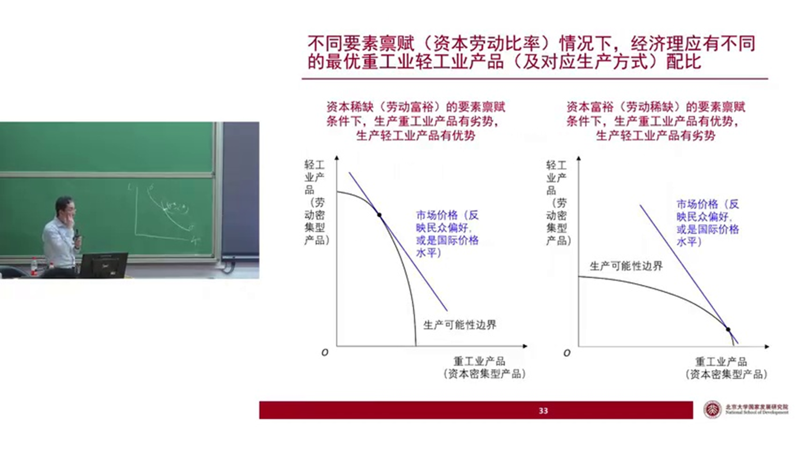
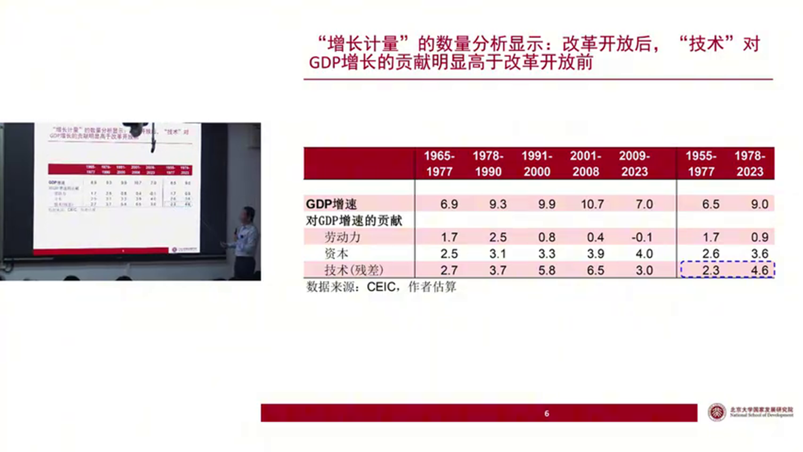

# 1 3-2：生产、增长与战略选择

## 1.1 等产线相交的逻辑辨析

### 1.1.1 问题的提出：等产线交点如何理解？

有同学提问：“如果两条等产线相交，交点上的情况应该如何理解？”

如果交点存在，这意味着在该点上，两种生产方式所使用的要素禀赋（资本和劳动）是完全相同的。然而，这并不意味着它们的产出也必须相等。例如，假设我们有两条分别代表不同生产方式的等产线相交。

### 1.1.2 要素禀赋相同与生产效率差异

这并非表示两条生产线上所有点的产量都相等。情况是这样的，这一点可能容易引起混淆。首先，我们分析的平面是资本和劳动的要素禀赋平面，所以平面上的任何一点都对应着一种特定的要素禀赋组合。现在，我们有两种生产方式。

第一种是资本密集型生产方式。我们可以用一组等产线来描述它，例如，在其中一条黑色的等产线上，所有点的产出都等于8个单位。

第二种是劳动密集型生产方式。我们同样用一组等产线来描述它。例如，在某条黄色的等产线上，所有点的产出都等于6个单位。

### 1.1.3 生产决策中的最优选择

这两组等产线可能会有交点。交点意味着什么呢？

交点意味着，在该点上，两种生产方式所使用的要素禀赋是完全一样的。我们可以将其标记为（K*, L*）。虽然在该点上使用的要素禀赋相同，但由于生产方式不同，它们各自得到的产出可能是不同的。

例如，在（K*, L*）这一点，如果采用资本密集型的生产方式，得到的产出是8个单位；如果采用劳动密集型的生产方式，得到的产出是6个单位。这两种产出没有必要一定相等。因此，在这一点上，不同的生产方式会得到不同的产出。这意味着，在该要素禀逼下，您不应该选择劳动密集型生产，而应该选择资本密集型生产。

所以，等产线的意义在于，在同一条等产线上，产量是恒定相等的。但是，当比较来自不同组的等产线时，比如代表劳动密集型的黄色线组和代表资本密集型的黑色线组，即使它们有交点，交点处的产出也未必需要相等。希望这个说明能够澄清大家可能存在的疑惑。

---

## 1.2 生产可能性边界（PPF）与技术残差项

### 1.2.1 分析维度的转换：从要素平面到产品平面

接下来我们继续讲下面的内容。当生产方式发生改变，例如从赶超战略转向比较优势发展战略后，整个经济的运行状况就会完全不同。

现在，我们回到一开始提出的问题：这种生产方式的选择，会如何影响我们在增长计量中得到的那个技术残差项（TFP）呢？

为了分析这个问题，我们需要换一种方式来描述生产过程。之前，我们是在资本和劳动的要素禀赋平面上分析问题。现在，我们转换到一个新的平面，即在两种产品——重工业产品和轻工业产品（分别对应资本密集型产品和劳动密集型产品）——的平面上进行分析。

### 1.2.2 要素禀赋与PPF形态的对应关系

在这个平面上，我们会看到我们上节课讲过的非常熟悉的概念——生产可能性边界（Production Possibility Frontier, PPF），就是这条弧线。我们的目标是生产出这两种产品。

请注意，这一张图对应的是某一个具体的要素禀赋状况。例如，我设定资本K为5，劳动L为20。在K=5，L=20这个给定的要素禀赋结构下，我可以画出该经济体的生产可能性边界，就是这条弧线。所以，这张产品平面图，可以理解为是从左边的要素禀赋平面图中的某一个点衍生出来的。

我把这个关系画得更清楚一点。左边的要素禀赋图中，可能有一个点代表着资本稀缺、劳动密集的状况。我们把这个点的要素禀赋拿出来，就可以画出它对应的生产可能性边界，它能够生产较多的轻工业品，但重工业品产能有限。

而屏幕上右边这张图，对应的则是另外一种要素禀赋结构。从它产生的生产可能性边界可以看出，该经济体可以生产出比较多的重工业产品。这对应的是一种资本比较密集的要素禀赋结构。

### 1.2.3 市场力量下的最优产出组合

最后，我们需要计算总产出，而总产出需要通过价格来折算重工业和轻工业产品。因此，我们会有一条代表市场价格的蓝色折线。这个市场价格可以理解为反映了民众在两种产品之间的偏好，也可以理解为是一个国际市场的相对价格。利用这个市场价格，就可以把两种产品折算成总价值。

如果交由市场去选择，市场一定会选择那个能够使总产值最大化的生产组合，也就是选择市场价格线与生产可能性边界相切的那个切点。

因此，在资本比较稀缺时，市场会自动倾向于多生产轻工业产品，少生产重工业产品。如果我们假设轻工业产品通过劳动密集型方式生产，重工业产品通过资本密集型方式生产，那么市场自然会选择更多地采用劳动密集型生产方式。

---

## 1.3 改革开放前后的战略变迁与绩效解释

### 1.3.1 赶超战略：非均衡点的政治经济选择

这张图，显然是一个资本稀缺、劳动密集的要素禀赋所对应的生产可能性边界。我们可以把这理解为新中国刚刚成立时，作为一个资本稀缺的小农经济体，它可以比较容易地生产出较多的轻工业产品，而不能生产太多的重工业产品。

但是，由于外生的目标（例如基于当时国际形势的政治选择），国家领导人认为国家的独立自强比单纯的经济产出更重要，因而需要生产更多的重工业产品。本来市场的选择只能生产较少量的重工业产品，但战略要求必须达到一个更高的产量。最终，在生产可能性边界上，选择了一个尽可能多地生产重工业产品的点。这样做的代价，就是以轻工业产出的大幅度下降，来实现重工业产出的上升。

这可以解释，在改革开放之前，我们追求重工业优先发展，在生产可能性边界上所选择的就是这样一个点。如果用市场价格去折算，会发现这个点并未达到工农业总产值的最大化。但在当时，这是次要的考虑，首要目标是获得足够的钢铁、坦克、大炮来维护国家安全。

### 1.3.2 转向比较优势：结构性变迁带来的“虚假”TFP增长

到了改革开放以后，我们不再追求必须生产那么多重工业产品，而是可以交由市场来决定如何生产。即使要素禀赋没有变化，市场也会将生产点从原来的位置移动到新的切点，即更多地生产轻工业产品，少生产重工业产品。

这样做的结果是，重工业产出下降了，但是由轻重工业总产值对应的那条价格线整体上移了。所以，我们看到的GDP（即轻重工业总产值折算出的总数）就上升了。

在要素禀赋没有发生变化的情况下，仅仅是生产点的移动，总产出就从较低的蓝线水平上升到了较高的蓝线水平。这时如果你用增长计量去估计，就会发现：总产出为何增加了？资本和劳动都无法解释这一增长，因此你只能将这个上升归结于技术残差项（TFP）增加。

但这个技术残差项的增加，真的是源于“越高越好”的技术在变化吗？不是的。它是因为我们选择了更符合自身要素禀赋结构的生产方式，从而导致了轻重工业总产值的上升。

### 1.3.3 动态积累效应与增长速度的差异

并且，这个图其实只画了静态的情况。如果把它想象成动态的，这个效果会更明显。如果我选择比较优势发展战略，每一期都处于产值最大化的状态，那么积累也是最高的。因此，在下一期，我的生产可能性边界也能够以更快的速度向外拓展。在拓展到更大的生产可能性边界后，我依然选择最大化产出的方式，于是就有更多的积累，生产可能性边界在再下一期又会继续往外扩展。

---

## 1.4 潜在产出与实际产出的偏差分析

### 1.4.1 潜在产出的不可观测性

我们回到上节课看的生产可能性边界的图。现在要对这个图做进一步的详细分析。给定一个要素禀赋，就会有一个生产可能性边界，这个边界也叫做我们的潜在产出水平或生产能力。但很重要的一点是，生产可能性边界是不可观测的。我们无法直接看到中国当前的生产可能性边界在哪里。

### 1.4.2 西方主流观点 vs. 凯恩斯主义

西方主流宏观经济学的假设是：实际产出水平Y和潜在产出水平 $Y^*$ 在长期中是一致的。实际产出可能会短期偏离潜在产出，但不会偏离太久。

但是，凯恩斯并不同意这个假设。他认为经济长期都可能存在有效需求不足的情况。这意味着，从供给面来讲，我们有足够的资源去获得更高的产出，但因为有效需求不足，所以实际只产出在了边界之内。

### 1.4.3 需求释放误诊为技术进步

好，假设在这种情况下，某一天政府采取了正确的政策，消除了有效需求不足的问题。于是，我们的产出从边界之内跳到了边界之上。当你用增长计量去研究时，你会发现这个国家的资本和劳动没有变化，但产出突然增加了许多。你只能将这部分增长归结为技术的上升。但实际上，这里面并没有技术的上升，而是有效需求不足的问题得到了解决。

## 1.5 关于“中国模式”的深刻探讨

### 1.5.1 中国模式的存在性与普世价值

这门课程其实还有一条主线，就是我要来探讨我们中国到底做对了什么？中国模式到底是什么？

关于中国模式，其实正反两面的观点都有。持正面观点的人会觉得中国确实存在“中国模式”，中国从实践中已经走出了不同于西方的现代化道路。但是，即使是持这种观点的人，也很少有人敢说中国模式具有普世价值，是别的国家可以学习、也应该学习的。

还有更多的人是不承认存在中国模式的。他们认为中国模式不过是市场推动经济发展的又一个注脚而已。他们会说，中国改革开放四十年来发展这么快，不就是搞了市场化，纠正了过去的错误吗？持这样观点的人大有人在。

但是，我的看法是：存在中国模式，而且中国模式有普世价值。我相信可能很少有人与我持相同观点，但我很坚定地相信这一点。中国式的现代化已经为人类发展走出了一条新路，而且这条路别的国家可以模仿，也应该模仿。所以在这门课程中，我会探讨中国模式到底是什么。

### 1.5.2 成功经验与失败教训的辩证关系

那么，中国模式是什么呢？这个问题其实就等于在问：中国做对了什么？中国模式其实就是中国成功经验的总结。但中国模式的存在，并不代表我们做的都是对的。要搞清楚，在中国的发展过程中，既有成功的经验，也有失败的教训。在我们的党中央文件中也明确讲到过我们犯过的错误，比如当年王明的“左”倾冒险主义导致我们丢失了江西的根据地，被迫长征，这就是犯了“左”倾教条主义的错误。还有就是“文革”，这些都在《关于建国以来党的若干历史问题的决议》这个文件里讲得很清楚了。所以，中国模式不代表我们什么都做得对。

但是，你如果拉长时间来看，把现在的中国和1840年的中国、1900年的中国做一个对比，那可以说是翻天覆地的变化。我们不仅是站起来了，而且是强起来了，而且是富起来了。这个在人类历史上是没有发生过的。所以，我想这是非常有必要总结的。

### 1.5.3 正确理解中国模式：以地方政府经营模式为例

我们未来也会给大家更多阐述，正是因为我们没有很好地回答“什么是中国模式”这个问题，所以我们现在出现了很多问题。为什么这么说呢？因为你如果不能够知道自己什么地方做对了，就很难坚持正确的东西。比如我以后会讲，中国地方政府经营城市的商业模式——地方政府用融资平台去搞基础设施投资，基建投资推高了地价和房价，然后地方政府通过卖地来部分地变现基建投资的社会效益。这套商业模式是别的国家没有的，因为它建立在土地公有制的基础上，这是使中国成为世人羡慕的“基建狂魔”的重要法宝。

但是很遗憾，有些人觉得地方政府融资平台是在搞“庞氏骗局”，最后要爆发债务危机；土地财政推高了房地产泡沫，最后也要崩掉。所以他们主张要去杠杆、要紧缩。这些政策在我看来，都是建立在误读中国之上的“自废武功”。明明中国经济可以搞得更好，大家今年可以有很好的就业状况，但就是因为政策不对路，现在就呈现出这个样子。其深层次原因，就是我们没有很好地回答哪些地方我们做对了要坚持，哪些地方我们做得不对要改正。所以，当西方经济学越来越多地引入中国之后，你发现中国的现实与西方经济学的很多结论是不符的。于是，一些很吊诡的人就会认为，和西方经济学不符的东西就是错的，要改掉。于是经济就呈现出现在的样子。

所以，回答“中国模式是什么”，才是化解当前中国经济面临最大风险的最根本之策。这是我们要贯穿这学期整个课程的一个深层次问题。

### 1.5.4 历史的统一性：两个三十年不能分割

而中国模式，你不要只看见了改革开放四十多年取得的辉煌成就。中国模式，其实应该从1921年共产党成立之后开始看，它是在共产党带领中国人民探索中华民族伟大复兴之路的百年历程中逐步形成的。所以，新中国成立前后（从建党到建国）以及从建国之后到现在，这两段时间是不能分割的，是统一的。而改革开放前后，也就是新中国的前三十年和后四十年，也是统一的。

所以我们看每一个阶段，不能只把视线聚焦到改革开放四十年，看哪些做得挺好。你要看到整个一百多年来贯穿其中的线索和共性，去发掘我们成功的基础。

### 1.5.5 计划经济时代的遗产及其现实意义

因此，看问题要辩证地看。从产出的角度来讲，如果你以市场的均衡为评价标准去看待我们改革开放之前的三十年计划经济，你会觉得这是一段弯路。但是，如果你把视线放得更广阔一些，它并非没有成就，它其实是取得了辉煌成就的。从一个一穷二白的小农经济，很快建立起了比较齐全的工业门类。到现在，全世界只有一个国家拥有联合国产业目录里的每一个细分产业，那就是中国。这个完整的产业体系是什么时候建立的？追根溯源，可以追溯到“一五”时期。

而且，在改革开放前后这总共七十多年里，你要看到的是我们党和国家强大的执行力以及集中力量办大事的能力，这是贯穿始终的。只不过这个执行力在改革开放前，它的重心没有放在经济建设上，而是更多地放在国防、安全等方面，这有其历史的考量。而改革开放之后，它把重心移到了经济建设上，只是目标转化了，但在追求目标的过程中，其强大的执行力和办事能力是贯穿始终的。我觉得这是西方很多国家非常欠缺的东西。

所以，我想我们分析改革开放前的历史，实际上有助于我们理解当下的中国经济。比如，我们的一些计划经济的“遗产”（我用的是一个中性词），它不一定全是好的或坏的。计划经济留下的有些东西，确实可能干扰了我们现在市场的运行，可能是我们高质量发展的阻碍。但它留下的另一些东西，对我们现在的发展可能又是有利的。

### 1.5.6 完整工业门类对抗“卡脖子”风险

比如很齐全的工业门类。这个东西按照林毅夫老师的比较优势发展战略肯定是搞不出来的。因为当你的要素禀赋是资本稀缺时，你就应该搞劳动密集型产业，然后随着资本密集度的提升，再慢慢地从劳动密集型转向资本密集型行业。但这种发展战略有一个前提条件，就是你需要一个自由贸易的国际环境。比如说，我生产一万双袜子，能够换回来我需要的飞机，我们相互交换。但是，如果人家不卖给你飞机呢？人家“卡你脖子”呢？那你一万双袜子自己也穿不了，飞机又买不回来，那不就什么都得自己生产吗？

所以，当下美国对中国有很强的戒心，到处要“卡我们的脖子”，尤其是在高科技领域。这个时候我们就要感谢我们改革开放前三十年，计划经济给我们建立起了这么完备的产业体系。所以它现在只能卡我们高科技的芯片，而且芯片里面也只能卡那个先进制程的。那些成熟制程的芯片，现在已经卡不了了。如果不是有这么齐全的工业门类，恐怕现在很多东西都会卡得我们非常难受。比如汽车你不能生产，冰箱你不能生产，电视你不能生产，那他再给你打贸易战，你就什么都弄不了了。

所以我想，一定要辩证地看问题。我们一定不能觉得只是改革开放后四十年做得好，其实前后都有它的成功之处，当然也有它的不足之处。只有拉通来看，你才能真正发现我们中国模式的精髓在哪里，我们做对的事情在哪里。

---

## 1.6 产业政策的理论脉络

### 1.6.1 供给面分析：产业政策的引入

好，讲完了发展战略对经济绩效的影响之后，我再进入今天最后一个内容：产业政策。

我们今天都在讲供给面，因为后面大部分内容我们会讲需求面。所以今天把供给面最后一个东西讲完，就是产业政策。产业政策显然也是一个供给面的政策，即通过影响产业结构，从而在产业发展和国际竞争中获得优势。

对于产业政策，其实讨论很激烈，包括我们国家内部也有很著名的两位老师持相反的观点。有人觉得产业政策很好，有人觉得没什么意义，甚至还有坏处。但其实，你如果看贸易理论，这个问题我觉得没有什么好争论的。因为讲产业就肯定会涉及国际竞争，而现在的新贸易理论已经给出了非常明确的答案：产业政策肯定是有用的，而且应该用。

### 1.6.2 古典贸易理论：绝对优势与比较优势

我们来探讨一下它的理论脉络。我们有古典的贸易理论，来自于亚当·斯密的绝对优势理论和来自于大卫·李嘉图的比较优势理论。亚当·斯密说，如果不同国家在不同产业上有绝对优势（比如英国生产羊毛毡成本比法国低，法国生产葡萄酒成本比英国低），那么它们之间就可以进行贸易。

但后来李嘉图说，不需要有绝对优势，有相对优势（即比较优势）也可以进行贸易。也就是说，你可以找一个各方面都比你差的国家，某个国家在所有产品的生产上都比你有绝对劣势，成本都比你高，效率都不如你，你仍然可以通过与它进行贸易来获得自身福利的提升。

### 1.6.3 比较优势理论的生动实例

要解释清楚比较优势理论，一个例子就够了。比如说我，写文章写得很好，非常熟练；同时因为写得多，打字也很熟练。我又擅长写别人写不了的文章，又擅长打字。同时，市面上有一个文员，他写文章写不过我，打字也比我慢。那我和他之间有没有合作的可能性呢？有的。

比较优势理论告诉你，我可以与他合作。我雇他来帮我打字，这样我就节约了打字的时间，可以用来做产出效率更高的写文章这件事。因为打字谁都可以做，效率差别不是那么大；但有些文章可能只有我能写，别人写不了。所以，我雇这个文员来帮我打字，节约了我的时间，让我的总产出增加了，因为写文章的收入更高。在这个例子里，文员可能在写文章和打字两方面的绝对效率都不如我，但是他在打字方面有“相对优势”，因为他写文章比我差得更多。而我在写文章方面有相对优势，因为我们打字水平的差别可能没那么大。所以，他向我“出口”他的比较优势产品（打字），我向他“出口”我的比较优势产品（写文章）。虽然他在两方面绝对效率都比我低，但我们通过合作，都获得了福利的提升。这就是比较优势贸易理论。

### 1.6.4 新贸易理论：规模经济与偶然性优势

经典的贸易理论，包括后来的赫克歇尔-俄林模型（Heckscher-Ohlin model），其实也都是基于你的比较优势。比如我们前面讲的“比较优势发展战略”，这个名字就来自于比较优势贸易理论。当你是一个资本稀缺的国家，你在国际贸易中就在劳动密集型产品上有比较优势，应该专注于这类生产。而一个资本富裕的国家，在资本密集型产品上有比较优势，就应该专注于资本密集型产业。然后相互之间做贸易。

但比较优势贸易理论有一个很大的问题。按照这个理论，贸易只应该发生在要素禀赋结构不一样的国家之间，比如发达国家和发展中国家之间。但实际情况是，现在绝大部分的贸易都发生在发达国家之间，它们的要素禀赋结构是类似的。此外，还有大量的“产业内贸易”，即同一个产业里面，一个国家既大量进口又大量出口。这些都是比较优势贸易理论解释不了的。

理论总是要为现实服务。所以在近几十年，经济学家提出了“新贸易理论”，来对现代国际贸易的这些特点做出解释。

这个理论的核心是什么呢？比如，现在各个产业（如瓶装水行业），其实内部有很多细分的市场（矿泉水、纯净水、碳酸饮料等）。在每一个细分市场里，都有很明显的“规模经济”效应，就是你规模越大，竞争优势越明显。由于整个细分行业的市场容量是有限的，如果一个国家能够在某个细分行业里率先形成规模优势，别的国家就很难再进来了。

但这个竞争优势是怎么形成的呢？因为都是发达国家，大家各方面都差不多，所以在形成规模优势的过程中，有很大的偶然性。可能某个国家突然出现一个像乔布斯那样的企业家，一下就把一个行业搞起来了，形成了先发优势，后发者就很难进入了。同样，另一个国家可能因为别的原因，在另一个细分行业里率先形成了规模经济。于是，不同的发达国家就在不同的细分行业里，因为偶然的原因各自形成了规模经济，然后相互之间就开始进行大量的贸易。

### 1.6.5 战略性贸易理论与政府干预的必要性

所以，从新贸易理论来看，国家在推动国内产业抢先形成规模优势方面是大有可为的。因为当要素禀赋结构类似时，谁能先把某个行业搞起来并获得规模优势，是不确定的。如果A国在产业政策上给予一些扶植，帮助这个产业率先发展起来，那么A国可能就首先形成了规模优势，这个行业就被A国占领了。因此，新贸易理论实际上为政府干预产业发展提供了理论依据，所以它又被称为“战略性贸易理论”。这个理论已经提出了几十年，是公认的能够很好解释现代贸易经验特征的理论。

所以从这个理论出发，你说国家要不要搞产业政策呢？结论是非常清晰的，我觉得没有什么好争论的。

### 1.6.6 新结构经济学：有为政府与有效市场的结合

当然，搞产业政策也不是乱搞，你还是要符合你的要素禀赋结构。你一个资本稀缺的国家，非要去搞一个和你要素结构差异巨大的资本密集型产业，那你就算下了很大力气，效果可能也不会很好。但是在符合你要素禀赋结构的产业中，选择是很多的，这时政府就可以推一把，让它能够率先获得规模经济。

这其实就是林毅夫老师在他的“新结构经济学”里讲的很核心的一个东西：有为政府和有效市场的结合。怎么结合呢？他有一整套产业识别的方法。首先要识别出哪些产业和你这个国家的要素禀赋结构是匹配的，不能乱推。然后，再去克服一些市场的不足之处。比如，企业家可能有风险规避的情绪，不敢做第一个吃螃蟹的人，这时政府可以给第一个做这件事的企业一定的补贴。又比如，一个行业的发展可能需要大量的基础人才，企业自己无法培养，这时就需要相关的教育体系来提供支持。再比如，大家可能缺的是信心，这时政府可以进行引导，指明方向，告诉大家这个方向可以搞，有发展空间。通过这样的产业政策，来引导我们在某些行业里形成规模经济，占据这个行业。

---

## 1.7 现实案例分析：中国汽车工业的崛起

### 1.7.1 中国汽车出口的爆发性增长

理论很清楚，我们再来看现实。一个现成的例子就摆在中国：中国的汽车行业。

大家可以看一下中、日、德、韩四个国家汽车的月度出口量。中国的出口量是爆发性增长，从2020年到现在，月度出口量已经超过日本。中国现在是世界第一大汽车出口国，这是毫无疑问的。

在国内市场，与我们出口爆发相伴随的，是我们自主品牌的崛起。看这张国内汽车月度销售量图，长期以来，自主品牌在国内市场是卖不过合资品牌的。但现在，自主品牌的销量大概是合资品牌销量的两倍，实现了反超，而且合资品牌的销量下跌趋势非常惊人。

### 1.7.2 新能源转型与全产业链的带动

为什么呢？就是因为新能源的转型。这张图的浅色线是我们汽车的出口量，深色线是新能源车在乘用车产量中的比重。从2020年年初的不到5%，到如今已经接近50%。所以现在大家在街上看到新能源车满地跑。

你可能觉得出口增长都是新能源车搞的，其实不是。我们把中国汽车出口拆分一下，会发现出口的大头仍然是传统能源车，也就是油车。而且油车的出口量从2020年到现在也翻了好几倍。为什么新能源转型反而带动了油车出口的爆发呢？因为它把整个汽车产业带起来了。

一来是品牌。之前在传统车领域，外资、合资品牌的优势很强。你开一辆很贵的国产车，人家可能觉得你脑子有毛病。但现在这个概念变了，国产车价格卖得很贵，大家反而觉得很时尚，有面子。整个中国汽车的品牌被市场认可了。

二来是整个产业链被带起来了。现在为什么好像人人都能造车？因为产业链完善了，你很容易就能在中国找到造车需要的所有零部件，组装一下就能搞出个车来。你再看看美国，造车为什么那么难？因为它的产业链已经衰退了，很多东西需要从零开始造，成本 and 难度自然就高多了。所以，中国的新能源转型，让整个汽车行业上了一个大台阶。

### 1.7.3 新能源汽车产业政策的系统性布局

很明显，就是新能源转型让我们中国汽车行业实现了“弯道超车”。为什么能够弯道超车呢？离不开产业政策。我这里做了一个梳理，与我们新能源车发展相关的政策非常多。

大致可以分为几类：

1. **发展规划**：早在2012年，国家就制定规划，设定了到2020年的产销量目标。
    
2. **消费端补贴**：比如从2014年开始对新能源车免征车辆购置税，以及根据续航里程提供不同额度的购置补贴。
    
3. **基础设施建设**：比如在2015年就提出到2020年要建成大量充换电站和充电桩的目标。
    
4. **生产端激励**：比如2017年推出的“双积分”政策，要求汽车制造商达到一定的新能源汽车积分比例，有奖有罚。
    

这一系列的规划和政策，涵盖了消费端、供给端和基础设施，从2012年开始搞了十几年，到现在终于开花结果。这应该说是一个非常成功的案例，完全可以写入产业经济学的教科书。

### 1.7.4 国际社会的反应：欧盟的“市场扭曲”报告

我们自己说好不算，来看看外国人怎么评价。比如欧盟，在今年4月10日发表了一篇长达712页的大报告，标题是《以贸易保护调查为目的的对中华人民共和国经济中重大扭曲的研究》。

这其实不是欧盟第一次写这种报告了，2017年就写过一个类似标题的，当时只有四百多页。这个报告专门分析中国的“市场扭曲”，并列出一些他认为扭曲非常严重的行业。在今年的版本中，除了钢铁、化工等传统行业，又增加了电信设备、半导体、可再生能源和新能源汽车等五个新兴行业。

我们来看看报告是怎么说新能源车的。它列出的重要“市场扭曲”包括：

- 购车补贴与税收减免来刺激需求。
    
- “双积分”政策来鼓励生产。
    
- 地方政府通过专项基金与补贴来鼓励发展。
    
- 国有企业的控制与主导。
    
- 融资政策向新能源汽车企业倾斜。
    

这些，站在欧盟的角度看，是中国通过扭曲市场获得的不公平的竞争优势。但站在中国的角度，你可以把它理解为是我们国家政府在推动新能源车发展方面采取的成功政策。

### 1.7.5 辩证看待政府与市场的界限

有句话说，当你的竞争对手都说你做得好（或者抱怨你做得太好）的时候，那才是真的好。所以你可以看到，美国一些反华的议员，在指责中国的同时，最后得出的结论是：美国也应该向中国学习，搞产业政策。

那么我们该怎么看待这些来自欧盟或其他国家的质疑呢？

如果你纯粹从西方经济学教科书的角度来看，这些东西当然是对市场的一种干扰。因为根据福利经济学第一和第二定理，完全竞争的市场均衡可以实现帕累托最优，任何对市场的干预都会带来效率损失。从这个角度看，政府干预是得不偿失的。确实，我们改革开放前三十年的计划经济，对市场形成了很强的扭曲，也确实降低了当时的经济发展绩效。

但是，不是就可以凭此就说，我们现在的这些产业政策和政府对市场的引导或干预就是不对的。肯定不是的。

有一次我开一个国际会议，一些西方经济学家就质疑中国的产业政策。我反问他们：“如果产业政策真的如你们所说的那样是不好的，那你们还担心什么呢？中国不是搬起石头砸了自己的脚吗？你们应该高兴才对啊！为什么那么激动地质疑呢？”核心在于，他质疑你，是因为你对他形成了威胁，带来了压力。他质疑你，正是因为你做对了。

所以，这里面是要区分开的。不是说对市场的干预就一定好，当然也不是说不干预就一定好。市场与政府之间，要有一根恰当的界限。这个界限到底在哪里？如果完全按照西方经济学那套逻辑，那就是政府从市场中完全退出来，一切交给市场。事实上，现在我们很多宏观政策决策背后的思路就是这个。但实际上，过去采取的很多这类措施带来了很严重的后果，市场没有变好，反而变得更糟了。

所以，市场与政府的界限，是我们分析中国经济时必须要解决的一个重要问题。两者之间应该是良好的配合，而这个配合要根据“国情”。这并非一个托词，而是你的具体情况确实如此。比如，中国的收入分配结构中公有制占比较重要的地位，国有部门获得了大量的国民收入。在这种结构下，政府就有责任把拿到的收入花出去，转换成为有效需求。这时你政府的积极作为，就是应该做的。如果你不作为，市场反倒会变得更坏。

所以，这是一个很重要的、值得探讨的话题。我整个学期想传达的一个理念就是，对具体经济的分析不能一概论，一定要放在大的宏观背景下，具体情况具体分析。

---

## 1.8 总结与展望：转向需求面分析

### 1.8.1 供给面分析的收尾

以上就是我们今天要讲的所有内容，也是我们对中国经济供给面的一个比较完整的分析。供给面能讲的东西其实并不是特别多，因为它很简单，就像一个企业生产，无非就是更多的资本、更多的劳动和更高的技术。但即使这么简单，仅在“技术”这一项里，也有很多东西可以挖掘。

### 1.8.2 宏观经济的复杂性：经济发展的源泉

但是，对中国经济而言，真正重要的，或者说要真正深入理解中国经济，更加重要的还是需求面。所以从下节课开始，我们就要进入对需求面的分析了。

最后几分钟，我再讲一件事。最近我开会时，有一位部级官员问出了一个非常关键的问题。他问：“经济发展的源泉是什么？”

如果你把这个问题抛给西方经济学家，他会马上告诉你：资本、劳动和技术。因为他的那套世界观决定了，他认为经济会长期运行在生产可能性边界上，不存在有效需求不足的问题，所以经济增长的瓶颈只能来自供给面。

### 1.8.3 现实的挑战：为什么生产要素充足但经济承压？

但是，现实好像不是这样。你说中国现在资本稀缺吗？一点儿不稀缺，资本很充裕。劳动稀缺吗？虽然人口老龄化，但现在青年失业率很高，大把年轻人找不到工作。技术呢？技术环境也不差，新能源车全球领先，半导体除了最先进制程被卡脖子，成熟制程也在大量出口。但经济怎么就这么差了呢？

显然，你用西方教科书回答不了这个问题。经济增长的源泉在哪里？我觉得很简单。经济增长有两个环节：第一，把东西生产出来（供给面）；第二，把东西分配给各个经济主体，让他们去用掉，变成福利的提升（需求面）。

宏观经济的特点就是它的复杂性。你生产出来的东西，就一定会被用掉吗？未必。我们过去批评资本主义国家经济危机时把牛奶倒进河里，结果近些年我们国家也出现了类似的情况。所以，把东西生产出来，和把东西分配给有需求的人让他能够消费掉，是同等重要的事情。

### 1.8.4 核心命题：需求不足的本质是收入分配问题

中国在生产方面没有问题，但在把生产出来的东西用掉方面是有问题的。我们有需求不足。这里的“需求”，不是我脑子里的胡思乱想，而是有购买力支撑的“有效需求”。人的欲望是无穷的，所以欲望本身不会是经济发展的瓶颈。但是，人的欲望要通过收入才能转变为有效需求，而收入是有限的。

一个国家的总产出等于这个国家的总收入，所以一个国家总是有足够的购买力来购买它自己的全部产出。问题在于，这个购买力要通过收入分配结构分配到不同的经济主体那里去。如果这个分配结构出了问题，就会导致有购买欲望的人没有购买力，而有购买力的人没有足够的欲望，最终造成有效需求不足。

所以，有效需求不足，或者说大家通俗讲的“内需不足”，归结到底是一个收入分配问题。大家记住这句话。我们中国现在为什么需求不足？就是收入分配结构出了问题。这是我们未来几讲要详细解释的内容。

你把这个东西想清楚了，把需求不足的成因想清楚了，再从这个源头出发去理解我们的实体经济、金融体系的各种问题，就像我们今天讲计划经济的形成一样，一切就都迎刃而解了。当前的中国经济现象纷繁复杂，但这些复杂的现象，最后都可以非常清晰地归结到一个核心矛盾所衍生出的种种后果。

好，这就是我们这节课要讲的内容。我们今天的课就讲到这里，下周再见！

---

如果您确认这段内容符合要求，我可以为您**将其转化为适合排印或打印的 PDF/Word 格式建议**。或者您需要我针对 1.7 节提到的“**新能源汽车发展时间轴**”整理一份详细的表格吗？