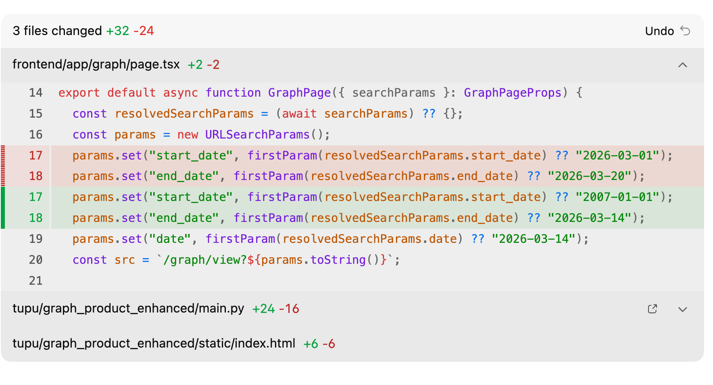
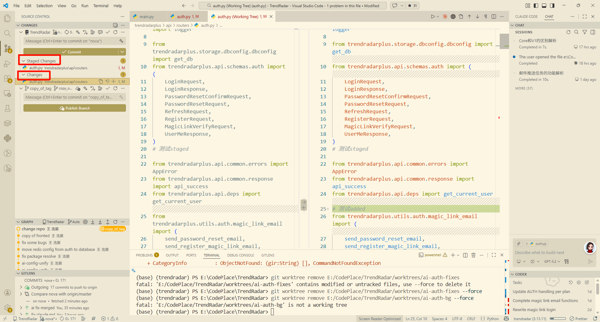
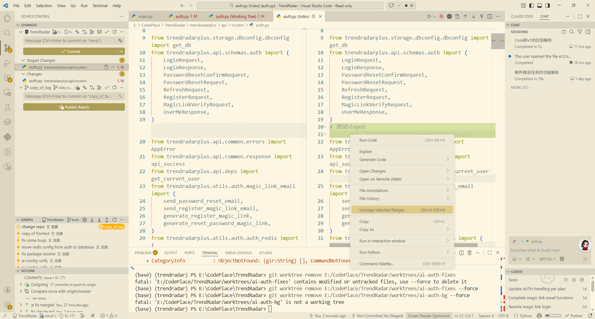

# 1	我为什么开始用 git worktree 管 AI 生成的代码

如果大家有用过Claude Code 或者 Codex 或者 Opencode之类的CLI的Coding工具的话，你会发现他不能像cursor那样选择性的apply或者reject代码，只能全盘接受他的所有修改（或者拒绝）

同时也没有什么很好的可视化的方式来看他修改了哪些代码（部分vscode插件可以做到预览，但是预览的也比较麻烦，可能就是这样类似的效果）


所以我开始尝试用git管理ai修改的代码。我可以用Pycharm自带的diff工具来查看不同的区别，同时选择性的选择应用。

主工作区继续干主线，AI 的改动单独丢进一个 `git worktree` 里。

这个做法最直接的好处，不是"Git 更高级了"，而是脑子终于不用频繁换上下文了。Git 官方对 `git worktree` 的定义，本来就是**同一个仓库可以挂多个工作目录，并且同时检出不同分支**。这件事一旦放到日常开发里，体验上的变化其实非常朴素：主仓库保持稳定，AI 在旁边大胆试，试完我再决定哪些要吸收，哪些直接删掉。

这个思路其实和我原来笔记里的几句土话是同一个意思：以前切分支像灵魂出窍，现在更像肉身分离；主仓库是责任区，实验区只是候选方案区。

## 1.1	我以前为什么不爱切分支

以前我也不是不会用分支。

功能分支、修 bug 分支、临时实验分支，这些都很正常。问题不在 Git，问题在"切换"这件事本身。你正在写一半的代码、开着一堆终端、dev server 跑着、脑子里还挂着当前任务的上下文，这时候突然来一个 hotfix，或者突然想让 AI 试一个重构方案，你虽然知道"切个分支就行"，但整个人还是会断一下。

尤其是 AI 参与之后，这个断裂感更明显。

因为 AI 最擅长的是"快速给一个候选答案"，而不是替你承担最后的责任。它特别适合去写样板、铺测试、试重构、改脚手架、补胶水代码；但如果你让它直接在你当前主工作区里折腾，最后常见的结果不是它写错了，而是**你看不清了**。哪些文件是我刚改的，哪些是 AI 改的，哪些改动是为了验证思路，哪些改动其实根本不该留下来，全都搅在一起。

所以我后来不再问"AI 能不能直接帮我写"，我问的是：**怎么让 AI 的输出和我的责任边界分开。**

`git worktree` 刚好就是干这个的。一个仓库，多开几个工作目录；主线在这边，实验在那边，谁也别打扰谁。([Git](https://git-scm.com/docs/git-worktree?utm_source=chatgpt.com "Git - git-worktree Documentation"))

## 1.2	我现在怎么用

我现在的目录通常会长这样：

```plain
~/projects/my-saas/                     # 主仓库，稳定开发
~/projects/my-saas/worktrees/my-saas-ai/       # AI 草稿区
~/projects/my-saas/worktrees/my-saas-hotfix/   # 紧急修复区
```

这个结构和我原来记下来的工作模式差不多：主仓库负责稳定开发，旁边挂几个不同用途的 worktree，像几个平行宇宙。

实际操作很简单。我一般会先把主线停在一个干净状态，然后给 AI 开一个短命分支，再单独挂一个 worktree 出去：

```bash
git switch main
git commit -am "checkpoint before ai draft"

git worktree add -b ai/draft-order-pricing ./worktrees/my-saas-ai main
```

`git worktree add` 本来就支持在指定目录创建一个新的工作树，也可以顺手基于某个起点新建分支。

做完以后，我通常会开两个 VS Code 窗口。

左边那个是主仓库，我继续写真正要进主线的东西。右边那个是 AI 草稿区，我让它在那里大胆尝试。它写坏了没关系，反正坏的是草稿区，不是我手上的主工作区。

这个感觉和"切分支"最大的差别，不在 Git 命令，而在人的注意力。切分支是逻辑切换；worktree 更像物理隔离。你看见的是两个目录，两个窗口，两套终端，两个开发上下文。脑子会轻松很多。

## 1.3	这个用法最爽的地方，不是 AI，而是 hotfix

一开始我以为自己会最常拿它干 AI 实验，后来发现真正让我离不开 worktree 的，反而是紧急修 bug。

场景很常见：你正在主仓库写新功能，写到一半，线上突然炸了。以前我的做法一般是先 stash，或者硬切分支过去修，修完再切回来。技术上当然也能干，但节奏会断，编辑器状态会断，终端上下文也会断。

现在我直接开一个 hotfix worktree：

```bash
git worktree add -b hotfix/critical-bug ./worktrees/my-saas-hotfix main
cd ./worktrees/my-saas-hotfix
```

然后在这个目录里修、提、推，修完以后把它关掉。主仓库那边原封不动，dev server 继续跑，写到一半的文件还停在那儿，我回来接着写就行。

我原来在笔记里写过一句话：以前切分支像"灵魂出窍"，现在是"肉身分离"。 这句话虽然土，但很准。因为 worktree 真正解决的不是 Git 技巧问题，而是上下文切换成本。

## 1.4	用命令行的方式审查ai的代码

你可以这样看差异
```bash
git diff main...ai/draft-order-pricing
```

或者只看某个文件：

```bash
git diff main...ai/draft-order-pricing -- src/domain/order_pricing.ts
```

你会发现，一旦 AI 的改动被隔离到一个独立 worktree 里，review 这件事会轻松很多。因为你面对的不是一坨混在当前工作区里的脏改动，而是一个清清楚楚的"候选答案"。

如果我觉得这份候选答案整体还行，但不想保留它那个分支历史，我会直接 squash 进当前分支：

```bash
git switch main
git merge --squash ai/draft-order-pricing
```

这个方式特别适合 AI 协作。因为 AI 的分支历史很多时候没有保留价值，我真正想要的只是"把这个候选实现铺到眼前，然后我自己再挑、再改、再提交"。

当然，如果你是大面积的修改，命令行看起来可能就有点不舒服了

## 1.5	如何不开pull Request自己Review AI代码


### 1.5.1	方法A
让AI在worktree写完后commit到`ai-fix`分支上【或者我们可以直接开一个worktree叫ai_playground然后每次ai写完了先Review和merge，然后再把`ai_fix`直接挪到merge后的结果上即可。这样就是开两个Vscode窗口就可以了】，然后用

```
# 1) 切到目标分支 main
git switch main

# 2) 确保工作区干净（很重要）
git status

# 3) 合并 ai-fix，但不提交
# --no-ff表示不用fastforward
git merge --no-commit --no-ff ai-fix


# 或者使用 把 ai-fix 的全部差异压扁应用到当前分支，但不提交
git merge --squash ai-fix
```


接下来打开vscode的change面板会有两个change，左侧是`HEAD`提交（也就是我们在`git merge --no-commit --no-ff ai-fix`前的提交）

这里会分`staged change`【在staged区】和普通`change`【在working区】，这里我点开的是普通的`change`。中间的按钮你可以revert或者把他staged了 


【刚跑完上面的命令一般只会有`staged change`我们可以参考图二取消`staged】



在`staged`里面，我们能做的比较少，一般只能取消`staged`，但是如果我们放到普通的`change`里面就可以直接对文件进行编辑。

可以用这个命令一键全部从`stage`覆盖到`working area`
```shell
git restore .

# 注意，--staged是用HEAD提交来覆盖index区域
```


## 1.6	几个我踩过的坑

### 1.6.1	1）别把实验分支养太久

AI 草稿分支这东西，最适合短命。

它的价值是"候选方案"，不是长期维护。你今天让它试一个重构，明天让它铺一层测试，后天再让它改个脚本，这些都适合用临时分支和临时 worktree 做。事完删掉，世界清净。

我现在会定期清理：

```bash
git worktree list
git worktree remove ./worktrees/my-saas-ai
git branch -D ai/draft-order-pricing
git worktree prune
```

`git worktree remove` 和 `git worktree prune` 都是官方支持的清理方式。([Git](https://git-scm.com/docs/git-worktree?utm_source=chatgpt.com "Git - git-worktree Documentation"))

### 1.6.2	2）别在两个 worktree 里同时改同一块东西

虽然是多个目录，但本质上它们还是挂在同一个仓库上。官方文档也明确说了，主工作树之外还可以有零个或多个 linked working tree。([Git](https://git-scm.com/docs/git-worktree/2.17.0?utm_source=chatgpt.com "Git - git-worktree Documentation"))

所以最怕的不是"不会用"，而是"乱用"：

- 主仓库改一半
- AI worktree 也在改同一个文件
- hotfix worktree 又顺手改了一下相关逻辑

最后不是 Git 出问题，是你自己已经不知道哪份改动该信谁了。

我的经验很简单：一块逻辑同一时刻只让一个 worktree 负责。主仓库负责主线，AI 区负责提议，hotfix 区只干救火。井水不犯河水，事情就会简单很多。
